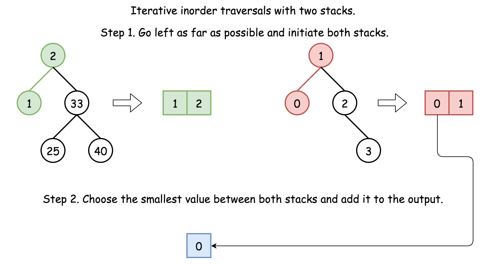

# 1305. All Elements in Two Binary Search Trees — Approaches

## Prerequisites

To solve this problem we use **inorder traversal of Binary Search Trees (BSTs)**.

### DFS Traversal Types

There are three Depth‑First Search traversal orders:

- **Preorder** → Node → Left → Right
- **Inorder** → Left → Node → Right
- **Postorder** → Left → Right → Node

For **Binary Search Trees**, **inorder traversal always produces values in sorted order**.

### Recursive Inorder Traversal Example

```java
public List<Integer> inorder(TreeNode root, List<Integer> arr) {
  if (root == null) return arr;

  inorder(root.left, arr);
  arr.add(root.val);
  inorder(root.right, arr);

  return arr;
}
```

---

# Approach 1: Recursive Inorder Traversal + Sort

## Intuition

The simplest solution is:

1. Perform **inorder traversal** of both BSTs.
2. This produces **two sorted arrays**.
3. Merge the arrays.
4. Sort the combined list.

This approach is **very easy to implement**, though not the most optimal.

---

## Steps

1. Compute inorder traversal of `root1`.
2. Compute inorder traversal of `root2`.
3. Combine both arrays.
4. Sort the resulting list.

---

## Implementation

```java
class Solution {

  public List<Integer> inorder(TreeNode root, List<Integer> arr) {
    if (root == null) return arr;

    inorder(root.left, arr);
    arr.add(root.val);
    inorder(root.right, arr);

    return arr;
  }

  public List<Integer> getAllElements(TreeNode root1, TreeNode root2) {

    List<Integer> output = new ArrayList<>();

    Stream.of(
        inorder(root1, new ArrayList<>()),
        inorder(root2, new ArrayList<>())
    ).forEach(output::addAll);

    Collections.sort(output);

    return output;
  }
}
```

---

## Complexity Analysis

Let:

- **N = number of nodes in tree1**
- **M = number of nodes in tree2**

### Time Complexity

```
O((N + M) log(N + M))
```

Steps:

- Build inorder arrays → `O(N + M)`
- Merge lists → `O(N + M)`
- Sort combined list → `O((N + M) log(N + M))`

---

### Space Complexity

```
O(N + M)
```

Space is required for:

- two inorder arrays
- final output array

---

# Approach 2: Iterative Inorder Traversal (One Pass)

## Intuition



Both BSTs produce **sorted sequences via inorder traversal**.

Instead of:

1. building two arrays
2. merging later

we can **merge during traversal itself**, similar to merging two sorted arrays.

This allows a **single‑pass solution with linear complexity**.

We maintain **two stacks** for the inorder traversal of both trees.

At each step:

- compare the **top node of both stacks**
- pick the **smaller value**
- add it to the result

---

## Algorithm

1. Initialize two stacks:
   - `stack1`
   - `stack2`

2. Traverse leftmost nodes for both trees.

3. Compare the top elements of both stacks.

4. Remove the smaller element and append it to output.

5. Move to the right subtree of the selected node.

6. Continue until both stacks and trees are empty.

---

## Implementation

```java
class Solution {

  public List<Integer> getAllElements(TreeNode root1, TreeNode root2) {

    ArrayDeque<TreeNode> stack1 = new ArrayDeque<>();
    ArrayDeque<TreeNode> stack2 = new ArrayDeque<>();
    List<Integer> output = new ArrayList<>();

    while (root1 != null || root2 != null ||
           !stack1.isEmpty() || !stack2.isEmpty()) {

      while (root1 != null) {
        stack1.push(root1);
        root1 = root1.left;
      }

      while (root2 != null) {
        stack2.push(root2);
        root2 = root2.left;
      }

      if (stack2.isEmpty() ||
          (!stack1.isEmpty() &&
           stack1.peek().val <= stack2.peek().val)) {

        root1 = stack1.pop();
        output.add(root1.val);
        root1 = root1.right;

      } else {

        root2 = stack2.pop();
        output.add(root2.val);
        root2 = root2.right;
      }
    }

    return output;
  }
}
```

---

## Complexity Analysis

### Time Complexity

```
O(N + M)
```

Each node in both trees is processed exactly **once**.

---

### Space Complexity

```
O(N + M)
```

Space is required for:

- traversal stacks
- result list

---

# Summary

| Approach         | Technique                        | Time             | Space  |
| ---------------- | -------------------------------- | ---------------- | ------ |
| Recursive + Sort | Two inorder traversals + sorting | O((N+M)log(N+M)) | O(N+M) |
| Iterative Merge  | Parallel inorder traversal       | O(N+M)           | O(N+M) |

---

# Key Insight

A **BST inorder traversal is already sorted**.

This allows us to treat the problem as:

> **Merge two sorted streams generated from trees.**

The second approach essentially performs **a tree-based merge sort merge step**.
