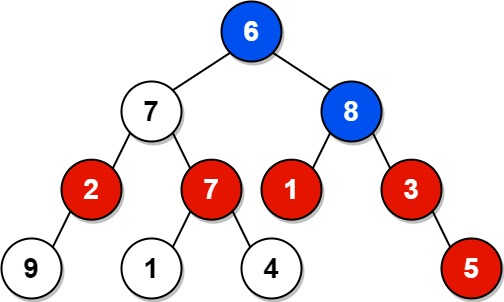

# 1315. Sum of Nodes with Even-Valued Grandparent

## Problem

Given the **root of a binary tree**, return the **sum of values of nodes whose grandparent has an even value**.

If there are **no nodes with an even-valued grandparent**, return **0**.

### Definition

A **grandparent** of a node is the **parent of its parent**, if it exists.

---

## Example 1



### Input

```
root = [6,7,8,2,7,1,3,9,null,1,4,null,null,null,5]
```

### Output

```
18
```

### Explanation

- The **blue nodes** represent nodes with **even values**.
- The **red nodes** represent nodes whose **grandparent is even-valued**.

The values of the red nodes are summed to produce the result.

---

## Example 2

### Input

```
root = [1]
```

### Output

```
0
```

### Explanation

There are no nodes with a grandparent in this tree, so the result is **0**.

---

## Constraints

```
1 ≤ number of nodes ≤ 10^4
1 ≤ Node.val ≤ 100
```
