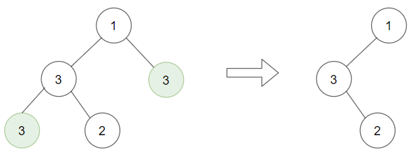
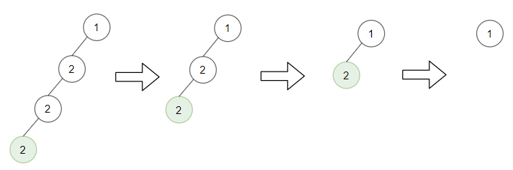

# 1325. Delete Leaves With a Given Value

## Problem

You are given:

- The **root of a binary tree**
- An integer **target**

Your task is to **delete all leaf nodes whose value equals the target**.

However, after deleting such a leaf node, its **parent may become a new leaf node**.
If that parent node also has value equal to **target**, it must also be deleted.

This process should **continue until no more deletions are possible**.

---

## Example 1


### Input

```
root = [1,2,3,2,null,2,4]
target = 2
```

### Output

```
[1,null,3,null,4]
```

### Explanation

1. First, remove leaf nodes with value `2`.
2. After removal, some parent nodes become new leaf nodes.
3. If these new leaf nodes also equal `2`, remove them as well.

This process repeats until no such leaf exists.

---

## Example 2



### Input

```
root = [1,3,3,3,2]
target = 3
```

### Output

```
[1,3,null,null,2]
```

---

## Example 3



### Input

```
root = [1,2,null,2,null,2]
target = 2
```

### Output

```
[1]
```

### Explanation

All leaf nodes with value `2` are removed repeatedly until only the root remains.

---

## Constraints

```
1 ≤ number of nodes ≤ 3000
1 ≤ Node.val ≤ 1000
1 ≤ target ≤ 1000
```
