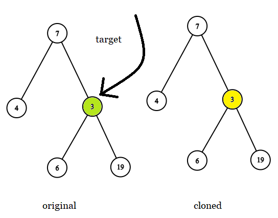

# 1379. Find a Corresponding Node of a Binary Tree in a Clone of That Tree

## Problem

You are given two binary trees:

- **original**
- **cloned**

The `cloned` tree is an **exact copy** of the `original` tree.

You are also given a **reference to a node `target` in the original tree**.

Your task is to **return the reference to the corresponding node in the cloned tree**.

### Important Constraints

- You **cannot modify** either tree.
- The returned node **must belong to the cloned tree**, not the original tree.

---

## Example 1



### Input

```
tree = [7,4,3,null,null,6,19]
target = 3
```

### Output

```
3
```

### Explanation

The node `3` exists in the original tree.

The corresponding node with the **same position** in the cloned tree should be returned.

---

## Example 2


### Input

```
tree = [7]
target = 7
```

### Output

```
7
```

---

## Example 3


### Input

```
tree = [8,null,6,null,5,null,4,null,3,null,2,null,1]
target = 4
```

### Output

```
4
```

---

## Constraints

```
1 <= number of nodes <= 10^4
All node values are unique
target is guaranteed to exist in the original tree
target is not null
```

---

## Follow-up

How would you solve the problem **if the tree allowed duplicate values**?
