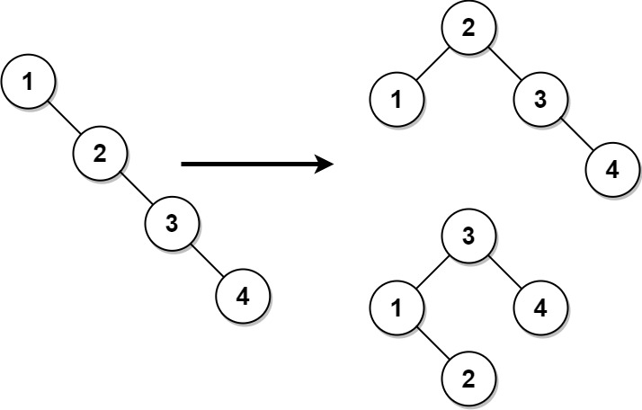

# Balance a Binary Search Tree

## Problem

Given the **root of a Binary Search Tree (BST)**, return a **balanced BST** containing the same node values.

If multiple valid balanced BSTs exist, you may return **any one of them**.

---

## Definition

A **Binary Search Tree** is balanced if:

```
For every node:
| height(left subtree) - height(right subtree) | ≤ 1
```

In other words, the depths of the left and right subtrees differ by **at most one** for every node.

---

## Example 1



### Input

```
root = [1,null,2,null,3,null,4,null,null]
```

### Output

```
[2,1,3,null,null,null,4]
```

### Explanation

The input tree is skewed:

```
1
 \
  2
   \
    3
     \
      4
```

A valid balanced tree could be:

```
    2
   / \\
  1   3
       \\
        4
```

Another valid balanced result is:

```
    3
   / \\
  1   4
   \\
    2
```

Both satisfy the balanced BST property.

---

## Example 2

### Input

```
root = [2,1,3]
```

### Output

```
[2,1,3]
```

### Explanation

The tree is already balanced, so it can be returned unchanged.

---

## Constraints

```
1 ≤ number of nodes ≤ 10^4
1 ≤ Node.val ≤ 10^5
```
