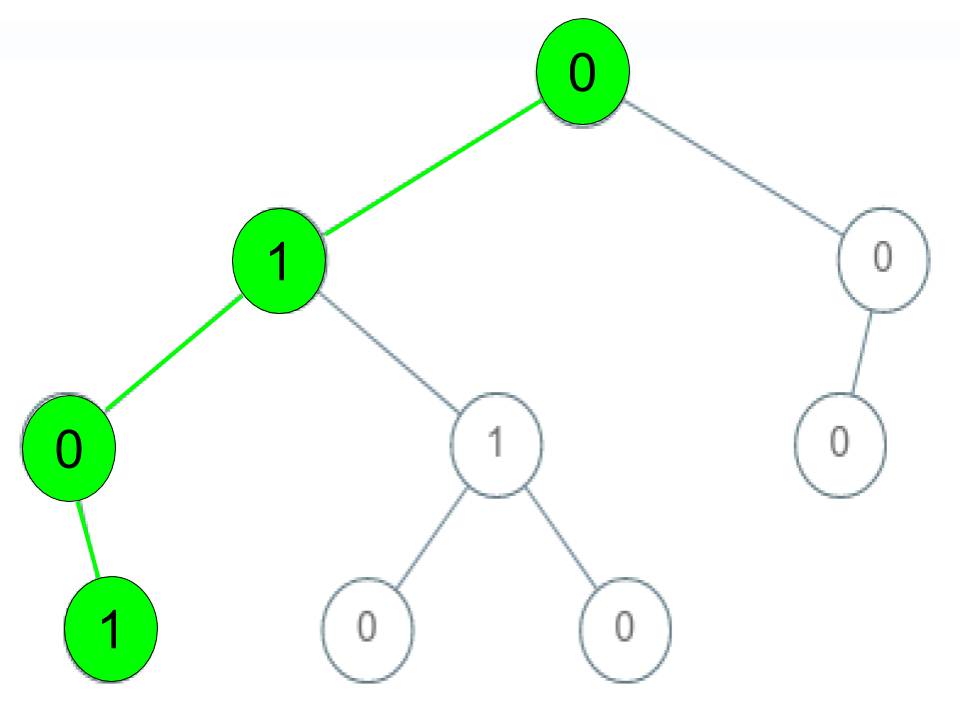
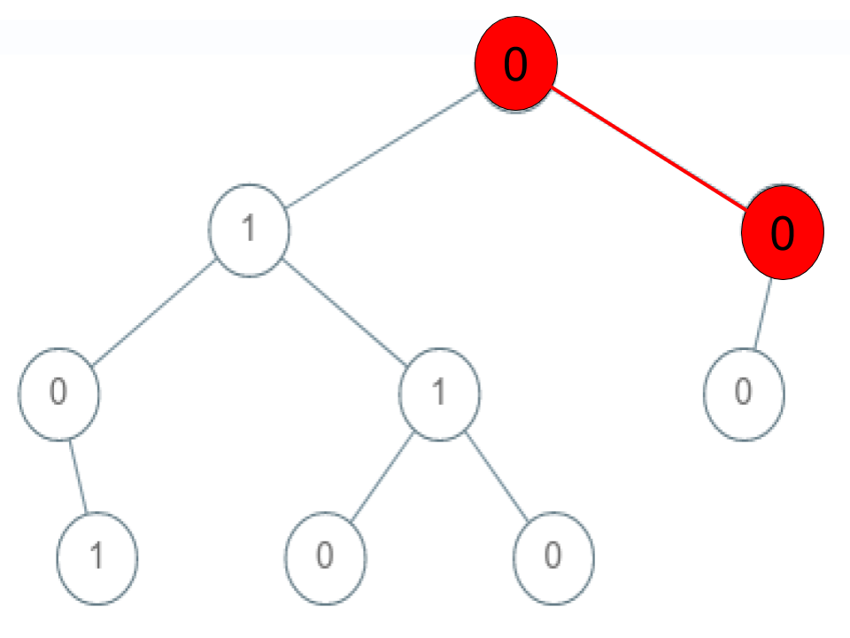
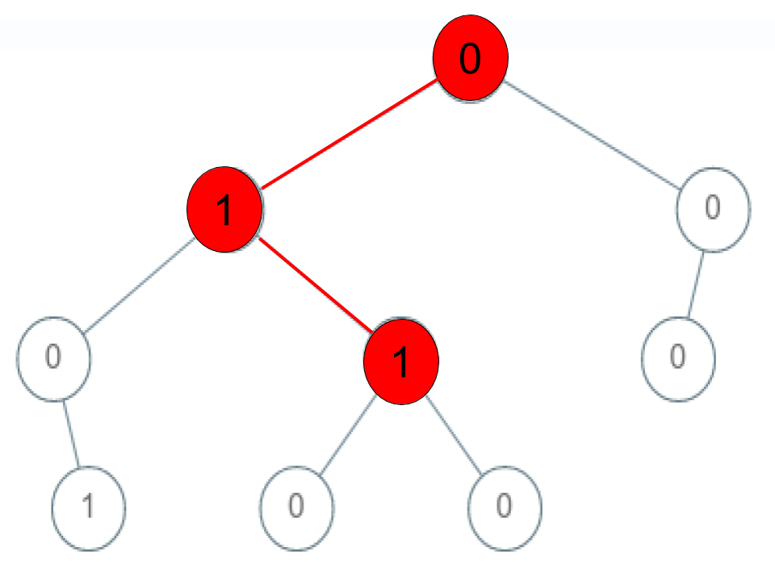

# 1430. Check If a String Is a Valid Sequence from Root to Leaves Path in a Binary Tree

## Problem

Given a **binary tree**, determine whether a given integer array `arr` forms a **valid root-to-leaf path**.

The array `arr` represents a sequence of node values.
We must check whether there exists a **path from the root to a leaf** such that:

```
node1 → node2 → node3 → ... → nodeN
```

matches exactly with:

```
arr[0], arr[1], arr[2], ..., arr[n-1]
```

A sequence is considered **valid** only if:

1. The path starts at the **root**
2. The path ends at a **leaf node**
3. The values match the array exactly

---

# Example 1



Input

```
root = [0,1,0,0,1,0,null,null,1,0,0]
arr = [0,1,0,1]
```

Output

```
true
```

Explanation

Valid path:

```
0 → 1 → 0 → 1
```

Other valid root-to-leaf sequences include:

```
0 → 1 → 1 → 0
0 → 0 → 0
```

---

# Example 2



Input

```
root = [0,1,0,0,1,0,null,null,1,0,0]
arr = [0,0,1]
```

Output

```
false
```

Explanation

The sequence:

```
0 → 0 → 1
```

does **not exist** in the tree.

---

# Example 3



Input

```
root = [0,1,0,0,1,0,null,null,1,0,0]
arr = [0,1,1]
```

Output

```
false
```

Explanation

Although the sequence:

```
0 → 1 → 1
```

exists in the tree, it **does not end at a leaf node**, so it is **not a valid root-to-leaf sequence**.

---

# Constraints

```
1 ≤ arr.length ≤ 5000
0 ≤ arr[i] ≤ 9
```

Additional guarantees:

- Node values range between **0 and 9**
- The tree may contain **multiple root-to-leaf paths**
