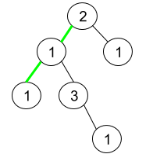

# 1457. Pseudo-Palindromic Paths in a Binary Tree

## Problem

You are given the **root of a binary tree** where each node value is a **digit from 1 to 9**.

A **path in the binary tree** is called **pseudo-palindromic** if **at least one permutation** of the node values in that path forms a **palindrome**.

Your task is to:

```
Return the number of pseudo-palindromic paths from the root to all leaf nodes.
```

---

# Definition

A **palindrome** is a sequence that reads the same **forward and backward**.

Examples:

```
[1,2,1]   → palindrome
[3,2,3]   → palindrome
[1,2,3]   → not a palindrome
```

A path is **pseudo-palindromic** if its values **can be rearranged** to form a palindrome.

---

# Example 1


### Input

```
root = [2,3,1,3,1,null,1]
```

### Output

```
2
```

### Explanation

There are three root → leaf paths:

```
[2,3,3]   (red path)
[2,1,1]   (green path)
[2,3,1]
```

Pseudo-palindromic paths:

```
[2,3,3] → rearranged → [3,2,3]
[2,1,1] → rearranged → [1,2,1]
```

Total:

```
2
```

---

# Example 2



### Input

```
root = [2,1,1,1,3,null,null,null,null,null,1]
```

### Output

```
1
```

### Explanation

Paths from root → leaf:

```
[2,1,1]
[2,1,3,1]
[2,1]
```

Only:

```
[2,1,1] → rearranged → [1,2,1]
```

is pseudo-palindromic.

---

# Example 3

### Input

```
root = [9]
```

### Output

```
1
```

### Explanation

Single node path:

```
[9]
```

A single element sequence is always a palindrome.

---

# Constraints

```
1 ≤ number of nodes ≤ 10^5
1 ≤ Node.val ≤ 9
```
