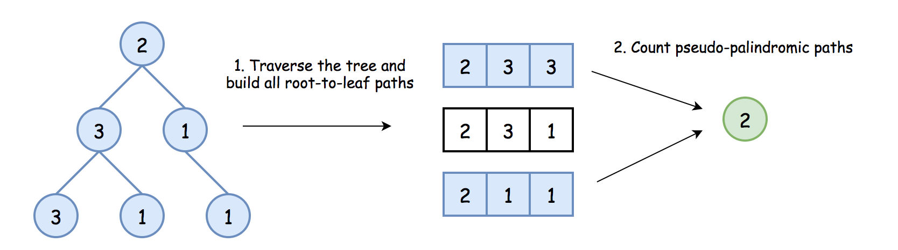
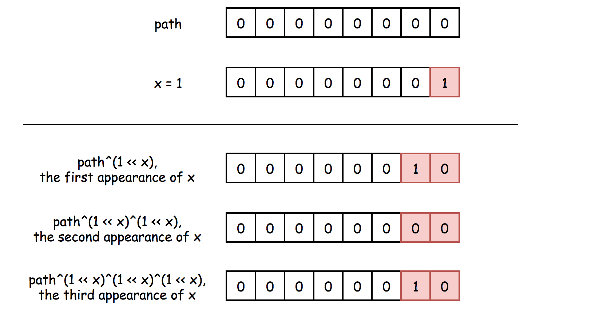
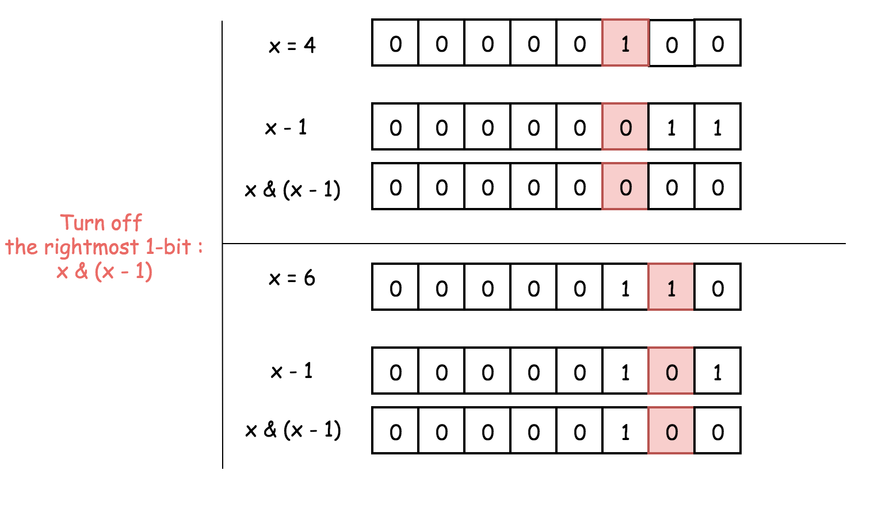

# Pseudo-Palindromic Paths in a Binary Tree — Approaches

## Overview

The problem can be broken into two main subproblems:

1. Traverse the tree to build all root-to-leaf paths.
2. For each root-to-leaf path, determine whether it is pseudo‑palindromic.



---

# Subproblem 1: Traversing Root-to-Leaf Paths

To enumerate root-to-leaf paths we use **Depth First Search (DFS)**.

DFS traversal orders include:

- Preorder
- Inorder
- Postorder

For root‑to‑leaf exploration we use **Preorder traversal**.

Traversal order:

```
Root → Left → Right
```

There are three ways to implement preorder traversal:

1. Iterative (using a stack)
2. Recursive
3. Morris traversal (advanced, constant space)

In this problem we focus on:

- Iterative DFS
- Recursive DFS

Both approaches require **O(H)** auxiliary space where **H = height of the tree**.


---

# Subproblem 2: Checking if a Path is Pseudo‑Palindromic

A path can be rearranged into a palindrome **if at most one digit appears an odd number of times**.

Example:

```
[2,3,3] → counts {2:1,3:2} → valid
[2,3,1] → counts {2:1,3:1,1:1} → invalid
```

---

# Straightforward Frequency Method

One approach is to store the path and count digit frequencies.

Example (Java):

```java
public boolean checkPalindrom(ArrayList<Integer> nums) {
    int isPalindrom = 0;

    for (int i = 1; i < 10; ++i) {
        if (Collections.frequency(nums, i) % 2 == 1) {
            ++isPalindrom;
            if (isPalindrom > 1) {
                return false;
            }
        }
    }
    return true;
}
```

However this approach requires storing entire paths which becomes expensive for large trees.

---

# Optimized Bitwise Method



Instead of storing frequencies, we maintain a **bitmask**.

Each bit represents whether a digit occurs **odd or even** times.

```
digit 1 → bit 1
digit 2 → bit 2
...
digit 9 → bit 9
```

Update rule:

```
path ^= (1 << node.val)
```

Meaning:

- If digit appears again → parity toggles.

Key property of XOR:

```
0 ^ 1 = 1
1 ^ 1 = 0
```

So the bit is **1 only if the digit occurs odd number of times**.

---

# Palindrome Check Using Bit Trick



A number has **at most one bit set** if:

```
x & (x - 1) == 0
```

This clears the rightmost set bit.

Example:

```
1000 & 0111 = 0000
```

Thus we check:

```java
if ((path & (path - 1)) == 0)
```

Meaning the path contains **at most one odd digit**.

---

# Approach 1: Iterative Preorder Traversal

## Intuition

Use a stack to simulate preorder DFS.

At each node:

1. Update bitmask.
2. If node is leaf → check palindrome condition.
3. Push children into stack.

---

## Algorithm

1. Initialize count = 0
2. Push `(root, pathMask)` into stack
3. While stack not empty:
   - Pop node
   - Update mask
   - If leaf → check palindrome condition
   - Push children
4. Return count

---

## Implementation

```java
class Solution {
    public int pseudoPalindromicPaths (TreeNode root) {
        int count = 0, path = 0;

        Deque<Pair<TreeNode, Integer>> stack = new ArrayDeque();
        stack.push(new Pair(root, 0));

        while (!stack.isEmpty()) {
            Pair<TreeNode, Integer> p = stack.pop();
            TreeNode node = p.getKey();
            path = p.getValue();

            if (node != null) {

                path = path ^ (1 << node.val);

                if (node.left == null && node.right == null) {
                    if ((path & (path - 1)) == 0) {
                        ++count;
                    }
                } else {
                    stack.push(new Pair(node.right, path));
                    stack.push(new Pair(node.left, path));
                }
            }
        }

        return count;
    }
}
```

---

## Complexity

Time Complexity

```
O(N)
```

Each node is visited exactly once.

Space Complexity

```
O(H)
```

Stack depth equals tree height.

---

# Approach 2: Recursive Preorder Traversal

## Intuition


Recursive DFS naturally follows preorder traversal.

At each node:

1. Update the path bitmask.
2. If leaf → validate palindrome condition.
3. Recurse left and right.

---

## Implementation

```java
class Solution {

    int count = 0;

    public void preorder(TreeNode node, int path) {
        if (node != null) {

            path = path ^ (1 << node.val);

            if (node.left == null && node.right == null) {
                if ((path & (path - 1)) == 0) {
                    ++count;
                }
            }

            preorder(node.left, path);
            preorder(node.right, path);
        }
    }

    public int pseudoPalindromicPaths(TreeNode root) {
        preorder(root, 0);
        return count;
    }
}
```

---

## Complexity

Time Complexity

```
O(N)
```

Each node is visited once.

Space Complexity

```
O(H)
```

Recursion stack depth equals tree height.

---

# Further Reading

This problem can also be solved using **Morris Traversal**, which achieves:

```
O(1) extra space
```

However Morris traversal is considerably more complex and rarely expected in interviews.
