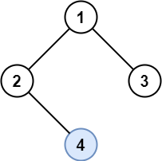
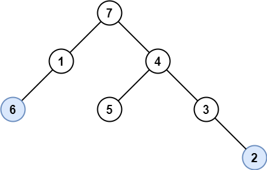
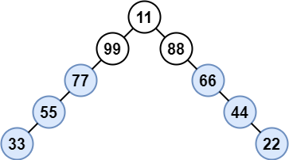

# 1469. Find All The Lonely Nodes

## Problem

In a binary tree, a **lonely node** is a node that is the **only child of its parent**.

The **root node is never lonely** because it does not have a parent.

Given the root of a binary tree, return an array containing the **values of all lonely nodes** in the tree.
The order of the returned list **does not matter**.

---

## Example 1



**Input**

```
root = [1,2,3,null,4]
```

**Output**

```
[4]
```

**Explanation**

- Node `4` is the only child of node `2`, so it is lonely.
- Node `1` is the root and cannot be lonely.
- Nodes `2` and `3` share the same parent, so they are not lonely.

---

## Example 2



**Input**

```
root = [7,1,4,6,null,5,3,null,null,null,null,null,2]
```

**Output**

```
[6,2]
```

**Explanation**

Nodes `6` and `2` are the only children of their respective parents.

The order of the result does not matter, so `[2,6]` is also valid.

---

## Example 3



**Input**

```
root = [11,99,88,77,null,null,66,55,null,null,44,33,null,null,22]
```

**Output**

```
[77,55,33,66,44,22]
```

**Explanation**

- Nodes `99` and `88` share the same parent and are not lonely.
- Node `11` is the root and cannot be lonely.
- All other nodes are lonely nodes.

---

## Constraints

```
1 <= number of nodes <= 1000
1 <= Node.val <= 10^6
```
