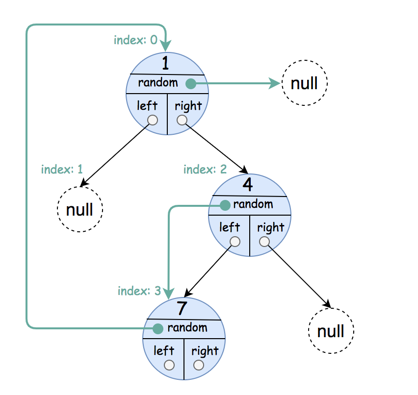
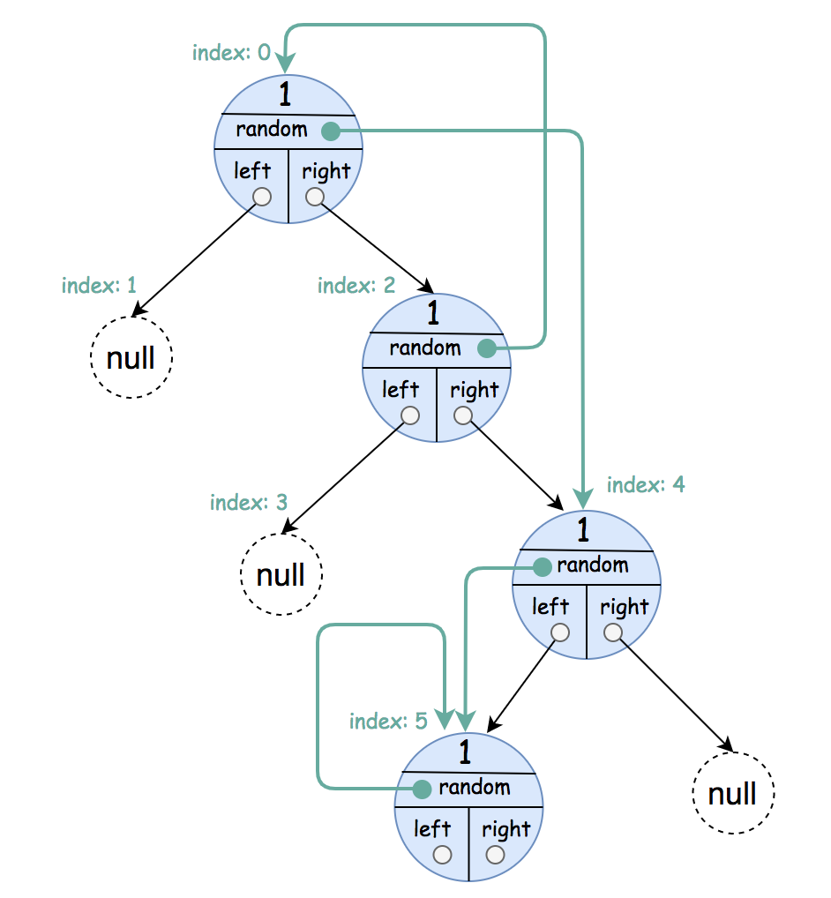
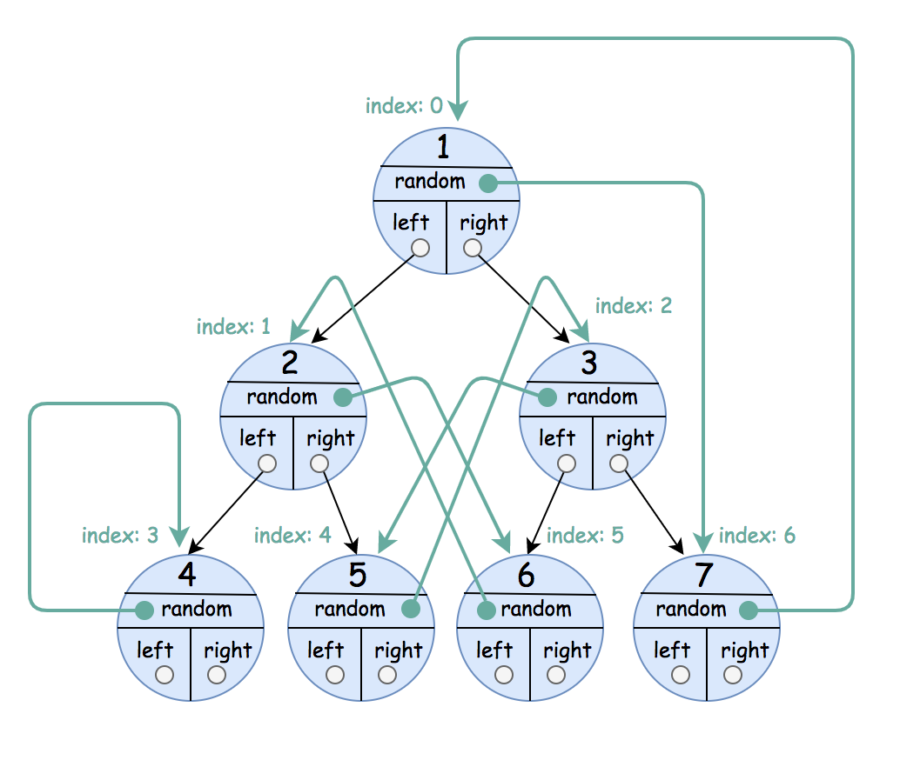

# 1485. Clone Binary Tree With Random Pointer

## Problem

A binary tree is given where each node contains:

- `left` pointer
- `right` pointer
- an additional **random pointer**

The **random pointer** may point to:

- any node in the tree, or
- `null`

Your task is to **create a deep copy of the entire tree**.

A deep copy means:

- A new tree must be created.
- Every node in the cloned tree must be a **new object**.
- All `left`, `right`, and `random` relationships must be preserved.

The cloned nodes must be returned using the class **NodeCopy**.

---

## Tree Representation

Each node is represented as:

```
[val, random_index]
```

Where:

- `val` → value of the node
- `random_index` → index of the node that the random pointer references
- `null` → if random pointer does not exist

---

# Example 1



Input

```
root = [[1,null],null,[4,3],[7,0]]
```

Output

```
[[1,null],null,[4,3],[7,0]]
```

Explanation

Original tree:

```
1
 \
  4
   \
    7
```

Random pointers:

```
1.random -> null
4.random -> 7
7.random -> 1
```

The cloned tree preserves the same relationships.

---

# Example 2



Input

```
root = [[1,4],null,[1,0],null,[1,5],[1,5]]
```

Output

```
[[1,4],null,[1,0],null,[1,5],[1,5]]
```

Explanation

Random pointers may also point **to the node itself**.

---

# Example 3



Input

```
root = [[1,6],[2,5],[3,4],[4,3],[5,2],[6,1],[7,0]]
```

Output

```
[[1,6],[2,5],[3,4],[4,3],[5,2],[6,1],[7,0]]
```

---

# Constraints

```
0 <= number of nodes <= 1000
1 <= Node.val <= 10^6
```
