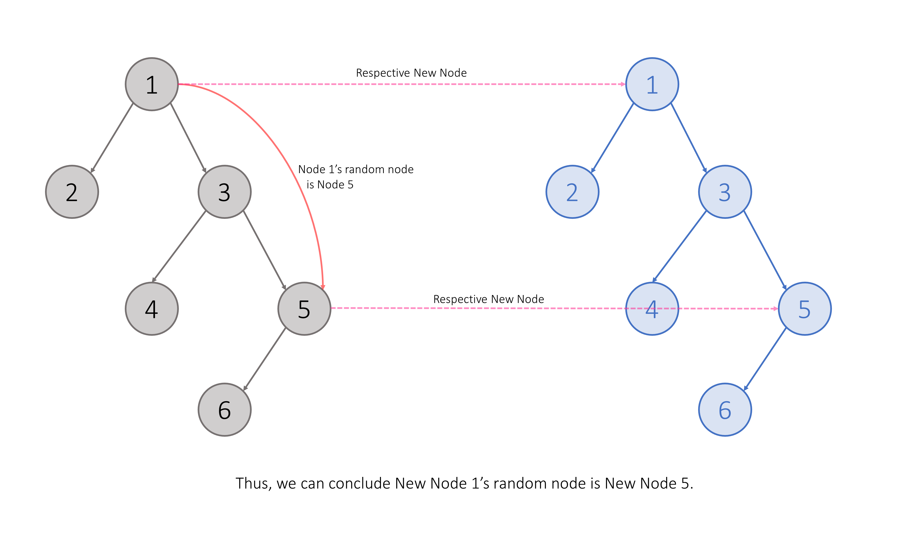
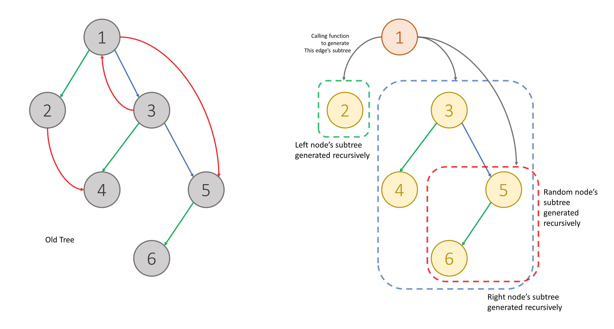

# 1485. Clone Binary Tree With Random Pointer

## Approach 1: Depth-First Search on Binary Tree (Two Passes)

### Intuition

First consider a simpler problem: cloning a normal binary tree with only `left` and `right` pointers.

To clone such a tree:

1. Traverse every node.
2. Create a new node for each visited node.
3. Recursively connect left and right children.

This can easily be done using **Depth-First Search (DFS)**.

DFS explores nodes as far as possible along a branch before backtracking. When we encounter a node, we recursively visit its neighbors (left and right children).

However, our tree also has a **random pointer**. If we simply copy the tree structure first, the random pointers are not yet connected.

To solve this, we use a **hash map** to store mappings between original nodes and their cloned counterparts.

```
oldNode -> newNode
```

Once this mapping exists, we can correctly connect random pointers:

```
A_old.random -> X_old
A_new.random -> X_new
```

Where:

```
X_new = map[X_old]
```

Thus the algorithm proceeds in two passes:

1. First pass: create cloned nodes and build the mapping.
2. Second pass: connect the random pointers using the mapping.



---

### Algorithm

1. Create a hashmap `newOldPairs` mapping old nodes to cloned nodes.
2. Perform DFS to clone the tree structure:
   - Create a new node.
   - Recursively clone left and right subtrees.
   - Store `(oldNode -> newNode)` in the hashmap.
3. Traverse the original tree again to assign random pointers:
   - Use the hashmap to find the cloned random node.
4. Return the cloned root.

---

### Java Implementation

```java
class Solution {
    private HashMap<Node, NodeCopy> newOldPairs = new HashMap<>();

    private NodeCopy deepCopy(Node root) {
        if (root == null) {
            return null;
        }

        NodeCopy newRoot = new NodeCopy(root.val);

        newRoot.left = deepCopy(root.left);
        newRoot.right = deepCopy(root.right);

        newOldPairs.put(root, newRoot);
        return newRoot;
    }

    private void mapRandomPointers(Node oldNode) {
        if (oldNode == null) {
            return;
        }

        NodeCopy newNode = newOldPairs.get(oldNode);
        NodeCopy newRandom = newOldPairs.get(oldNode.random);

        newNode.random = newRandom;

        mapRandomPointers(oldNode.left);
        mapRandomPointers(oldNode.right);
    }

    public NodeCopy copyRandomBinaryTree(Node root) {
        NodeCopy newRoot = deepCopy(root);
        mapRandomPointers(root);
        return newRoot;
    }
}
```

---

### Complexity Analysis

Let `n` be the number of nodes.

**Time Complexity:** `O(n)`
We traverse the tree twice.

**Space Complexity:** `O(n)`
Used by:

- HashMap storing node mappings
- Recursive call stack

---

# Approach 2: DFS on Graph (Single Pass)

### Intuition

We can treat the binary tree with random pointers as a **graph**.

Each node can have up to **three edges**:

```
left
right
random
```

Graph cloning problems are commonly solved using DFS.

If we encounter a node we already cloned, we simply return the stored clone instead of recreating it.

This prevents infinite loops and duplicate nodes.

Thus we maintain a hashmap:

```
oldNode -> clonedNode
```

During DFS:

1. If the node already exists in the hashmap → return the clone.
2. Otherwise:
   - create a new node
   - store mapping
   - recursively clone left, right, and random edges.

This clones the entire structure in **one traversal**.



---

### Algorithm

1. Create hashmap `seen` storing old nodes and cloned nodes.
2. Define DFS:
   - If node is null → return null.
   - If node already cloned → return stored clone.
3. Create new node.
4. Store mapping.
5. Recursively clone:
   - left
   - right
   - random
6. Return the new node.

---

### Java Implementation

```java
class Solution {
    private HashMap<Node, NodeCopy> seen = new HashMap<>();

    private NodeCopy dfs(Node root) {
        if (root == null) {
            return null;
        }

        if (seen.containsKey(root)) {
            return seen.get(root);
        }

        NodeCopy newRoot = new NodeCopy(root.val);

        seen.put(root, newRoot);

        newRoot.left = dfs(root.left);
        newRoot.right = dfs(root.right);
        newRoot.random = dfs(root.random);

        return newRoot;
    }

    public NodeCopy copyRandomBinaryTree(Node root) {
        return dfs(root);
    }
}
```

---

### Complexity Analysis

Let `n` be the number of nodes.

**Time Complexity:** `O(n)`

Each node and edge is visited once.

**Space Complexity:** `O(n)`

Due to:

- HashMap storing cloned nodes
- Recursion stack

---

# Approach 3: Breadth-First Search on Graph

### Intuition

Instead of DFS we can also traverse using **Breadth-First Search (BFS)**.

BFS explores nodes **level by level** using a queue.

We maintain the same hashmap mapping old nodes to cloned nodes.

When processing a node:

1. Create clones for unvisited neighbors.
2. Add neighbors to the queue.
3. Connect left, right, and random pointers.

This ensures every node is processed exactly once.

---

### Algorithm

1. Create hashmap `seen`.
2. Initialize queue with the root node.
3. Create clone of root and store mapping.
4. While queue is not empty:
   - Pop node.
   - Process left, right, random pointers.
   - If neighbor not cloned:
     - create clone
     - add to queue
5. Return clone of root.

---

### Java Implementation

```java
class Solution {
    private HashMap<Node, NodeCopy> seen = new HashMap<>();

    private NodeCopy bfs(Node root) {
        if (root == null) {
            return null;
        }

        Queue<Node> queue = new LinkedList<>();

        queue.add(root);
        seen.put(root, new NodeCopy(root.val));

        while (!queue.isEmpty()) {
            Node oldNode = queue.poll();
            NodeCopy newNode = seen.get(oldNode);

            if (oldNode.left != null) {
                if (!seen.containsKey(oldNode.left)) {
                    seen.put(oldNode.left, new NodeCopy(oldNode.left.val));
                    queue.add(oldNode.left);
                }
                newNode.left = seen.get(oldNode.left);
            }

            if (oldNode.right != null) {
                if (!seen.containsKey(oldNode.right)) {
                    seen.put(oldNode.right, new NodeCopy(oldNode.right.val));
                    queue.add(oldNode.right);
                }
                newNode.right = seen.get(oldNode.right);
            }

            if (oldNode.random != null) {
                if (!seen.containsKey(oldNode.random)) {
                    seen.put(oldNode.random, new NodeCopy(oldNode.random.val));
                    queue.add(oldNode.random);
                }
                newNode.random = seen.get(oldNode.random);
            }
        }

        return seen.get(root);
    }

    public NodeCopy copyRandomBinaryTree(Node root) {
        return bfs(root);
    }
}
```

---

### Complexity Analysis

Let `n` be the number of nodes.

**Time Complexity:** `O(n)`

Every node and edge is processed once.

**Space Complexity:** `O(n)`

Used by:

- HashMap storing cloned nodes
- BFS queue

---

# Key Insight

A tree with a **random pointer** behaves like a **graph** because:

- random pointers can form cycles
- random pointers can point anywhere

Thus cloning must avoid **duplicate copies** and **infinite loops**.

The standard technique is:

```
HashMap<OldNode, NewNode>
```

This guarantees each node is cloned exactly once.
