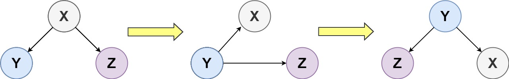
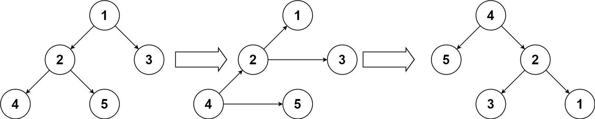

# 156. Binary Tree Upside Down

## Problem

Given the **root of a binary tree**, turn the tree **upside down** and return the **new root**.

The transformation follows these rules:

1. The **original left child becomes the new root**.
2. The **original root becomes the new right child**.
3. The **original right child becomes the new left child**.

These steps are applied **level by level**.



### Important Constraints

- Every **right node has a sibling** (a left node with the same parent).
- Every **right node has no children**.

---

# Examples

## Example 1



**Input**

```
root = [1,2,3,4,5]
```

**Output**

```
[4,5,2,null,null,3,1]
```

---

## Example 2

**Input**

```
root = []
```

**Output**

```
[]
```

---

## Example 3

**Input**

```
root = [1]
```

**Output**

```
[1]
```

---

## Constraints

- Number of nodes: **[0, 10]**
- Node values: **1 ≤ Node.val ≤ 10**
- Every right node has a **left sibling**
- Every right node has **no children**
