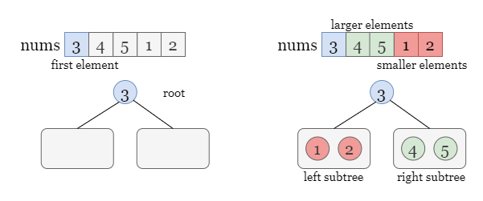
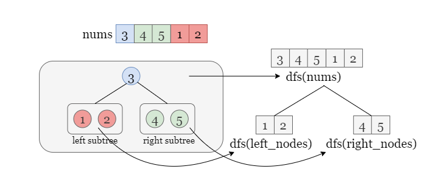
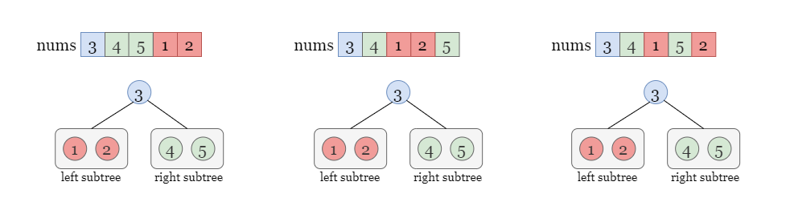
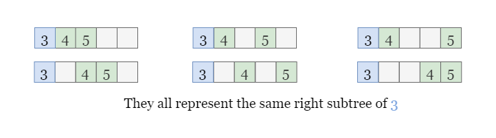
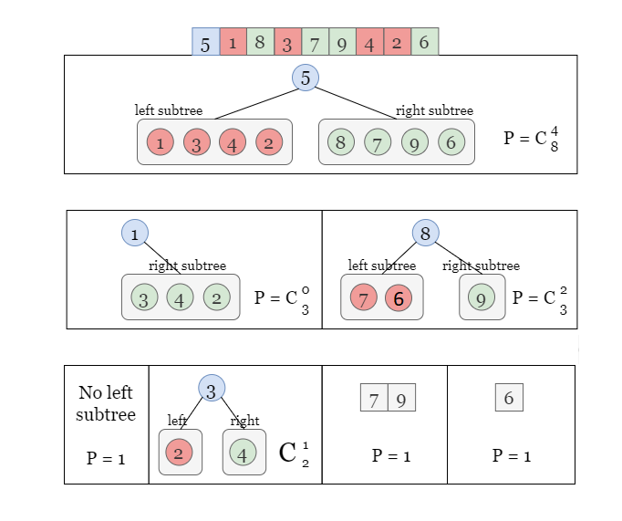

# 1569. Number of Ways to Reorder Array to Get Same BST — Recursion Approach

## Approach: Recursion

### Intuition



Several important observations help solve this problem.

1. **The first element of `nums` is always the root of the BST.**

2. In a **Binary Search Tree (BST)**:
   - All elements **smaller than the root** go to the **left subtree**
   - All elements **greater than the root** go to the **right subtree**

If we denote:

```
dfs(nums)
```

as the number of permutations of `nums` that produce the **same BST**, then:



```
nums[0] → root
nums[1:] → split into left and right subtree elements
```

Example:

```
nums = [3,4,5,1,2]

root = 3

left_nodes  = [1,2]
right_nodes = [4,5]
```



As long as the **relative order inside each subtree is preserved**, the BST structure remains identical.

Thus:

```
dfs(nums) = dfs(left_nodes) * dfs(right_nodes)
```

However, this does **not yet count different ways of interleaving left and right nodes**.



---

# Interleaving Left and Right Subtrees

Even if the relative order within the left and right subsequences stays the same, the **positions of these elements among themselves can change**.

Example:

```
left_nodes  = [1,2]
right_nodes = [4,5]
```

When inserting into `nums[1:]`, there are **multiple ways** to mix these nodes while preserving their internal order.

The number of such permutations equals the **binomial coefficient**:

```
C(n, k)
```

Where:

```
n = total remaining nodes
k = number of nodes in left subtree
```

Formula:

```
C(n, k) = n! / (k! * (n-k)!)
```

Thus the recurrence becomes:

```
dfs(nums) =
C(m-1, left_size) *
dfs(left_nodes) *
dfs(right_nodes)
```

Where:

```
m = size of nums
```



---

# Base Case

If the subtree size is:

```
m < 3
```

There is only **one possible permutation**, so:

```
dfs(nums) = 1
```

---

# Example Walkthrough

```
nums = [5,1,8,3,7,9,4,2,6]
```

Split into:

```
left  = [1,3,4,2]
right = [8,7,9,6]
```

Number of ways to interleave:

```
C(8,4)
```

Then recursively compute:

```
dfs([1,3,4,2])
dfs([8,7,9,6])
```

Continue recursively until reaching base cases.

Final result:

```
answer =
C(8,4) *
C(3,0) *
C(3,2) *
C(2,1) *
1 * 1 * 1
```

Finally:

```
(answer - 1) % (10^9 + 7)
```

We subtract **1** because the **original array ordering should not be counted**.

---

# Algorithm

1. Precompute **Pascal's Triangle** to obtain binomial coefficients.

2. Define recursive function:

```
dfs(nums)
```

3. Base case:

```
if size < 3 → return 1
```

4. Partition the array:

```
left_nodes  = elements < root
right_nodes = elements > root
```

5. Compute recursively:

```
dfs(left_nodes)
dfs(right_nodes)
```

6. Combine results:

```
C(m-1, left_size) * dfs(left_nodes) * dfs(right_nodes)
```

7. Return:

```
(numOfWays - 1) % MOD
```

---

# Java Implementation

```java
class Solution {
    private long mod = (long)1e9 + 7;
    private long[][] table;

    public int numOfWays(int[] nums) {
        int m = nums.length;

        table = new long[m][m];

        for (int i = 0; i < m; ++i) {
            table[i][0] = table[i][i] = 1;
        }

        for (int i = 2; i < m; i++) {
            for (int j = 1; j < i; j++) {
                table[i][j] =
                    (table[i - 1][j - 1] + table[i - 1][j]) % mod;
            }
        }

        List<Integer> arrList =
            Arrays.stream(nums).boxed().collect(Collectors.toList());

        return (int)((dfs(arrList) - 1) % mod);
    }

    private long dfs(List<Integer> nums) {

        int m = nums.size();

        if (m < 3) {
            return 1;
        }

        List<Integer> leftNodes = new ArrayList<>();
        List<Integer> rightNodes = new ArrayList<>();

        for (int i = 1; i < m; ++i) {

            if (nums.get(i) < nums.get(0)) {
                leftNodes.add(nums.get(i));
            } else {
                rightNodes.add(nums.get(i));
            }
        }

        long leftWays = dfs(leftNodes) % mod;
        long rightWays = dfs(rightNodes) % mod;

        return (((leftWays * rightWays) % mod)
                * table[m - 1][leftNodes.size()]) % mod;
    }
}
```

---

# Complexity Analysis

Let **m = nums.length**

### Time Complexity

```
O(m²)
```

Reasons:

- Pascal triangle construction → `O(m²)`
- Recursive DFS splits arrays and processes nodes
- Each level performs `O(m)` work

---

### Space Complexity

```
O(m²)  (Pascal triangle)
or
O(m)   (recursion stack in worst case)
```

Worst case occurs when the BST becomes **skewed**, producing recursion depth **m**.
