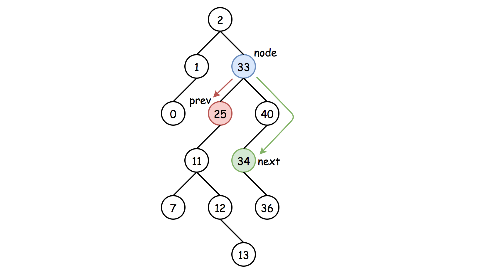
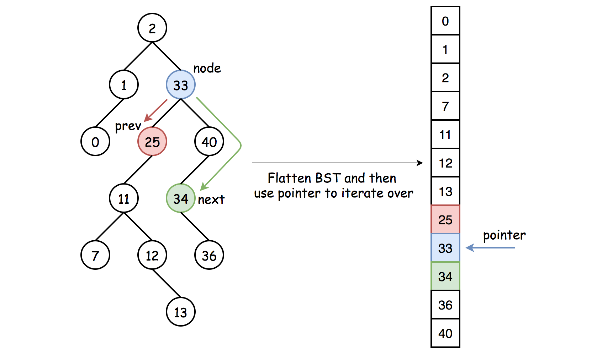
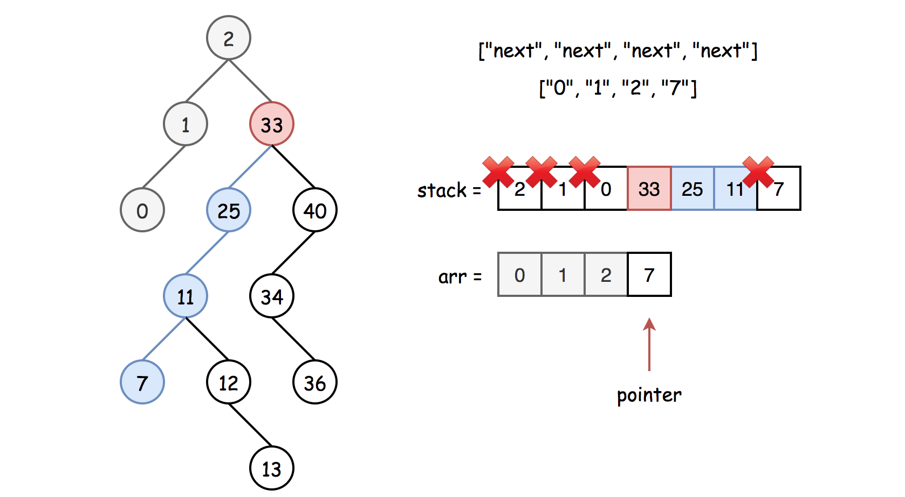
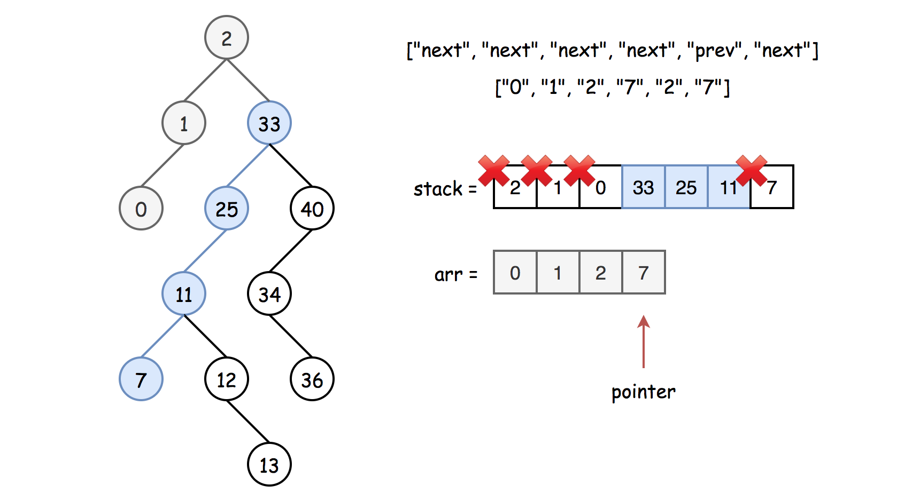

# 1586. Binary Search Tree Iterator II — Detailed Approaches

## Overview

The problem asks us to implement a **bidirectional iterator** over the **in-order traversal of a Binary Search Tree (BST)**.

An iterator allows traversal of a container without exposing the internal structure of the container.

For this problem, the iterator must support:

- Moving **forward** using `next()`
- Moving **backward** using `prev()`

And we must efficiently implement:

```
hasNext()
next()
hasPrev()
prev()
```

### Requirements for Iterators

Two important goals when designing iterators:

1. **Constant time operations** for `next()` and `prev()` (or amortized constant time).
2. **Lightweight initialization**, meaning the constructor should avoid expensive operations if possible.



---

## Key BST Property

A Binary Search Tree has an important property:

```
Inorder traversal of BST → sorted values (ascending order)
```

Thus the iterator should traverse nodes in **in-order sequence**.

```
Left → Node → Right
```

So the next element is:

```
smallest element greater than current
```

And prev element is:

```
largest element smaller than current
```

---

# Approach 1: Flatten the BST (Recursive Inorder Traversal)

## Idea

The simplest approach is to:

1. Perform **inorder traversal** of the tree.
2. Store all node values in an array.
3. Use a pointer to move forward/backward.

This ensures:

```
next() → move pointer forward
prev() → move pointer backward
```

### Drawback

The constructor must traverse the **entire tree**, which costs:

```
O(N) time
```



---

## Algorithm

### Constructor

1. Perform recursive inorder traversal.
2. Store values in `arr`.
3. Initialize:

```
pointer = -1
n = arr.size()
```

---

### hasNext()

```
return pointer < n - 1
```

---

### next()

```
pointer++
return arr[pointer]
```

---

### hasPrev()

```
return pointer > 0
```

---

### prev()

```
pointer--
return arr[pointer]
```

---

## Java Implementation

```java
class BSTIterator {

    List<Integer> arr = new ArrayList<>();
    int pointer;
    int n;

    public void inorder(TreeNode r, List<Integer> arr) {
        if (r == null) return;

        inorder(r.left, arr);
        arr.add(r.val);
        inorder(r.right, arr);
    }

    public BSTIterator(TreeNode root) {
        inorder(root, arr);
        n = arr.size();
        pointer = -1;
    }

    public boolean hasNext() {
        return pointer < n - 1;
    }

    public int next() {
        ++pointer;
        return arr.get(pointer);
    }

    public boolean hasPrev() {
        return pointer > 0;
    }

    public int prev() {
        --pointer;
        return arr.get(pointer);
    }
}
```

---

## Complexity Analysis

Let **N** be the number of nodes.

**Time Complexity**

```
Constructor → O(N)
hasNext → O(1)
next → O(1)
hasPrev → O(1)
prev → O(1)
```

**Space Complexity**

```
O(N)
```

because the inorder traversal array stores all nodes.

---

# Approach 2: Follow-up — Lazy Iterative Inorder Traversal

## Motivation

Approach 1 performs expensive work during initialization.

In many real systems, iterator initialization should be **O(1)**.

Instead of flattening the whole tree, we generate elements **only when needed**.

This is called **lazy traversal**.



---

## Key Idea

Use **iterative inorder traversal** with a stack.

Maintain:

```
stack → traversal helper
arr → already visited nodes
last → next subtree root to explore
pointer → current iterator position
```

We only compute nodes when `next()` moves beyond the precomputed area.



---

## Worst Case Scenario

When `next()` is called and no nodes are precomputed:

We must traverse the **leftmost subtree**.

Worst-case cost:

```
O(N)
```

But this happens **only once per node**.

Thus the **amortized complexity becomes O(1)**.

---

## Algorithm

### Constructor

```
last = root
stack = empty
arr = empty
pointer = -1
```

---

### hasNext()

Return true if:

```
last != null
OR stack not empty
OR pointer < arr.size() - 1
```

---

### next()

1. Move pointer forward:

```
pointer++
```

2. If pointer is outside computed range:

Traverse left subtree:

```
while last != null:
    push last into stack
    last = last.left
```

3. Pop node

```
curr = stack.pop()
```

4. Save node

```
arr.add(curr.val)
```

5. Move right

```
last = curr.right
```

6. Return `arr[pointer]`

---

### hasPrev()

```
return pointer > 0
```

---

### prev()

```
pointer--
return arr[pointer]
```

---

## Java Implementation

```java
class BSTIterator {

    Deque<TreeNode> stack;
    List<Integer> arr;
    TreeNode last;
    int pointer;

    public BSTIterator(TreeNode root) {
        last = root;
        stack = new ArrayDeque<>();
        arr = new ArrayList<>();
        pointer = -1;
    }

    public boolean hasNext() {
        return !stack.isEmpty() || last != null || pointer < arr.size() - 1;
    }

    public int next() {
        ++pointer;

        if (pointer == arr.size()) {

            while (last != null) {
                stack.push(last);
                last = last.left;
            }

            TreeNode curr = stack.pop();
            last = curr.right;

            arr.add(curr.val);
        }

        return arr.get(pointer);
    }

    public boolean hasPrev() {
        return pointer > 0;
    }

    public int prev() {
        --pointer;
        return arr.get(pointer);
    }
}
```

---

## Complexity Analysis

### Time Complexity

```
Constructor → O(1)
hasNext → O(1)
hasPrev → O(1)
prev → O(1)
next → O(N) worst-case
```

However:

```
Amortized next() = O(1)
```

because each node is processed only once.

---

### Space Complexity

```
O(N)
```

Components:

```
arr → stores visited nodes (≤ N)
stack → up to tree height H
```

---

# Key Insight

BST iterator is essentially **controlled inorder traversal**.

Two main strategies exist:

### Strategy 1

```
Precompute entire traversal
Fast operations
Slow initialization
```

### Strategy 2

```
Lazy traversal
Fast initialization
Amortized operations
```

Approach 2 is the **preferred interview solution** because it satisfies the follow-up requirement.
