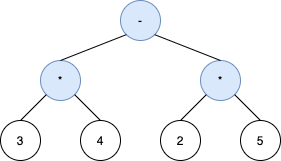
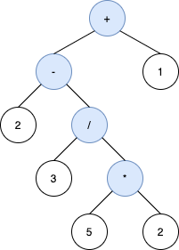

# 1597. Build Binary Expression Tree From Infix Expression

## Problem

A **binary expression tree** is a binary tree used to represent arithmetic expressions.

### Node Rules

Each node has either:

- **0 children** → operand (number)
- **2 children** → operator

Operators allowed:

```
+  addition
-  subtraction
*  multiplication
/  division
```

For an internal node with operator `o`, the expression it represents is:

```
(A o B)
```

Where:

- `A` = expression represented by the left subtree
- `B` = expression represented by the right subtree

---

# Input

You are given a string `s` representing an **infix expression**.

The expression may contain:

```
digits (0-9)
+  -  *  /
( )
```

You must construct **any valid binary expression tree** whose:

```
inorder traversal == s (ignoring parentheses)
```

The tree must also **respect operator precedence**:

```
1. Parentheses
2. Multiplication / Division
3. Addition / Subtraction
```

Operands must appear **in the same order** as in `s`.

---

# Example 1



### Input

```
s = "3*4-2*5"
```

### Output

```
[-,*,*,3,4,2,5]
```

### Explanation

The only valid expression tree is:

```
        -
       / \
      *   *
     / \ / \
    3  4 2  5
```

Inorder traversal:

```
3*4-2*5
```

---

# Example 2



### Input

```
s = "2-3/(5*2)+1"
```

### Output

```
[+,-,1,2,/,null,null,null,null,3,*,null,null,5,2]
```

### Explanation

One valid tree:

```
        +
       / \
      -   1
     / \
    2   /
       / \
      3   *
         / \
        5   2
```

Inorder traversal:

```
2-3/5*2+1
```

Parentheses are omitted but operator precedence ensures the expression evaluates correctly.

---

# Example 3

### Input

```
s = "1+2+3+4+5"
```

### Output

```
[+,+,5,+,4,null,null,+,3,null,null,1,2]
```

Many valid trees exist because addition is associative.

---

# Constraints

```
1 <= s.length <= 100
```

The string contains:

```
digits
( )
+ - * /
```

Additional guarantees:

- Operands are **single-digit numbers**
- The expression `s` is **always valid**
