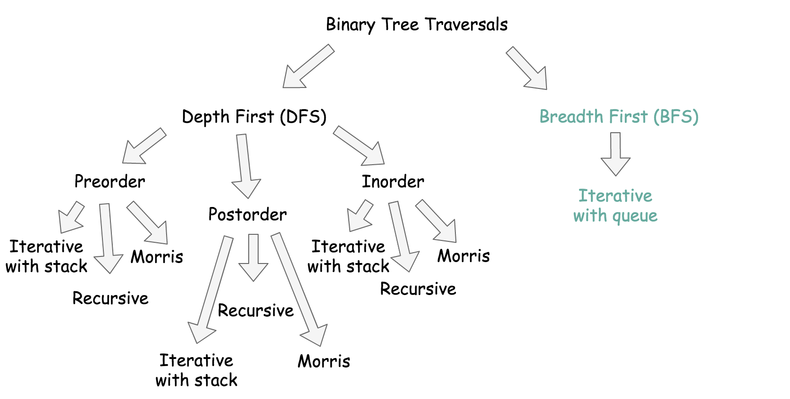
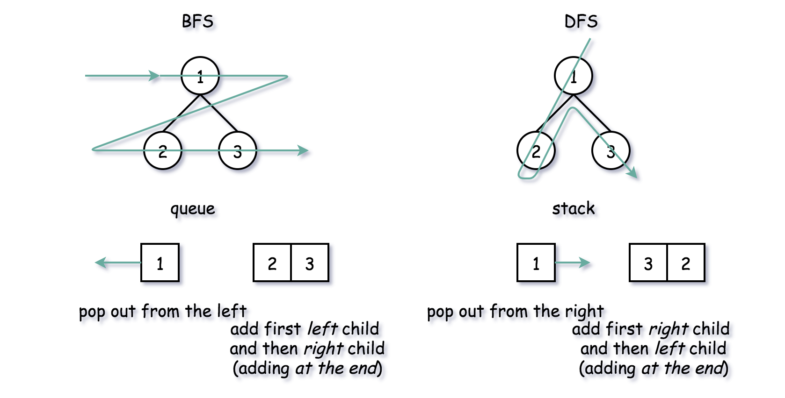
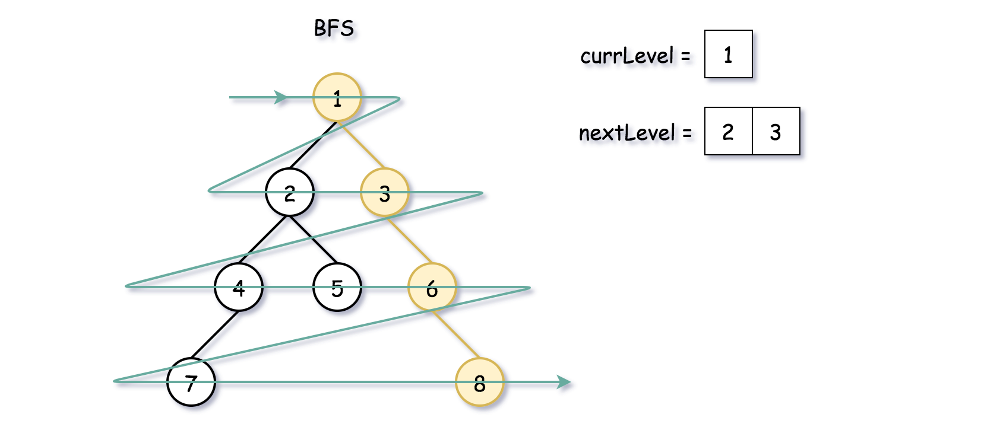
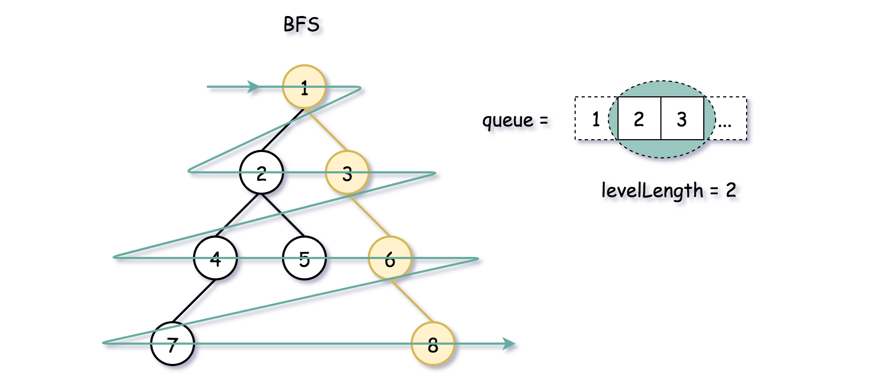

# 1602. Find Nearest Right Node in Binary Tree — Approaches

## Overview

There are two main ways to traverse a binary tree:

- **DFS (Depth First Search)**
- **BFS (Breadth First Search)**

### DFS vs BFS

**DFS**

- Traverses down to leaves first
- Typical traversals: preorder, inorder, postorder

**BFS**

- Traverses **level by level**
- Uses a queue

For this problem, we must find the **nearest node on the same level to the right of `u`**, therefore **BFS is the most natural solution**.




### Complexity Comparison

| Method | Time Complexity | Space Complexity |
| ------ | --------------- | ---------------- |
| DFS    | O(N)            | O(H)             |
| BFS    | O(N)            | O(D)             |

Where:

- **N** = number of nodes
- **H** = tree height
- **D** = tree diameter (max nodes at a level)

Worst case for both is **O(N)**.

---

# Approach 1: BFS Using Two Queues

## Idea

Use two queues:

- `currLevel`
- `nextLevel`

We process nodes of the current level and push children into the next level.

When we encounter node `u`, the next node in the queue is the answer.



---

## Algorithm

1. Initialize `nextLevel` with the root.
2. While `nextLevel` is not empty:
3. Move it into `currLevel`.
4. Clear `nextLevel`.
5. Process nodes in `currLevel`.
6. If node equals `u`, return next node in queue.
7. Push children into `nextLevel`.



---

## Java Implementation

```java
class Solution {
    public TreeNode findNearestRightNode(TreeNode root, TreeNode u) {
        if (root == null) return null;

        ArrayDeque<TreeNode> nextLevel = new ArrayDeque() {{ offer(root); }};
        ArrayDeque<TreeNode> currLevel = new ArrayDeque();

        TreeNode node = null;
        while (!nextLevel.isEmpty()) {
            currLevel = nextLevel.clone();
            nextLevel.clear();

            while (!currLevel.isEmpty()) {
                node = currLevel.poll();

                if (node == u)
                    return currLevel.poll();

                if (node.left != null)
                    nextLevel.offer(node.left);
                if (node.right != null)
                    nextLevel.offer(node.right);
            }
        }
        return null;
    }
}
```

### Complexity

Time: **O(N)**
Space: **O(D)**

---

# Approach 2: BFS Using Sentinel

## Idea

Use **one queue** and a **sentinel (`null`)** to mark level boundaries.

Queue structure example:

```
[ root , null ]
```

When `null` appears → level ended.


---

## Algorithm

1. Push `root` and `null` sentinel.
2. While queue not empty:
3. Pop node.
4. If node equals `u`, return next element.
5. If node is not null, push children.
6. If node is null → push another sentinel.

---

## Java Implementation

```java
class Solution {
    public TreeNode findNearestRightNode(TreeNode root, TreeNode u) {
        if (root == null) return null;

        Queue<TreeNode> queue = new LinkedList(){{ offer(root); offer(null); }};
        TreeNode curr = null;

        while (!queue.isEmpty()) {
            curr = queue.poll();

            if (curr != null) {

                if (curr == u)
                    return queue.poll();

                if (curr.left != null) queue.offer(curr.left);
                if (curr.right != null) queue.offer(curr.right);

            } else {

                if (!queue.isEmpty())
                    queue.offer(null);
            }
        }
        return null;
    }
}
```

### Complexity

Time: **O(N)**
Space: **O(D)**

---

# Approach 3: BFS Using Level Size

## Idea

Instead of a sentinel, record **size of current level**.

This is often the **cleanest BFS solution**.



---

## Algorithm

1. Push root into queue.
2. While queue not empty:
3. Record level size.
4. Process nodes in that level.
5. If node equals `u`:
   - If last in level → return null
   - Else return next queue node.

---

## Java Implementation

```java
class Solution {
    public TreeNode findNearestRightNode(TreeNode root, TreeNode u) {
        if (root == null) return null;

        Queue<TreeNode> queue = new LinkedList<>();
        queue.offer(root);

        while (!queue.isEmpty()) {

            int levelSize = queue.size();

            for (int i = 0; i < levelSize; i++) {

                TreeNode curr = queue.poll();

                if (curr == u) {

                    if (i == levelSize - 1)
                        return null;
                    else
                        return queue.poll();
                }

                if (curr.left != null)
                    queue.offer(curr.left);

                if (curr.right != null)
                    queue.offer(curr.right);
            }
        }

        return null;
    }
}
```

### Complexity

Time: **O(N)**
Space: **O(D)**

---

# Approach 4: DFS (Preorder Traversal)

Although BFS is more natural, DFS can also solve this.

### Idea

1. Record depth of node `u`
2. Continue traversal
3. First node encountered at same depth **after `u`** is the answer

---

## Java Implementation

```java
class Solution {

    private int uDepth;
    private TreeNode nextNode, targetNode;

    public TreeNode findNearestRightNode(TreeNode root, TreeNode u) {
        uDepth = -1;
        targetNode = u;
        nextNode = null;

        dfs(root, 0);

        return nextNode;
    }

    public void dfs(TreeNode currNode, int depth) {

        if (currNode == targetNode) {
            uDepth = depth;
            return;
        }

        if (depth == uDepth) {
            if (nextNode == null)
                nextNode = currNode;
            return;
        }

        if (currNode.left != null)
            dfs(currNode.left, depth + 1);

        if (currNode.right != null)
            dfs(currNode.right, depth + 1);
    }
}
```

### Complexity

Time: **O(N)**
Space: **O(H)**

Where:

- **H** = tree height

Worst case (skewed tree): **O(N)**

---

# Key Interview Insight

Best solution to explain:

**BFS with level size (Approach 3)**

Reasons:

- Clean implementation
- Natural level traversal
- No extra sentinel
- Standard interview pattern
