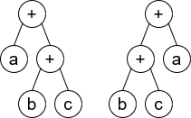
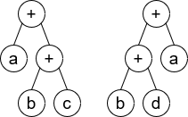

# 1612. Check If Two Expression Trees are Equivalent

## Problem

A **binary expression tree** represents arithmetic expressions.

Properties:

- Each node has **either 0 or 2 children**.
- **Leaf nodes** represent operands (variables).
- **Internal nodes** represent operators.

In this problem, the **only operator is `+` (addition)**.

You are given the roots of two binary expression trees:

- `root1`
- `root2`

Return **true** if the two expression trees are **equivalent**.

Two expression trees are considered **equivalent** if they evaluate to the **same value regardless of what values variables take**.

---

## Example 1

**Input**

```
root1 = [x]
root2 = [x]
```

**Output**

```
true
```

---

## Example 2



**Input**

```
root1 = [+,a,+,null,null,b,c]
root2 = [+,+,a,b,c]
```

**Output**

```
true
```

**Explanation**

```
a + (b + c) == (b + c) + a
```

Addition is **commutative**, so both trees represent the same expression.

---

## Example 3



**Input**

```
root1 = [+,a,+,null,null,b,c]
root2 = [+,+,a,b,d]
```

**Output**

```
false
```

**Explanation**

```
a + (b + c) ≠ (b + d) + a
```

The variable sets differ.

---

## Constraints

```
1 <= number of nodes <= 4999
Number of nodes is odd
Node.val is '+' or a lowercase English letter
```

Additional guarantees:

- Both trees contain the **same number of nodes**
- Trees are **valid binary expression trees**
- Only the **`+` operator** appears

---

## Follow-up

How would the solution change if the tree also supported the **`-` (subtraction)** operator?

Subtraction introduces **order sensitivity**, because:

```
a - b ≠ b - a
```

Therefore, the approach would need to **preserve operand order**, unlike addition which is commutative.
