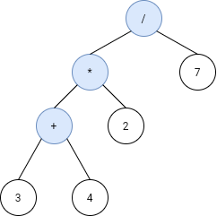
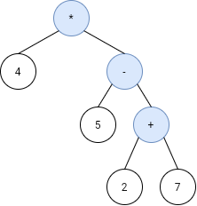

# 1628. Design an Expression Tree With Evaluate Function

## Problem

Given the **postfix tokens** of an arithmetic expression, build and return the **binary expression tree** that represents this expression.

**Postfix notation** is a notation for writing arithmetic expressions in which the operands (numbers) appear before their operators.

Example:

Expression:

4 \* (5 - (7 + 2))

Postfix tokens:

```
["4","5","7","2","+","-","*"]
```

The class **Node** is an interface used to implement the binary expression tree.

The returned tree will be tested using the **evaluate()** function, which should evaluate the tree’s value.

You **must not remove the Node class**, but you may modify it and create additional classes if needed.

---

# Binary Expression Tree

A **binary expression tree** represents arithmetic expressions.

Rules:

- Each node has **either 0 or 2 children**
- **Leaf nodes** represent operands (numbers)
- **Internal nodes** represent operators

Supported operators:

```
+  addition
-  subtraction
*  multiplication
/  division
```

---

# Example 1



Input

```
s = ["3","4","+","2","*","7","/"]
```

Output

```
2
```

Explanation

The tree represents:

```
((3 + 4) * 2) / 7
```

Evaluation:

```
3 + 4 = 7
7 * 2 = 14
14 / 7 = 2
```

---

# Example 2



Input

```
s = ["4","5","2","7","+","-","*"]
```

Output

```
-16
```

Explanation

The expression:

```
4 * (5 - (2 + 7))
```

Evaluation:

```
2 + 7 = 9
5 - 9 = -4
4 * -4 = -16
```

---

# Constraints

```
1 <= s.length < 100
s.length is odd
```

Other guarantees:

- `s` contains **numbers or operators**
- operators are `+`, `-`, `*`, `/`
- numbers are ≤ 10^5
- expression is always valid
- intermediate values ≤ 10^9
- **division by zero will never occur**

---

# Follow-up

Could you design the expression tree such that it is **more modular**?

For example:

- Add new operators without modifying the existing `evaluate()` implementation.
