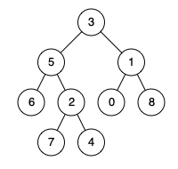

# 1650. Lowest Common Ancestor of a Binary Tree III

## Problem

Given two nodes `p` and `q` of a binary tree, return their **lowest common ancestor (LCA)**.

Each node contains a reference to its **parent node**.

### Node Definition

```java
class Node {
    public int val;
    public Node left;
    public Node right;
    public Node parent;
}
```

---

## Definition of LCA

According to the definition of **Lowest Common Ancestor (LCA)**:

> The lowest common ancestor of two nodes `p` and `q` in a tree `T` is the **lowest node that has both `p` and `q` as descendants** (where we allow a node to be a descendant of itself).

---

# Example 1



Input

```
root = [3,5,1,6,2,0,8,null,null,7,4]
p = 5
q = 1
```

Output

```
3
```

Explanation

The lowest common ancestor of nodes **5** and **1** is **3**.

---

# Example 2


Input

```
root = [3,5,1,6,2,0,8,null,null,7,4]
p = 5
q = 4
```

Output

```
5
```

Explanation

Node **5** is an ancestor of **4**, so the LCA is **5**.

A node can be a **descendant of itself** according to the LCA definition.

---

# Example 3

Input

```
root = [1,2]
p = 1
q = 2
```

Output

```
1
```

---

# Constraints

```
2 <= number of nodes <= 10^5
-10^9 <= Node.val <= 10^9
```

Additional guarantees:

- All node values are **unique**
- `p != q`
- Both `p` and `q` **exist in the tree**
