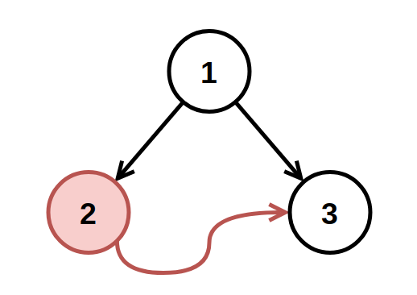
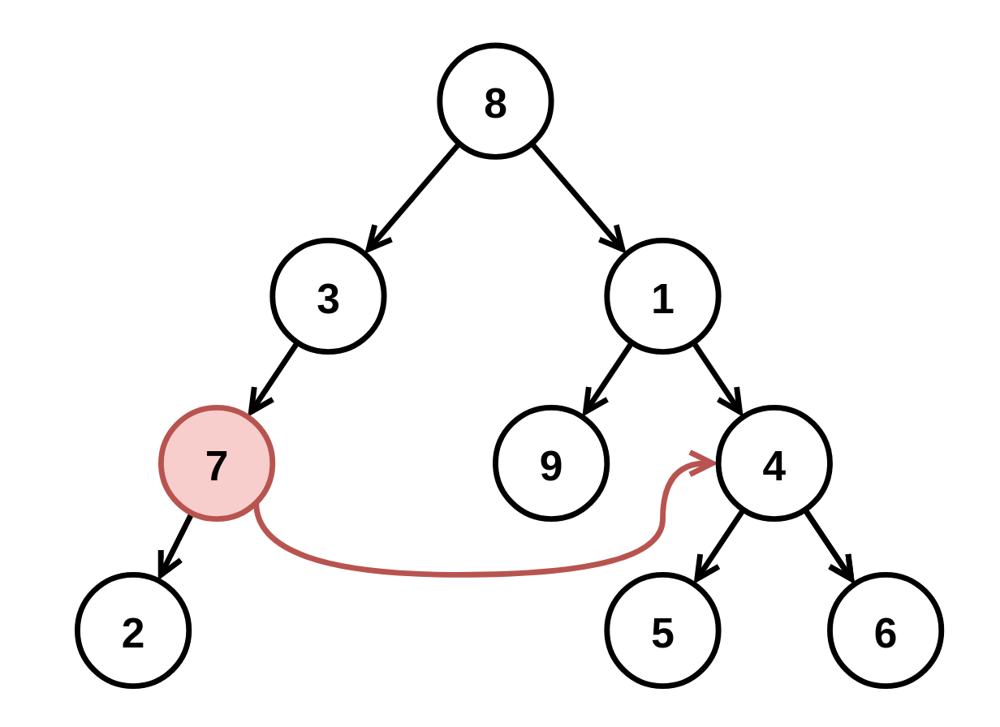

# 1660. Correct a Binary Tree

## Problem

You are given a **binary tree** with a small defect.

There exists **exactly one invalid node** where:

- Its **right child pointer incorrectly points to another node**
- That node is **at the same depth**
- And is **to the right of the invalid node**

Your task is to **remove the invalid node and all nodes in its subtree**, except the node it incorrectly points to.

Return the **corrected binary tree root**.

---

# Custom Testing

The input is given in three lines:

```
TreeNode root
int fromNode
int toNode
```

Steps performed by the test framework:

1. The binary tree `root` is created.
2. The node with value `fromNode` will have its **right pointer changed** to point to the node with value `toNode`.
3. Then `root` is passed to `correctBinaryTree(root)`.

Note:

- `fromNode` and `toNode` are **not available to the function**.

---

# Example 1



### Input

```
root = [1,2,3]
fromNode = 2
toNode = 3
```

### Output

```
[1,null,3]
```

### Explanation

Node `2` is invalid because its right pointer points to node `3` on the same level.

So we remove node `2`.

---

# Example 2



### Input

```
root = [8,3,1,7,null,9,4,2,null,null,null,5,6]
fromNode = 7
toNode = 4
```

### Output

```
[8,3,1,null,null,9,4,null,null,5,6]
```

### Explanation

Node `7` incorrectly points to `4`.

We remove node `7` and its subtree:

```
7
└── 2
```

---

# Constraints

```
3 <= number of nodes <= 10^4
-10^9 <= Node.val <= 10^9
```

Additional guarantees:

- All node values are **unique**
- `fromNode != toNode`
- `fromNode` and `toNode` exist in the tree
- Both nodes are **at the same depth**
- `toNode` is **to the right of `fromNode`**
- `fromNode.right` is **initially null before corruption**
