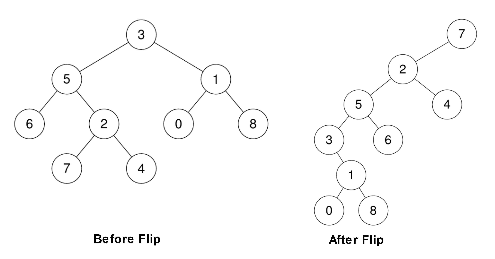

# 1666. Change the Root of a Binary Tree

## Problem

You are given:

- The **root of a binary tree**
- A **leaf node** in that tree

Your task is to **reroot the tree so that the given leaf becomes the new root**.

---

## Rerooting Rules

For every node `cur` on the path from the **leaf up to the original root** (excluding the root):

1. If `cur` has a **left child**, that child becomes **cur's right child**.
2. `cur`'s **original parent becomes cur's left child**.
3. The **parent's pointer to cur becomes null**, ensuring the parent has at most one child.

After performing these transformations along the path, return the **new root (the given leaf)**.

---

## Important Requirement

Your solution **must correctly update `Node.parent` pointers** after rerooting.

If the parent pointers are not updated properly, the solution will produce a **Wrong Answer**.

---

# Example 1



### Input

```
root = [3,5,1,6,2,0,8,null,null,7,4]
leaf = 7
```

### Output

```
[7,2,null,5,4,3,6,null,null,null,1,null,null,0,8]
```

---

# Example 2

### Input

```
root = [3,5,1,6,2,0,8,null,null,7,4]
leaf = 0
```

### Output

```
[0,1,null,3,8,5,null,null,null,6,2,null,null,7,4]
```

---

# Constraints

```
2 <= number of nodes <= 100
-10^9 <= Node.val <= 10^9
```

Additional guarantees:

- All `Node.val` values are **unique**
- The given `leaf` **exists in the tree**
