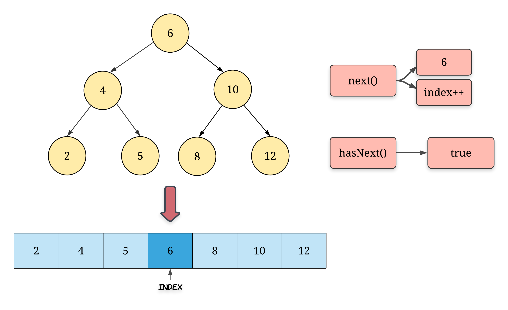
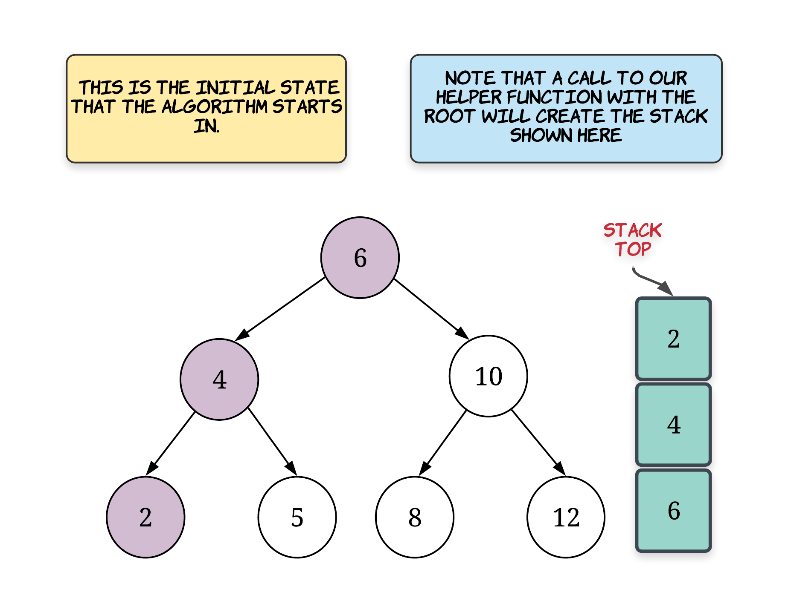
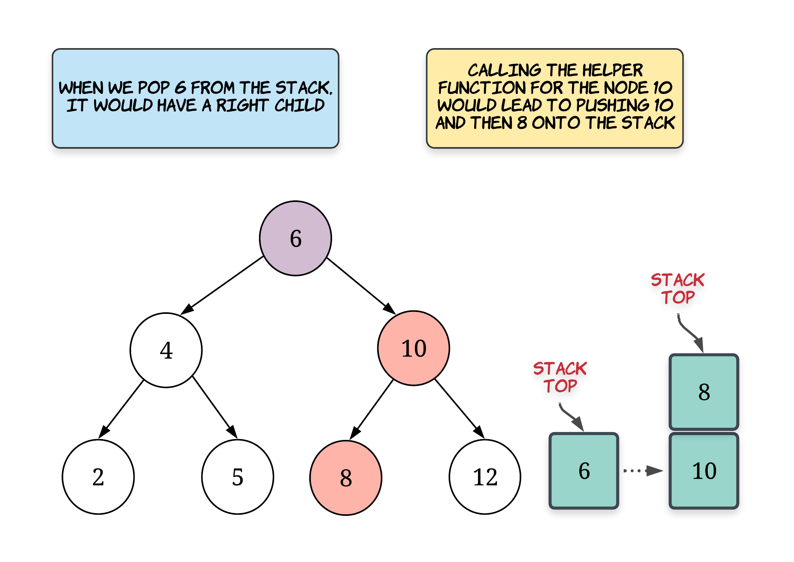

# BST Iterator — Detailed Solution

## Overview

The problem asks us to implement an **iterator over a Binary Search Tree (BST)** that returns elements in **ascending order**.

The iterator must support two operations:

- `next()` → return the **next smallest element**
- `hasNext()` → check if more elements remain

Example usage:

```text
iterator = new BSTIterator(root)

while (iterator.hasNext()):
    process(iterator.next())
```

### Key Insight

A **Binary Search Tree** has an important property:

> The **inorder traversal of a BST produces values in sorted order**.

Therefore the iterator must simulate **inorder traversal**.

Inorder traversal order:

```
Left → Root → Right
```

---

# Approach 1: Flatten the BST

## Intuition

The easiest way to implement an iterator is if the data already exists in an **array**.

So we:

1. Perform an **inorder traversal**
2. Store all nodes in a sorted array
3. Use an **index pointer** to simulate iteration

This approach trades **space for simplicity**.

---

## Algorithm

1. Create an empty array `nodesSorted`
2. Run inorder traversal
3. Store node values in the array
4. Maintain an index pointer

Operations:

- `next()` → return `nodesSorted[++index]`
- `hasNext()` → check if `index + 1 < size`



---

## Java Implementation

```java
class BSTIterator {

    ArrayList<Integer> nodesSorted;
    int index;

    public BSTIterator(TreeNode root) {
        nodesSorted = new ArrayList<>();
        index = -1;

        inorder(root);
    }

    private void inorder(TreeNode root) {
        if (root == null) return;

        inorder(root.left);
        nodesSorted.add(root.val);
        inorder(root.right);
    }

    public int next() {
        return nodesSorted.get(++index);
    }

    public boolean hasNext() {
        return index + 1 < nodesSorted.size();
    }
}
```

---

## Complexity Analysis

### Time Complexity

Constructor:

```
O(N)
```

Because we traverse the entire tree.

Operations:

```
next()    → O(1)
hasNext() → O(1)
```

### Space Complexity

```
O(N)
```

Because all nodes are stored in an array.

This **does not satisfy the follow-up constraint** of `O(h)` memory.

---

# Approach 2: Controlled Recursion (Stack Simulation)

## Intuition

Instead of flattening the tree, we simulate **inorder traversal lazily**.

We maintain a stack that always holds the **path to the next smallest element**.

Invariant:

> The **top of the stack is always the next element to return**.

---

## Helper Function

We define:

```
_leftmostInorder(node)
```

This pushes the entire **left branch** onto the stack.

Pseudo code:

```
while node != null:
    stack.push(node)
    node = node.left
```





---

## Algorithm

### Constructor

1. Initialize an empty stack
2. Push all nodes from root to the **leftmost node**

### next()

1. Pop the top node
2. If the node has a right child:
   - call `_leftmostInorder(node.right)`
3. Return the popped node value

### hasNext()

Return whether the stack is empty.

---

## Java Implementation

```java
class BSTIterator {

    Stack<TreeNode> stack;

    public BSTIterator(TreeNode root) {
        stack = new Stack<>();
        leftmostInorder(root);
    }

    private void leftmostInorder(TreeNode root) {
        while (root != null) {
            stack.push(root);
            root = root.left;
        }
    }

    public int next() {
        TreeNode node = stack.pop();

        if (node.right != null) {
            leftmostInorder(node.right);
        }

        return node.val;
    }

    public boolean hasNext() {
        return !stack.isEmpty();
    }
}
```

---

## Complexity Analysis

### Time Complexity

`hasNext()`

```
O(1)
```

`next()`

Worst case:

```
O(N)
```

But **amortized complexity**:

```
O(1)
```

Reason:

Every node is pushed and popped **exactly once**.

---

### Space Complexity

```
O(H)
```

Where `H` is the height of the tree.

This satisfies the follow-up requirement.

---

# Why the Stack Solution Works

Consider BST:

```
      7
     / \\
    3   15
       /  \\
      9    20
```

Stack initialization:

```
push 7
push 3
```

Stack:

```
[7,3]
```

Top → `3` (smallest element)

Calling `next()`:

1. pop `3`
2. return `3`

Stack becomes:

```
[7]
```

Next call:

1. pop `7`
2. process right subtree
3. push `15`
4. push `9`

Stack becomes:

```
[15,9]
```

Next smallest element: `9`

---

# Why Amortized O(1)

Even though `_leftmostInorder()` may traverse multiple nodes, **each node is pushed exactly once**.

Total stack pushes:

```
N
```

Total stack pops:

```
N
```

Thus total work:

```
O(N)
```

Across `N` calls.

Average per call:

```
O(1)
```

---

# Comparison of Approaches

| Approach         | Time next()    | Space | Notes                    |
| ---------------- | -------------- | ----- | ------------------------ |
| Flatten BST      | O(1)           | O(N)  | Simplest but high memory |
| Stack Simulation | O(1) amortized | O(H)  | Optimal solution         |

---

# Final Recommended Solution

The **stack-based lazy inorder traversal** is the optimal design because:

- satisfies `O(h)` space requirement
- `O(1)` average time
- does not preprocess entire tree
- suitable for very large BSTs

```java
class BSTIterator {

    Stack<TreeNode> stack;

    public BSTIterator(TreeNode root) {
        stack = new Stack<>();
        leftmostInorder(root);
    }

    private void leftmostInorder(TreeNode node) {
        while (node != null) {
            stack.push(node);
            node = node.left;
        }
    }

    public int next() {
        TreeNode node = stack.pop();

        if (node.right != null) {
            leftmostInorder(node.right);
        }

        return node.val;
    }

    public boolean hasNext() {
        return !stack.isEmpty();
    }
}
```
