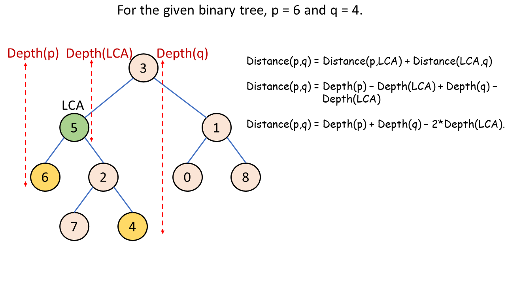

# 1740. Find Distance in a Binary Tree — Approaches

## Overview

We need to find the **distance between two nodes with values `p` and `q`** in a binary tree with **unique values**.

The **distance between two nodes** is the number of **edges** on the path between them.

### Key Observation

The path between any two nodes in a binary tree is **hill‑shaped** with a single peak.

That peak is the **Lowest Common Ancestor (LCA)** of the two nodes.

So the distance formula becomes:

```
distance(p, q) = distance(LCA, p) + distance(LCA, q)
```

Thus the task becomes:

1. Find the **LCA of p and q**
2. Compute the **depth from LCA to p**
3. Compute the **depth from LCA to q**
4. Add them together

---

# Approach 1: LCA + Depth First Search (DFS)

## Intuition

We first compute the **Lowest Common Ancestor (LCA)** of nodes `p` and `q`.

Then we compute the **distance from the LCA to p** and **distance from the LCA to q**.

The final answer is:

```
distance = depth(LCA, p) + depth(LCA, q)
```

Note:

We treat the **LCA as depth = 0** to simplify calculations.

---

## Algorithm

### Main function

```
findDistance(root, p, q)
```

Steps:

1. Find `lca = findLCA(root, p, q)`
2. Return

```
depth(lca, p) + depth(lca, q)
```

---

### LCA function

```
findLCA(root, p, q)
```

1. If root is null → return null
2. If root value equals `p` or `q` → return root
3. Recursively compute LCA for left and right subtree
4. If both sides return non-null → root is LCA
5. Otherwise return the non-null side

---

### Depth function

```
depth(root, target)
```

1. If node is null → return -1
2. If node value equals target → return current depth
3. Search left subtree
4. If found → return depth
5. Otherwise search right subtree

---

## Java Implementation

```java
public class Solution {

    public int findDistance(TreeNode root, int p, int q) {
        TreeNode lca = findLCA(root, p, q);
        return depth(lca, p) + depth(lca, q);
    }

    private TreeNode findLCA(TreeNode root, int p, int q) {
        if (root == null || root.val == p || root.val == q) {
            return root;
        }

        TreeNode left = findLCA(root.left, p, q);
        TreeNode right = findLCA(root.right, p, q);

        if (left != null && right != null) {
            return root;
        }

        return left != null ? left : right;
    }

    private int depth(TreeNode root, int target) {
        return depth(root, target, 0);
    }

    private int depth(TreeNode root, int target, int d) {
        if (root == null) return -1;

        if (root.val == target) return d;

        int left = depth(root.left, target, d + 1);
        if (left != -1) return left;

        return depth(root.right, target, d + 1);
    }
}
```

---

## Complexity

### Time Complexity

```
O(n)
```

- LCA search visits each node once
- Depth search visits nodes again

---

### Space Complexity

```
O(n)
```

Recursion stack in the worst case (skewed tree).

---

# Approach 2: LCA + Breadth First Search (BFS)

## Intuition

Instead of DFS to compute depths, we can use **BFS starting from the LCA**.

BFS explores nodes **level by level**, so the level number corresponds to depth.

Whenever we find `p` or `q`, we add that depth to the answer.

---

## Algorithm

1. Compute `lca = findLCA(root, p, q)`
2. Start BFS from `lca`
3. Track:

```
depth
distance
foundp
foundq
```

4. Traverse level by level
5. When `p` or `q` is found:

```
distance += depth
```

6. Stop when both nodes are found

---

## Java Implementation

```java
public class Solution {

    public int findDistance(TreeNode root, int p, int q) {
        TreeNode lca = findLCA(root, p, q);

        Queue<TreeNode> queue = new LinkedList<>();
        queue.add(lca);

        int distance = 0;
        int depth = 0;

        boolean foundp = false;
        boolean foundq = false;

        while (!queue.isEmpty() && (!foundp || !foundq)) {

            int size = queue.size();

            for (int i = 0; i < size; i++) {

                TreeNode node = queue.poll();

                if (node.val == p) {
                    distance += depth;
                    foundp = true;
                }

                if (node.val == q) {
                    distance += depth;
                    foundq = true;
                }

                if (node.left != null) queue.add(node.left);
                if (node.right != null) queue.add(node.right);
            }

            depth++;
        }

        return distance;
    }

    private TreeNode findLCA(TreeNode root, int p, int q) {

        if (root == null || root.val == p || root.val == q)
            return root;

        TreeNode left = findLCA(root.left, p, q);
        TreeNode right = findLCA(root.right, p, q);

        if (left != null && right != null)
            return root;

        return left != null ? left : right;
    }
}
```

---

## Complexity

### Time Complexity

```
O(n)
```

- LCA search: O(n)
- BFS traversal: O(n)

---

### Space Complexity

```
O(n)
```

Queue may contain up to `n` nodes.

---

# Approach 3: One-Pass DFS (LCA + Distance Together)

## Intuition

Instead of computing LCA and depth separately, we can compute everything **in a single DFS traversal**.

We track:

- the depth of nodes
- the LCA discovery
- the distance computation

Once both nodes are found, we compute:

```
distance = depth(p) + depth(q) - 2 * depth(LCA)
```



---

## Algorithm

Create a recursive function:

```
distance(node, p, q, depth)
```

For each node:

1. If node equals `p` or `q`, return its depth
2. Recursively search left and right
3. If both sides contain targets → current node is LCA
4. Adjust distance using:

```
retDistance -= 2 * depth
```

---

## Java Implementation

```java
public class Solution {

    public int findDistance(TreeNode root, int p, int q) {
        return distance(root, p, q, 0);
    }

    private int distance(TreeNode root, int p, int q, int depth) {

        if (root == null || p == q) return 0;

        if (root.val == p || root.val == q) {

            int left = distance(root.left, p, q, 1);
            int right = distance(root.right, p, q, 1);

            return (left > 0 || right > 0) ? Math.max(left, right) : depth;
        }

        int left = distance(root.left, p, q, depth + 1);
        int right = distance(root.right, p, q, depth + 1);

        int retDistance = left + right;

        if (left != 0 && right != 0) {
            retDistance -= 2 * depth;
        }

        return retDistance;
    }
}
```

---

## Complexity

### Time Complexity

```
O(n)
```

Single DFS traversal.

---

### Space Complexity

```
O(n)
```

Recursion stack.

---

# Comparison of Approaches

| Approach     | Idea                              | Time | Space |
| ------------ | --------------------------------- | ---- | ----- |
| DFS + LCA    | Separate LCA and depth search     | O(n) | O(n)  |
| BFS + LCA    | BFS to compute depths             | O(n) | O(n)  |
| One-pass DFS | Compute LCA and distance together | O(n) | O(n)  |

---

# Key Insight

The entire problem relies on a simple tree property:

```
distance(p,q) = depth(p) + depth(q) − 2 * depth(LCA)
```

So once we identify the **LCA**, the rest becomes straightforward depth computation.
