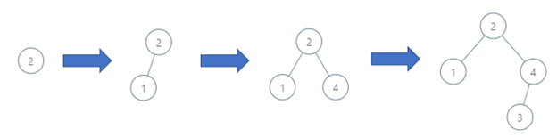
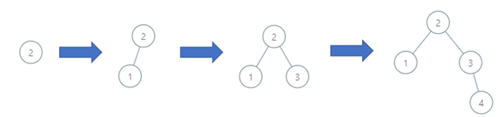
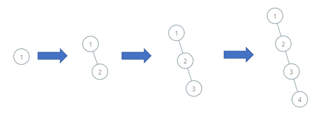

# 1902. Depth of BST Given Insertion Order

## Problem

You are given a **0-indexed integer array `order`** of length `n`.
It represents a **permutation of integers from `1` to `n`** and describes the **order in which values are inserted into a Binary Search Tree (BST)**.

---

## Binary Search Tree Rules

A **Binary Search Tree** follows these rules:

- The **left subtree** of a node contains only nodes with keys **less than** the node's key.
- The **right subtree** of a node contains only nodes with keys **greater than** the node's key.
- Both subtrees must themselves be **binary search trees**.

---

## Tree Construction

The BST is constructed using the insertion order:

1. `order[0]` becomes the **root**.
2. Each subsequent element is inserted into the BST following standard **BST insertion rules**.

---

## Goal

Return the **depth of the resulting binary search tree**.

### Definition of Depth

The **depth of a binary tree** is:

> The number of nodes along the **longest path from the root to the farthest leaf**.

---

# Example 1



### Input

```
order = [2,1,4,3]
```

### Output

```
3
```

### Explanation

The constructed BST:

```
      2
     / \\
    1   4
       /
      3
```

Longest path:

```
2 → 4 → 3
```

Depth = **3**

---

# Example 2



### Input

```
order = [2,1,3,4]
```

### Output

```
3
```

### Explanation

BST:

```
    2
   / \\
  1   3
        \\
         4
```

Longest path:

```
2 → 3 → 4
```

Depth = **3**

---

# Example 3



### Input

```
order = [1,2,3,4]
```

### Output

```
4
```

### Explanation

BST becomes completely skewed:

```
1
 \\
  2
   \\
    3
     \\
      4
```

Longest path:

```
1 → 2 → 3 → 4
```

Depth = **4**

---

# Constraints

```
n == order.length
1 ≤ n ≤ 10^5
order is a permutation of integers from 1 to n
```
