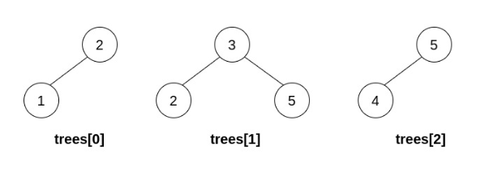
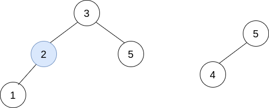
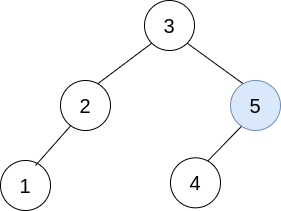
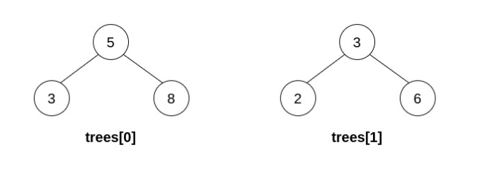
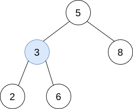
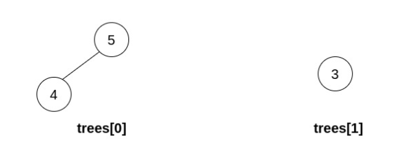

# 1932. Merge BSTs to Create Single BST

## Problem Description

You are given **n Binary Search Trees (BSTs)** stored in an array `trees` (0‑indexed).
Each BST contains **at most 3 nodes**, and **all root values are unique**.

In one operation you may:

1. Select two distinct indices `i` and `j` such that **a leaf node in `trees[i]` has the same value as the root of `trees[j]`**.
2. Replace that leaf node in `trees[i]` with the entire tree `trees[j]`.
3. Remove `trees[j]` from the array.

You must perform exactly **n − 1 merges** so that all trees combine into **one single BST**.

Return the **root of the resulting BST** if it is possible to construct a valid BST after performing these operations.
Otherwise return **null**.

---

# Definition of a BST

A **Binary Search Tree** satisfies:

- Every node in the **left subtree** has value **strictly less** than the node value.
- Every node in the **right subtree** has value **strictly greater** than the node value.
- Both subtrees must themselves be valid BSTs.

---

# Definition of Leaf

A **leaf** is a node that has **no children**.

---

# Example 1



Input:

```
trees = [[2,1],[3,2,5],[5,4]]
```

Output:

```
[3,2,5,1,null,4]
```

Explanation:

First operation:

Merge tree `[2,1]` into tree `[3,2,5]`.

```
trees = [[3,2,5,1],[5,4]]
```

Second operation:

Merge `[5,4]` into `[3,2,5,1]`.

Final BST:

```
        3
       / \\
      2   5
     /   /
    1   4
```

This is a valid BST.





---

# Example 2



Input:

```
trees = [[5,3,8],[3,2,6]]
```

Output:

```
[]
```

Explanation:

Merge `[3,2,6]` into `[5,3,8]`.

Resulting tree:

```
      5
     / \\
    3   8
   / \\
  2   6
```

This **violates BST rules** because `6` is in the left subtree of `5`.

Therefore return **null**.



---

# Example 3

Input:



```
trees = [[5,4],[3]]
```

Output:

```
[]
```

Explanation:

No valid merge can be performed because no leaf matches another root.

---

# Constraints

- `n == trees.length`
- `1 ≤ n ≤ 5 × 10⁴`
- Each tree has **1 to 3 nodes**
- Each node may have children **but no grandchildren**
- **All roots are unique**
- All trees are initially **valid BSTs**
- `1 ≤ TreeNode.val ≤ 5 × 10⁴`
