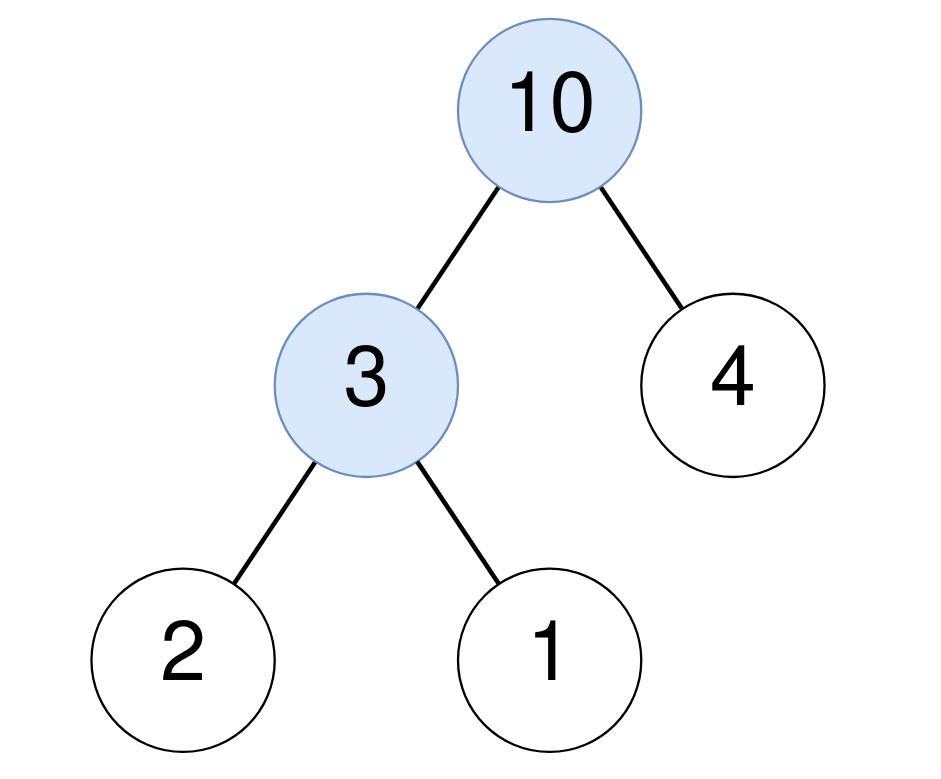
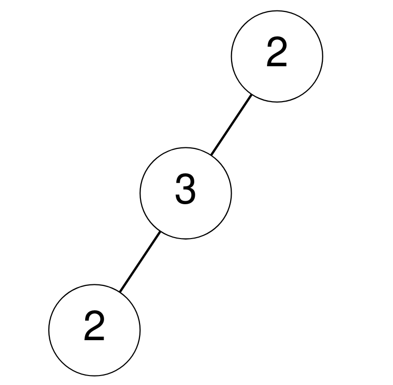

# 1973. Count Nodes Equal to Sum of Descendants

## Problem

Given the **root of a binary tree**, return the number of nodes where:

> the value of the node is equal to the **sum of the values of its descendants**.

### Definition

A **descendant** of a node `x` is any node that lies on the path from `x` down to a leaf node.

If a node has **no descendants**, the sum is considered **0**.

---

## Example 1



**Input**

```
root = [10,3,4,2,1]
```

**Output**

```
2
```

**Explanation**

- Node `10`
  - Descendants: `3, 4, 2, 1`
  - Sum = `3 + 4 + 2 + 1 = 10`
  - Condition satisfied

- Node `3`
  - Descendants: `2, 1`
  - Sum = `2 + 1 = 3`
  - Condition satisfied

So the answer is **2**.

---

## Example 2



**Input**

```
root = [2,3,null,2,null]
```

**Output**

```
0
```

**Explanation**

No node has a value equal to the sum of its descendants.

---

## Example 3

**Input**

```
root = [0]
```

**Output**

```
1
```

**Explanation**

The node has no descendants.

Sum of descendants = `0`, which equals the node value.

---

## Constraints

```
The number of nodes in the tree is in the range [1, 10^5]
0 ≤ Node.val ≤ 10^5
```
