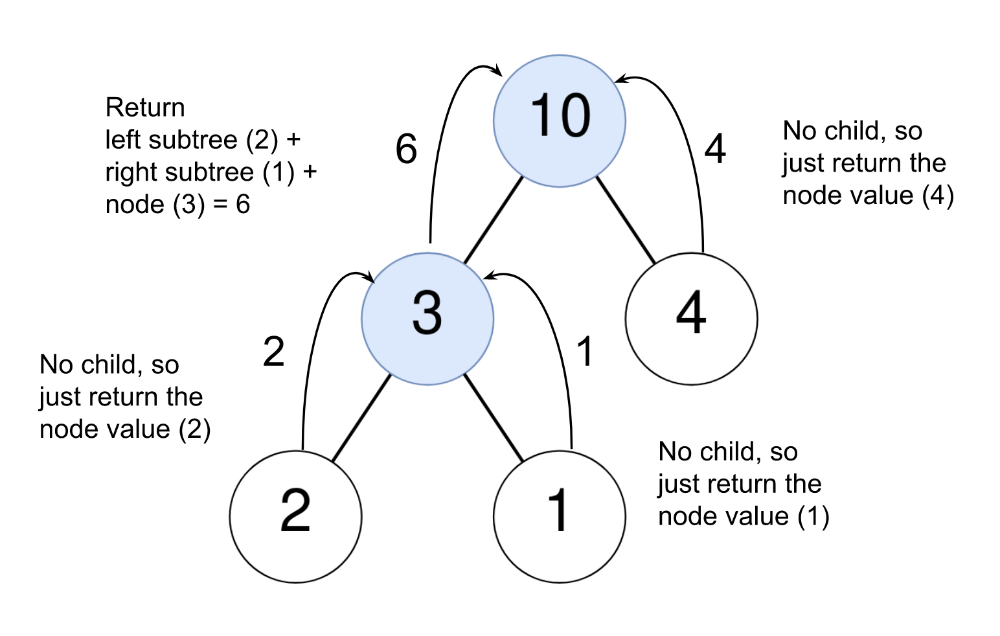

# 1973. Count Nodes Equal to Sum of Descendants

## Approach: Depth-First Search with Postorder Traversal

### Intuition

We need to determine whether the value of a node equals the **sum of all values in its descendants**.

A naive solution might repeatedly compute subtree sums for each node by traversing the subtree again and again. However, that would be inefficient because the same subtree sums would be recomputed multiple times.

A better approach is to compute subtree sums **once** using recursion and reuse them while moving upward in the tree.

This is naturally achieved using **postorder traversal**:

1. Compute the sum of the left subtree.
2. Compute the sum of the right subtree.
3. Check whether:

```
node.val == leftSum + rightSum
```

If this condition holds, the node satisfies the requirement and should be counted.

Because postorder traversal processes children before the parent, the subtree sums are already available when evaluating the parent node.



---

## Algorithm

1. Initialize a global variable `count = 0` to store the number of valid nodes.

2. Define a recursive function `countNodes(root)`:

   **Base Case**
   - If `root == null`, return `0`.

   **Recursive Step**
   - Compute the sum of the left subtree:

   ```
   left = countNodes(root.left)
   ```

   - Compute the sum of the right subtree:

   ```
   right = countNodes(root.right)
   ```

   - If the sum of descendants equals the node value:

   ```
   if root.val == left + right
       increment count
   ```

   - Return the sum of the subtree rooted at this node:

   ```
   return left + right + root.val
   ```

3. Call `countNodes(root)`.

4. Return `count`.

---

## Java Implementation

```java
class Solution {
    int count;

    private long countNodes(TreeNode root) {
        if (root == null) {
            return 0;
        }

        long left = countNodes(root.left);
        long right = countNodes(root.right);

        if (root.val == left + right) {
            count++;
        }

        return left + right + root.val;
    }

    public int equalToDescendants(TreeNode root) {
        countNodes(root);
        return count;
    }
}
```

---

## Complexity Analysis

Let **N** be the number of nodes in the tree.

### Time Complexity

```
O(N)
```

Each node is visited exactly once during the DFS traversal.

---

### Space Complexity

```
O(N)
```

The recursion stack depth equals the **height of the tree**.

Worst case (completely skewed tree):

```
height = N
```

So the recursion stack can grow to **O(N)**.
