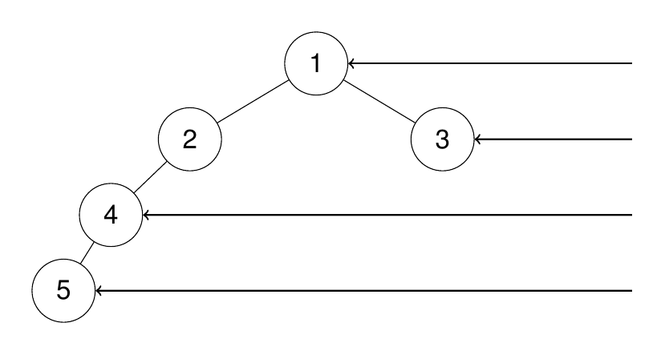

from pathlib import Path

content = """

# 199. Binary Tree Right Side View

## Problem

Given the **root of a binary tree**, imagine yourself standing on the **right side of the tree**.

Return the values of the nodes that are **visible from top to bottom** when looking at the tree from the right side.

---

## Example 1


**Input**

```
root = [1,2,3,null,5,null,4]
```

**Output**

```
[1,3,4]
```

**Explanation**

From the right side, the visible nodes are:

```
1 → 3 → 4
```

---

## Example 2



**Input**

```
root = [1,2,3,4,null,null,null,5]
```

**Output**

```
[1,3,4,5]
```

---

## Example 3

**Input**

```
root = [1,null,3]
```

**Output**

```
[1,3]
```

---

## Example 4

**Input**

```
root = []
```

**Output**

```
[]
```

---

## Constraints

- Number of nodes in the tree: **[0, 100]**
- `-100 ≤ Node.val ≤ 100`
  """

path = Path("/mnt/data/binary_tree_right_side_view_199.md")
path.write_text(content)

path
