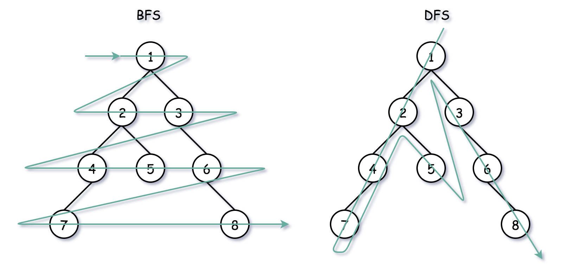
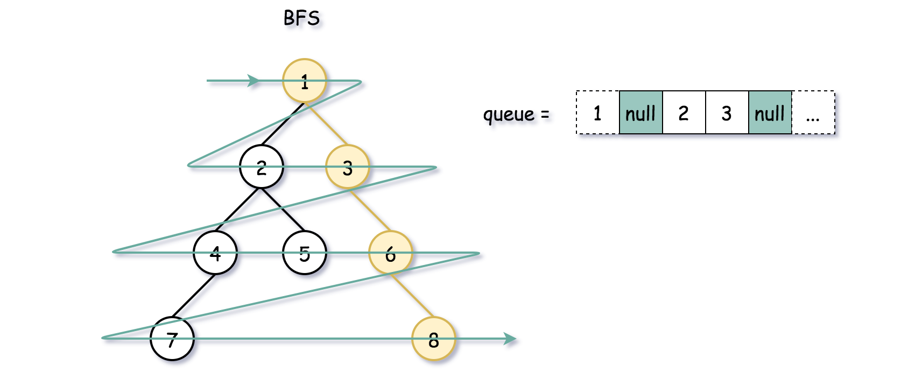

# Binary Tree Right Side View — Solution Approaches

## Overview

There are two major ways to traverse a binary tree:


### 1. DFS (Depth First Search)

DFS explores nodes **deep into a branch before backtracking**.

Common DFS traversals:

- Preorder
- Inorder
- Postorder



### 2. BFS (Breadth First Search)

BFS explores nodes **level by level**, starting from the root.

---

## DFS vs BFS

| Method | Traversal Style                 |
| ------ | ------------------------------- |
| DFS    | Goes deep first (toward leaves) |
| BFS    | Goes level by level             |

---

## Which Approach Works Best?

The problem asks for the **last element of each level** (rightmost node).

This naturally matches **level order traversal**, making **BFS the most intuitive solution**.

---

## Complexity Comparison

| Method | Time | Space |
| ------ | ---- | ----- |
| DFS    | O(N) | O(H)  |
| BFS    | O(N) | O(D)  |

Where:

- **H** = height of the tree
- **D** = diameter (maximum width)

Worst-case space:

- DFS → skewed tree → **O(N)**
- BFS → full tree → **O(N)**

---

# Approach 1: BFS Using Two Queues

## Idea


Use:

- one queue for **current level**
- one queue for **next level**

Process nodes level by level.

When the current level queue becomes empty, the last node processed is the **rightmost node**.

---

## Algorithm

1. Create result list `rightside`
2. Create two queues:
   - `currLevel`
   - `nextLevel`
3. Add root to `nextLevel`
4. Repeat while queue not empty:
   - Move `nextLevel → currLevel`
   - Process all nodes in `currLevel`
   - Push children into `nextLevel`
5. Last processed node of each level → add to result

---

## Java Implementation

```java
class Solution {

    public List<Integer> rightSideView(TreeNode root) {
        if (root == null) return new ArrayList<>();

        ArrayDeque<TreeNode> nextLevel = new ArrayDeque<>();
        nextLevel.offer(root);

        ArrayDeque<TreeNode> currLevel;
        List<Integer> rightside = new ArrayList<>();
        TreeNode node = null;

        while (!nextLevel.isEmpty()) {

            currLevel = nextLevel;
            nextLevel = new ArrayDeque<>();

            while (!currLevel.isEmpty()) {
                node = currLevel.poll();

                if (node.left != null) nextLevel.offer(node.left);
                if (node.right != null) nextLevel.offer(node.right);
            }

            rightside.add(node.val);
        }

        return rightside;
    }
}
```

---

## Complexity

Time Complexity:

```
O(N)
```

Space Complexity:

```
O(D)
```

Where **D** is the tree diameter.

---

# Approach 2: BFS Using Sentinel

## Idea



Use a **single queue** and a **null sentinel** to mark the end of each level.

Steps:

- Push root
- Push `null` sentinel
- When sentinel appears → level finished

The **previous node before sentinel** is the rightmost node.

---

## Algorithm

1. Queue ← `[root, null]`
2. Track previous node
3. Process nodes until `null`
4. Add previous node value to result
5. Insert another sentinel

---

## Java Implementation

```java
class Solution {

    public List<Integer> rightSideView(TreeNode root) {
        if (root == null) return new ArrayList<>();

        Queue<TreeNode> queue = new LinkedList<>();
        queue.offer(root);
        queue.offer(null);

        TreeNode prev, curr = root;
        List<Integer> rightside = new ArrayList<>();

        while (!queue.isEmpty()) {

            prev = curr;
            curr = queue.poll();

            while (curr != null) {

                if (curr.left != null) queue.offer(curr.left);
                if (curr.right != null) queue.offer(curr.right);

                prev = curr;
                curr = queue.poll();
            }

            rightside.add(prev.val);

            if (!queue.isEmpty()) queue.offer(null);
        }

        return rightside;
    }
}
```

---

## Complexity

Time Complexity:

```
O(N)
```

Space Complexity:

```
O(D)
```

---

# Approach 3: BFS Using Level Size

## Idea


Instead of using sentinel nodes, we track the **size of each level**.

Steps:

1. Get `levelSize = queue.size()`
2. Process nodes from `0 → levelSize - 1`
3. The last node processed is the rightmost node.

---

## Algorithm

1. Initialize queue with root
2. While queue not empty:
   - record `levelLength`
   - iterate `levelLength` times
3. Add value of last node in that level

---

## Java Implementation

```java
class Solution {

    public List<Integer> rightSideView(TreeNode root) {
        if (root == null) return new ArrayList<>();

        ArrayDeque<TreeNode> queue = new ArrayDeque<>();
        queue.offer(root);

        List<Integer> rightside = new ArrayList<>();

        while (!queue.isEmpty()) {

            int levelLength = queue.size();

            for (int i = 0; i < levelLength; i++) {

                TreeNode node = queue.poll();

                if (i == levelLength - 1) {
                    rightside.add(node.val);
                }

                if (node.left != null) queue.offer(node.left);
                if (node.right != null) queue.offer(node.right);
            }
        }

        return rightside;
    }
}
```

---

## Complexity

Time Complexity:

```
O(N)
```

Space Complexity:

```
O(D)
```

---

# Approach 4: Recursive DFS

## Idea

Perform DFS but visit **right child first**.

This ensures the **first node encountered at each depth** is the visible node.

We track levels using recursion.

If the current level equals the result list size, add the node.

---

## Algorithm

1. DFS traversal
2. Visit right child before left child
3. If visiting level first time → record node

---

## Java Implementation

```java
class Solution {

    List<Integer> rightside = new ArrayList<>();

    public void helper(TreeNode node, int level) {

        if (level == rightside.size()) {
            rightside.add(node.val);
        }

        if (node.right != null) helper(node.right, level + 1);
        if (node.left != null) helper(node.left, level + 1);
    }

    public List<Integer> rightSideView(TreeNode root) {

        if (root == null) return rightside;

        helper(root, 0);
        return rightside;
    }
}
```

---

## Complexity

Time Complexity:

```
O(N)
```

Space Complexity:

```
O(H)
```

Where **H** is the height of the tree.

Worst case:

```
O(N)
```

(skewed tree)

---

# Approach Comparison

| Approach       | Time | Space | Notes             |
| -------------- | ---- | ----- | ----------------- |
| BFS Two Queues | O(N) | O(D)  | Easy to reason    |
| BFS Sentinel   | O(N) | O(D)  | Slightly complex  |
| BFS Level Size | O(N) | O(D)  | Most common       |
| DFS Recursive  | O(N) | O(H)  | Elegant recursive |

---

# Recommended Solution

The **BFS Level Size approach** is the most commonly used in interviews because:

- clean logic
- no sentinel nodes
- easy to implement

```java
class Solution {

    public List<Integer> rightSideView(TreeNode root) {

        if (root == null) return new ArrayList<>();

        Queue<TreeNode> queue = new LinkedList<>();
        queue.offer(root);

        List<Integer> result = new ArrayList<>();

        while (!queue.isEmpty()) {

            int size = queue.size();

            for (int i = 0; i < size; i++) {

                TreeNode node = queue.poll();

                if (i == size - 1) {
                    result.add(node.val);
                }

                if (node.left != null) queue.offer(node.left);
                if (node.right != null) queue.offer(node.right);
            }
        }

        return result;
    }
}
```
