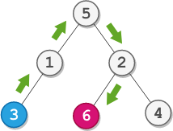

# 2096. Step-By-Step Directions From a Binary Tree Node to Another

## Problem

You are given the **root of a binary tree with `n` nodes**. Each node has a **unique value from `1` to `n`**.

You are also given:

- `startValue` → value of the **start node `s`**
- `destValue` → value of the **destination node `t`**

Your task is to find the **shortest path from node `s` to node `t`** and return the **step‑by‑step directions** as a string.

The string may contain the following characters:

| Direction | Meaning                     |
| --------- | --------------------------- |
| `L`       | Move to the **left child**  |
| `R`       | Move to the **right child** |
| `U`       | Move to the **parent node** |

Return the sequence of steps required to travel from `s` to `t`.

---

# Example 1



### Input

```
root = [5,1,2,3,null,6,4]
startValue = 3
destValue = 6
```

### Output

```
"UURL"
```

### Explanation

Shortest path:

```
3 → 1 → 5 → 2 → 6
```

Step directions:

```
3 → 1   = U
1 → 5   = U
5 → 2   = R
2 → 6   = L
```

Result:

```
UURL
```

---

# Example 2

### Input

```
root = [2,1]
startValue = 2
destValue = 1
```

### Output

```
"L"
```

### Explanation

```
2 → 1
```

Move to left child → `L`

---

# Constraints

```
The number of nodes in the tree is n
2 ≤ n ≤ 10^5

1 ≤ Node.val ≤ n
All node values are unique

1 ≤ startValue, destValue ≤ n
startValue ≠ destValue
```
