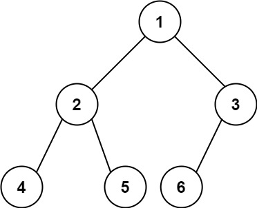

# 222. Count Complete Tree Nodes

## Problem

Given the **root of a complete binary tree**, return the **number of nodes in the tree**.

### Definition of Complete Binary Tree

According to Wikipedia:

A **complete binary tree** is a binary tree in which:

- Every level, except possibly the last, is **completely filled**.
- All nodes in the **last level appear as far left as possible**.

If the height of the tree is `h`, the last level can contain between:

```
1 and 2^h nodes
```

inclusive.

---

## Requirement

Design an algorithm that runs in **less than O(n) time complexity**.

---

## Examples

### Example 1



**Input**

```
root = [1,2,3,4,5,6]
```

**Output**

```
6
```

---

### Example 2

**Input**

```
root = []
```

**Output**

```
0
```

---

### Example 3

**Input**

```
root = [1]
```

**Output**

```
1
```

---

## Constraints

- Number of nodes in the tree: **[0, 5 × 10⁴]**
- `0 ≤ Node.val ≤ 5 × 10⁴`
- The tree is guaranteed to be **complete**
