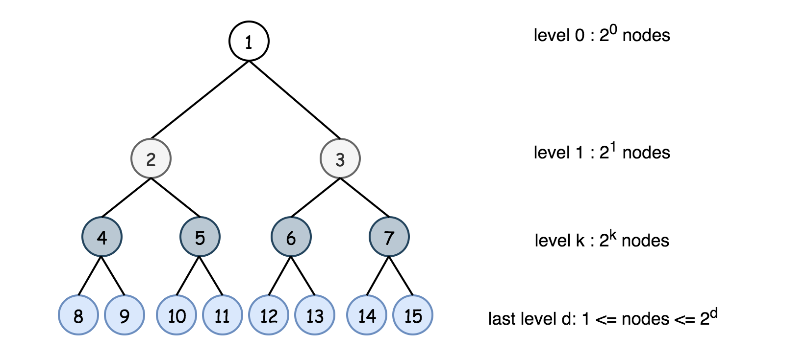
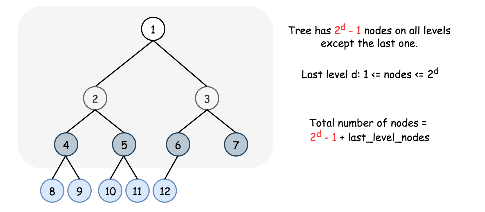
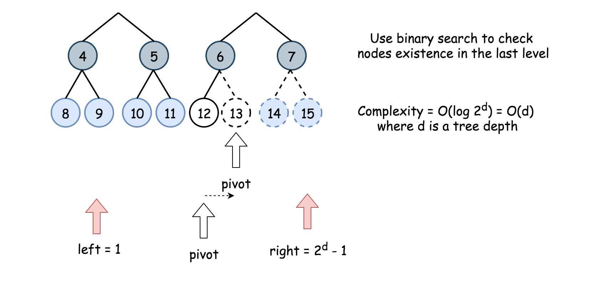
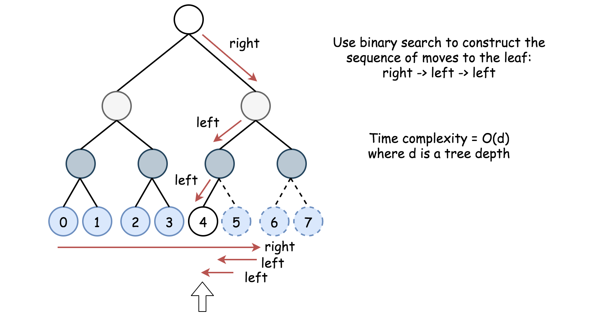

# Count Complete Tree Nodes — Solution Approaches

## Approach 1: Linear Time

### Intuition

This is the **naive solution**.
We simply count nodes recursively by visiting each node exactly once.

The algorithm:

- If the node is `null`, return `0`
- Otherwise return:

```
1 + count(left subtree) + count(right subtree)
```

This performs a full traversal of the tree.

### Implementation

```java
class Solution {
  public int countNodes(TreeNode root) {
    return root != null ? 1 + countNodes(root.right) + countNodes(root.left) : 0;
  }
}
```

### Complexity Analysis

**Time Complexity**

```
O(N)
```

Every node is visited once.

**Space Complexity**

```
O(d) = O(log N)
```

Where `d` is the tree depth (recursion stack).

---

# Approach 2: Binary Search on the Last Level



## Intuition

The naive approach does not use the fact that the tree is **complete**.

A complete binary tree has the following properties:

- Every level except the last is completely filled.
- The last level is filled from **left to right**.

If the depth of the tree is `d`, then:

- Nodes in levels `0..d-1` =

```
2^d - 1
```

- Nodes in the last level range between:

```
1 and 2^d
```

Thus the problem reduces to:

> Count how many nodes exist in the **last level**.



---

## Key Idea

Instead of checking all `2^d` nodes in the last level, we perform **binary search**.

Number of checks needed:

```
log(2^d) = d
```

For each index we verify whether a node exists by navigating from the root.

Example:

If `idx = 4` in a level of `0..7`:

```
0 1 2 3 | 4 5 6 7
          ^
```

First move → right subtree.

Then continue binary search to determine the next direction.

Each existence check takes:

```
O(d)
```

Total complexity:

```
O(d * d) = O(d²)
```

Since `d = log N`:

```
O(log² N)
```





---

# Algorithm

1. If the tree is empty → return `0`.
2. Compute tree depth `d`.
3. If `d == 0`, return `1`.
4. Nodes in full levels:

```
2^d - 1
```

5. Perform binary search on the last level:

```
0 → 2^d - 1
```

6. Use helper function `exists(idx, d, root)` to check if a node exists.
7. Return:

```
(2^d - 1) + number_of_nodes_in_last_level
```

---

# Java Implementation

```java
class Solution {

  public int computeDepth(TreeNode node) {
    int d = 0;
    while (node.left != null) {
      node = node.left;
      d++;
    }
    return d;
  }

  public boolean exists(int idx, int d, TreeNode node) {
    int left = 0, right = (int)Math.pow(2, d) - 1;

    for (int i = 0; i < d; i++) {
      int pivot = left + (right - left) / 2;

      if (idx <= pivot) {
        node = node.left;
        right = pivot;
      } else {
        node = node.right;
        left = pivot + 1;
      }
    }

    return node != null;
  }

  public int countNodes(TreeNode root) {

    if (root == null) return 0;

    int d = computeDepth(root);

    if (d == 0) return 1;

    int left = 1, right = (int)Math.pow(2, d) - 1;

    while (left <= right) {
      int pivot = left + (right - left) / 2;

      if (exists(pivot, d, root)) {
        left = pivot + 1;
      } else {
        right = pivot - 1;
      }
    }

    return (int)Math.pow(2, d) - 1 + left;
  }
}
```

---

# Complexity Analysis

### Time Complexity

```
O(d²) = O(log² N)
```

Where `d` is the depth of the tree.

### Space Complexity

```
O(1)
```

Only a few variables are used; no recursion stack is required.
