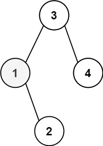
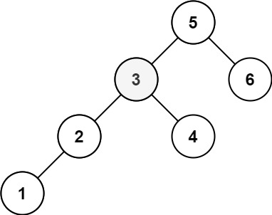

import pypandoc

text = """

# 230. Kth Smallest Element in a BST

## Problem

Given the **root of a Binary Search Tree (BST)** and an integer **k**, return the **kth smallest value (1-indexed)** among all the values of the nodes in the tree.

Because this is a **Binary Search Tree**, an **inorder traversal** of the tree returns the node values in **sorted ascending order**.

---

## Example 1



**Input**

```
root = [3,1,4,null,2]
k = 1
```

**Output**

```
1
```

---

## Example 2



**Input**

```
root = [5,3,6,2,4,null,null,1]
k = 3
```

**Output**

```
3
```

---

## Constraints

- The number of nodes in the tree is **n**
- `1 ≤ k ≤ n ≤ 10^4`
- `0 ≤ Node.val ≤ 10^4`

---

## Follow Up

If the BST is **modified frequently** (insertions and deletions), and we need to find the **kth smallest element often**, how could we optimize the solution?

Possible idea:

- Augment the BST by storing **subtree sizes** at each node.
- Maintain the size during **insert/delete operations**.
- This allows finding the **kth smallest element in O(log n)** time by navigating the tree based on subtree sizes.
  """

out = "/mnt/data/kth_smallest_bst_230.md"
pypandoc.convert_text(text, "md", format="md", outputfile=out, extra_args=["--standalone"])

out
