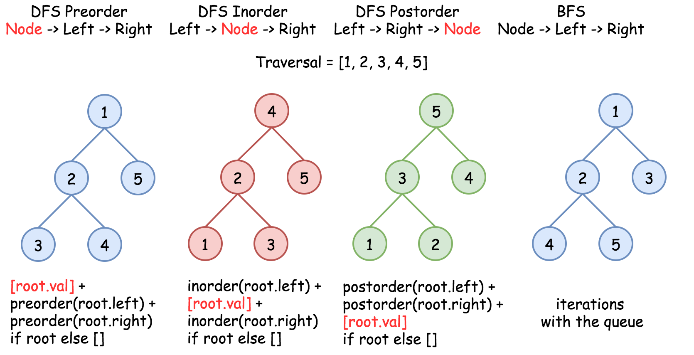
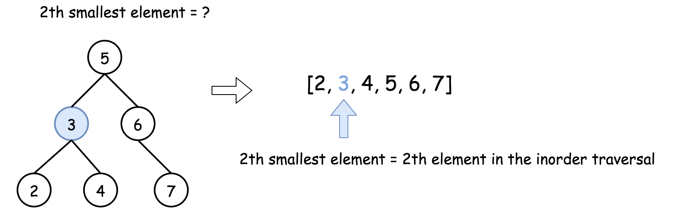
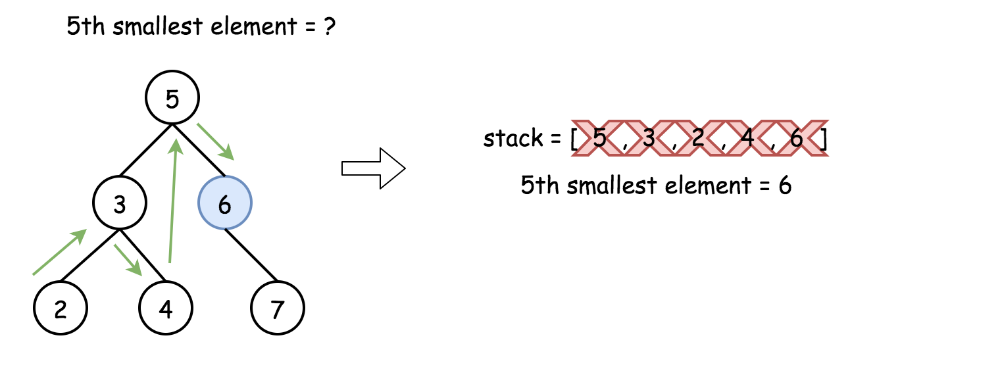
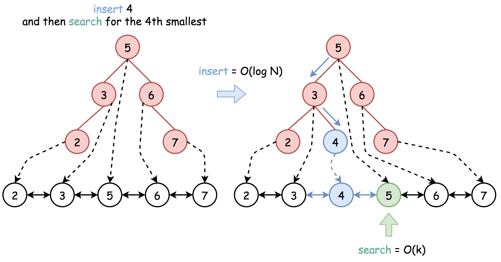

# Kth Smallest Element in a BST — Solution Approaches

## Tree Traversal Strategies

There are two primary ways to traverse a tree.

### Depth First Search (DFS)

DFS prioritizes **depth**. We start at the root and explore one branch completely before moving to another branch.

Types of DFS traversal:

- **Preorder** (Root → Left → Right)
- **Inorder** (Left → Root → Right)
- **Postorder** (Left → Right → Root)

For a **Binary Search Tree (BST)**, the **inorder traversal produces values in sorted order**.

---

### Breadth First Search (BFS)

BFS explores the tree **level by level**, starting from the root and moving downward.

Nodes at a higher level are visited before nodes at lower levels.



---

# Key Observation

For a **BST**, an **inorder traversal produces a sorted list of values**.

Therefore:

```
kth smallest element = element at index (k - 1) in inorder traversal
```

---

# Approach 1: Recursive Inorder Traversal

## Intuition

We perform an **inorder traversal** of the BST and store all values in a list.

Since inorder traversal of a BST is sorted, the **kth smallest element is simply the (k-1)th element** in the list.



---

## Java Implementation

```java
class Solution {

  public ArrayList<Integer> inorder(TreeNode root, ArrayList<Integer> arr) {
    if (root == null) return arr;

    inorder(root.left, arr);
    arr.add(root.val);
    inorder(root.right, arr);

    return arr;
  }

  public int kthSmallest(TreeNode root, int k) {
    ArrayList<Integer> nums = inorder(root, new ArrayList<Integer>());
    return nums.get(k - 1);
  }
}
```

---

## Complexity Analysis

### Time Complexity

```
O(N)
```

We must visit every node to build the traversal.

### Space Complexity

```
O(N)
```

The inorder traversal list stores all nodes.

---

# Approach 2: Iterative Inorder Traversal

## Intuition



Instead of building the entire inorder traversal, we simulate recursion using a **stack**.

Key idea:

- Traverse left as much as possible.
- Process nodes in sorted order.
- Stop once the **kth element is reached**.

This avoids storing the entire traversal.

---

## Java Implementation

```java
class Solution {

  public int kthSmallest(TreeNode root, int k) {

    LinkedList<TreeNode> stack = new LinkedList<>();

    while (true) {

      while (root != null) {
        stack.push(root);
        root = root.left;
      }

      root = stack.pop();

      if (--k == 0) return root.val;

      root = root.right;
    }
  }
}
```

---

## Complexity Analysis

### Time Complexity

```
O(H + k)
```

Where:

- **H** = height of the tree

Balanced tree:

```
O(log N + k)
```

Worst case (skewed tree):

```
O(N + k)
```

---

### Space Complexity

```
O(H)
```

Stack stores nodes along the traversal path.

Balanced tree:

```
O(log N)
```

Worst case (skewed tree):

```
O(N)
```

---

# Follow-Up Problem

What if the BST is **modified frequently** (insert/delete operations) and we must **find kth smallest often**?

Without optimization:

- Insert → `O(H)`
- Delete → `O(H)`
- kth smallest → `O(H + k)`

Total:

```
O(2H + k)
```



---

# Optimization Idea

We design a **data structure combining**:

- BST (for ordered structure)
- Doubly Linked List (for sequential access)

This structure provides:

| Operation    | Time Complexity |
| ------------ | --------------- |
| Insert       | O(H)            |
| Delete       | O(H)            |
| kth smallest | O(k)            |

Thus total cost becomes:

```
O(H + k)
```

instead of:

```
O(2H + k)
```

---

# Complexity Summary

| Operation    | Average  | Worst |
| ------------ | -------- | ----- |
| Insert       | O(log N) | O(N)  |
| Delete       | O(log N) | O(N)  |
| kth smallest | O(k)     | O(k)  |

---

## Space Complexity

```
O(N)
```

Space is required to maintain the linked list along with the BST.
