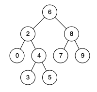

# 235. Lowest Common Ancestor of a Binary Search Tree

## Problem

Given a **Binary Search Tree (BST)**, find the **Lowest Common Ancestor (LCA)** of two given nodes `p` and `q`.

### Definition (Wikipedia)

The **Lowest Common Ancestor** of two nodes `p` and `q` is defined as:

> The lowest node in the tree that has both `p` and `q` as descendants (where we allow a node to be a descendant of itself).

---

## Example 1



**Input**

```
root = [6,2,8,0,4,7,9,null,null,3,5]
p = 2
q = 8
```

**Output**

```
6
```

**Explanation**

The lowest common ancestor of nodes **2** and **8** is **6**.

---

## Example 2


**Input**

```
root = [6,2,8,0,4,7,9,null,null,3,5]
p = 2
q = 4
```

**Output**

```
2
```

**Explanation**

The LCA of nodes **2** and **4** is **2**, since a node can be a descendant of itself.

---

## Example 3

**Input**

```
root = [2,1]
p = 2
q = 1
```

**Output**

```
2
```

---

## Constraints

- Number of nodes in the tree: **[2, 10⁵]**
- `-10⁹ ≤ Node.val ≤ 10⁹`
- All `Node.val` values are **unique**
- `p != q`
- Both **p and q exist in the BST**
