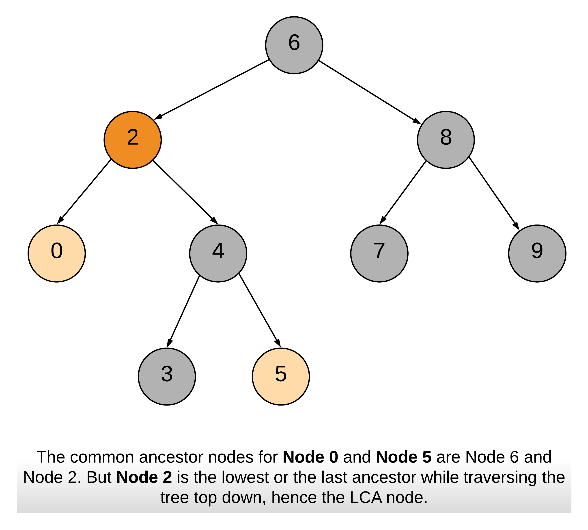
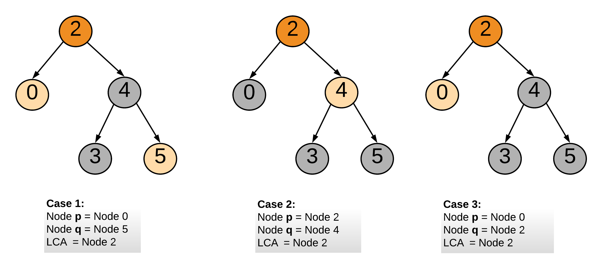

# Lowest Common Ancestor of a Binary Search Tree — Solution

## Key Idea

Although this problem can be solved using the **general LCA algorithm for binary trees**, we can take advantage of the **Binary Search Tree (BST) property** to design a more efficient and simpler solution.

### Properties of a BST

For any node **N**:

- All nodes in the **left subtree** have values **≤ N.val**
- All nodes in the **right subtree** have values **> N.val**
- Both left and right subtrees are also **BSTs**

Using these properties, we can determine where nodes **p** and **q** lie relative to the current node.

---

# Approach 1: Recursive Approach

## Intuition



The **Lowest Common Ancestor (LCA)** of two nodes `p` and `q` is the **lowest node that has both as descendants**.

Because of the BST property:

- If **both p and q are smaller than root**, the LCA must be in the **left subtree**
- If **both p and q are greater than root**, the LCA must be in the **right subtree**
- Otherwise, the current node is the **split point** and therefore the **LCA**



---

## Algorithm

1. Start from the root node.
2. Compare values of `p` and `q` with the current node.
3. If both are greater → move to the **right subtree**.
4. If both are smaller → move to the **left subtree**.
5. Otherwise → current node is the **LCA**.

---

## Java Implementation

```java
class Solution {

    public TreeNode lowestCommonAncestor(TreeNode root, TreeNode p, TreeNode q) {

        int parentVal = root.val;
        int pVal = p.val;
        int qVal = q.val;

        if (pVal > parentVal && qVal > parentVal) {
            return lowestCommonAncestor(root.right, p, q);
        }
        else if (pVal < parentVal && qVal < parentVal) {
            return lowestCommonAncestor(root.left, p, q);
        }
        else {
            return root;
        }
    }
}
```

---

## Complexity Analysis

### Time Complexity

```
O(N)
```

In the worst case (skewed BST), we may traverse all nodes.

For a balanced BST, this becomes:

```
O(log N)
```

---

### Space Complexity

```
O(N)
```

Due to recursion stack in the worst-case skewed tree.

Balanced BST:

```
O(log N)
```

---

# Approach 2: Iterative Approach

## Intuition

The same logic used in the recursive approach can be applied **iteratively**.

Since we never need to backtrack, we can simply move **down the tree** until we reach the split point.

This avoids recursion and therefore saves stack space.

---

## Algorithm

1. Start at the root node.
2. Compare `p` and `q` values with current node.
3. If both are larger → move right.
4. If both are smaller → move left.
5. Otherwise → current node is the **LCA**.

---

## Java Implementation

```java
class Solution {

    public TreeNode lowestCommonAncestor(TreeNode root, TreeNode p, TreeNode q) {

        int pVal = p.val;
        int qVal = q.val;

        TreeNode node = root;

        while (node != null) {

            int parentVal = node.val;

            if (pVal > parentVal && qVal > parentVal) {
                node = node.right;
            }
            else if (pVal < parentVal && qVal < parentVal) {
                node = node.left;
            }
            else {
                return node;
            }
        }

        return null;
    }
}
```

---

## Complexity Analysis

### Time Complexity

```
O(N)
```

Worst case (skewed tree).

Balanced tree:

```
O(log N)
```

---

### Space Complexity

```
O(1)
```

No recursion or extra data structures are used.
