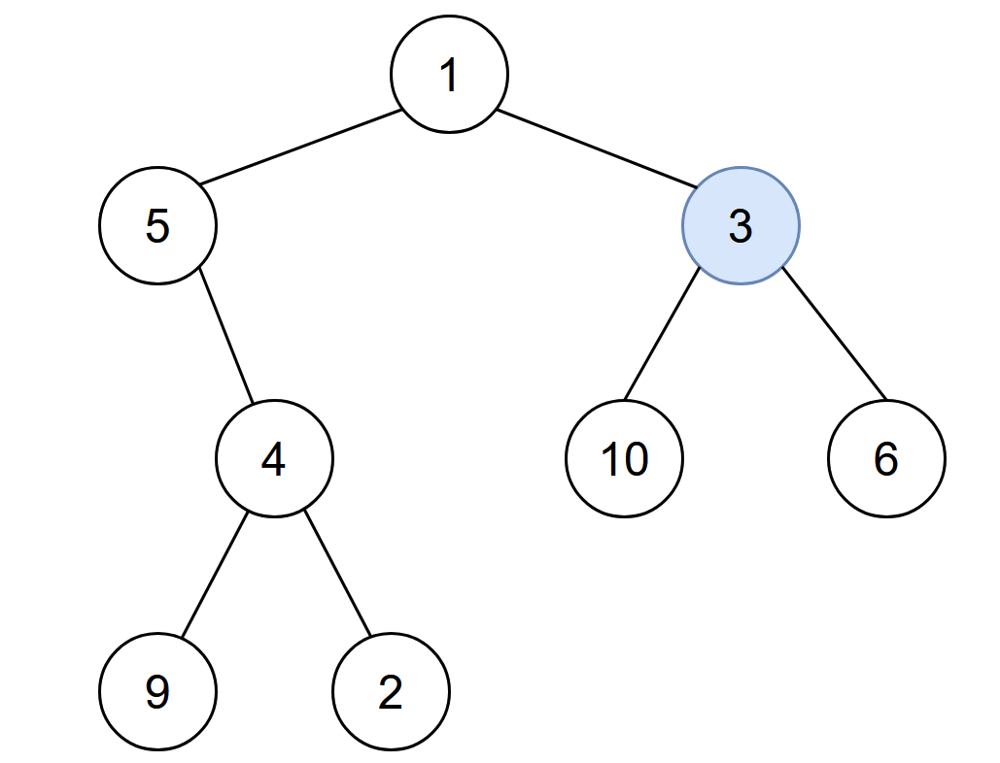

# 2385. Amount of Time for Binary Tree to Be Infected

## Problem

You are given the **root of a binary tree** with **unique values**, and an integer **start**.

At **minute 0**, an infection begins from the node with value `start`.

Each minute, a node becomes infected if:

1. The node is currently **uninfected**.
2. The node is **adjacent to an infected node**.

Adjacency means a node can be infected from:

- its **parent**
- its **left child**
- its **right child**

Return the **number of minutes needed for the entire tree to become infected**.

---

## Example 1



### Input

```
root = [1,5,3,null,4,10,6,9,2]
start = 3
```

### Output

```
4
```

### Explanation

The infection spreads as follows:

```
Minute 0: Node 3
Minute 1: Nodes 1, 10, 6
Minute 2: Node 5
Minute 3: Node 4
Minute 4: Nodes 9, 2
```

After **4 minutes**, every node in the tree becomes infected.

---

## Example 2

### Input

```
root = [1]
start = 1
```

### Output

```
0
```

### Explanation

The tree contains only one node.
It is infected immediately at **minute 0**, so the total time required is **0 minutes**.

---

# Constraints

```
1 ≤ number of nodes ≤ 10^5
1 ≤ Node.val ≤ 10^5
All node values are unique
The node with value = start exists in the tree
```

---

# Key Observations

- Infection spreads like a **graph traversal problem**.
- A binary tree normally allows traversal **downwards** only.
- Infection however spreads **both upward and downward**, meaning the tree behaves like an **undirected graph**.
- Typical solutions involve:
  - Converting the tree into a **graph representation**, or
  - Tracking **parent pointers** and performing BFS from the start node.
