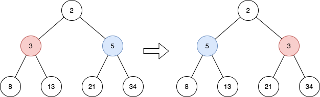
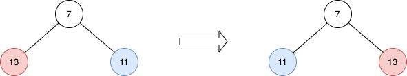

# 2415. Reverse Odd Levels of Binary Tree

## Problem

Given the **root of a perfect binary tree**, reverse the node values at **each odd level** of the tree.

For example, if the node values at **level 3** are:

```
[2,1,3,4,7,11,29,18]
```

After reversal they should become:

```
[18,29,11,7,4,3,1,2]
```

Return the **root of the reversed tree**.

---

## Definitions

### Perfect Binary Tree

A binary tree is **perfect** if:

- All internal nodes have **exactly two children**.
- All leaf nodes are at the **same depth**.

### Node Level

The **level of a node** is defined as the **number of edges** in the path from the **root to that node**.

- Root → Level **0**
- Root children → Level **1**
- Next level → Level **2**
- And so on.

Odd levels are:

```
1, 3, 5, ...
```

---

# Example 1



### Input

```
root = [2,3,5,8,13,21,34]
```

### Output

```
[2,5,3,8,13,21,34]
```

### Explanation

The tree has only **one odd level (level 1)**.

Nodes at level 1:

```
[3, 5]
```

After reversing:

```
[5, 3]
```

---

# Example 2



### Input

```
root = [7,13,11]
```

### Output

```
[7,11,13]
```

### Explanation

Nodes at **level 1**:

```
[13,11]
```

After reversing:

```
[11,13]
```

---

# Example 3

### Input

```
root = [0,1,2,0,0,0,0,1,1,1,1,2,2,2,2]
```

### Output

```
[0,2,1,0,0,0,0,2,2,2,2,1,1,1,1]
```

### Explanation

Odd levels contain non-zero values.

Level 1:

```
[1,2] → [2,1]
```

Level 3:

```
[1,1,1,1,2,2,2,2]
→
[2,2,2,2,1,1,1,1]
```

---

# Constraints

```
1 ≤ number of nodes ≤ 2^14
0 ≤ Node.val ≤ 10^5
root is a perfect binary tree
```
