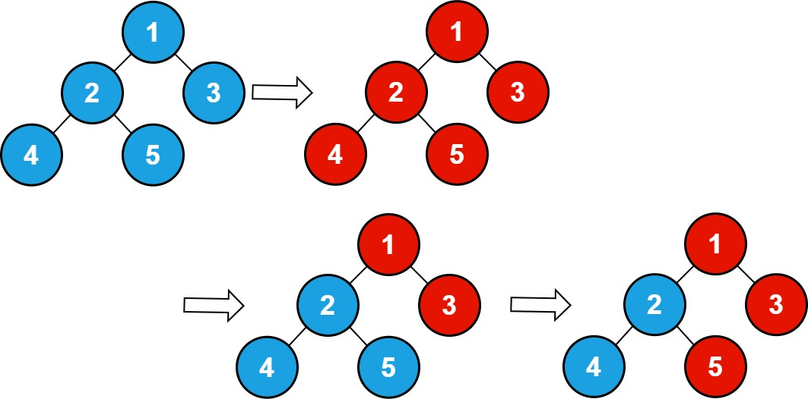
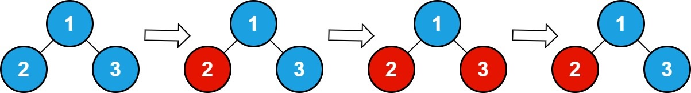

# 2445. Number of Nodes With Value One

## Problem

There is an **undirected connected tree** with `n` nodes labeled from **1 to n** and **n - 1 edges**.

The tree structure follows a specific rule:

- The **parent** of a node with label `v` is:

```
floor(v / 2)
```

- The **root** of the tree is node **1**.

### Example

If `n = 7`:

- Node `3` → parent = `floor(3 / 2) = 1`
- Node `7` → parent = `floor(7 / 2) = 3`

---

## Initial State

- Every node initially has **value = 0**.

---

## Queries

You are given an integer array:

```
queries
```

For each query `queries[i]`:

- **Flip all values in the subtree** rooted at node `queries[i]`.

### Flipping Rule

```
0 → 1
1 → 0
```

---

## Goal

After processing all queries, return:

```
the total number of nodes whose value is 1
```

---

# Example 1



### Input

```
n = 5
queries = [1,2,5]
```

### Output

```
3
```

### Explanation

After performing all flips, the nodes with value **1** are:

```
1, 3, 5
```

Total nodes with value `1` = **3**.

---

# Example 2



### Input

```
n = 3
queries = [2,3,3]
```

### Output

```
1
```

### Explanation

After all operations, the only node with value `1` is:

```
2
```

---

# Constraints

```
1 ≤ n ≤ 10^5
1 ≤ queries.length ≤ 10^5
1 ≤ queries[i] ≤ n
```
