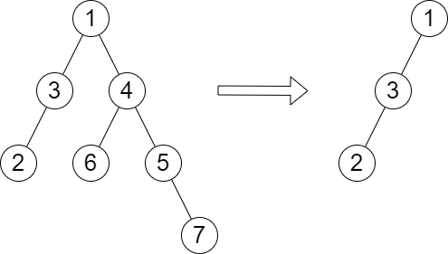

# 2458. Height of Binary Tree After Subtree Removal Queries

## Problem

You are given the **root of a binary tree** with **n nodes**.
Each node has a **unique value from 1 to n**.

You are also given an array **queries** of size **m**.

For each query `queries[i]`:

1. Remove the **subtree rooted at node with value queries[i]**.
2. Compute the **height of the remaining tree**.

Return an array **answer** where:

```
answer[i] = height of the tree after removing the subtree rooted at queries[i]
```

### Important Notes

- Each query is **independent**.
- The tree returns to its **original state after each query**.
- The **height of a tree** is the number of edges in the longest path from the root to any node.

---

# Example 1



### Input

```
root = [1,3,4,2,null,6,5,null,null,null,null,null,7]
queries = [4]
```

### Output

```
[2]
```

### Explanation

After removing the subtree rooted at node **4**, the remaining tree's longest path is:

```
1 → 3 → 2
```

Height = **2**.

---

# Example 2


### Input

```
root = [5,8,9,2,1,3,7,4,6]
queries = [3,2,4,8]
```

### Output

```
[3,2,3,2]
```

### Explanation

Queries:

1. Remove subtree rooted at **3**
   - Longest path: `5 → 8 → 2 → 4`
   - Height = **3**

2. Remove subtree rooted at **2**
   - Longest path: `5 → 8 → 1`
   - Height = **2**

3. Remove subtree rooted at **4**
   - Longest path: `5 → 8 → 2 → 6`
   - Height = **3**

4. Remove subtree rooted at **8**
   - Longest path: `5 → 9 → 3`
   - Height = **2**

---

# Constraints

```
2 ≤ n ≤ 10^5
1 ≤ Node.val ≤ n
All node values are unique
1 ≤ m ≤ min(n, 10^4)
queries[i] ≠ root.val
```

Where:

- **n** = number of nodes in the tree
- **m** = number of queries

---

# Key Idea

Each query removes an entire subtree.

The challenge is efficiently determining the **new tree height** after removing that subtree without rebuilding the tree each time.

Efficient solutions typically rely on:

- Precomputing subtree heights
- Tracking maximum heights from other branches
- Using DFS preprocessing
