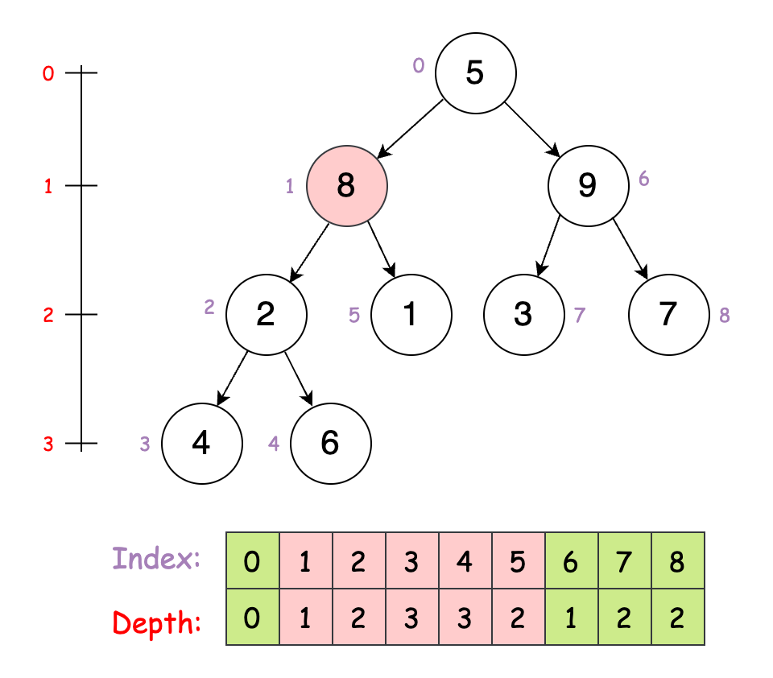
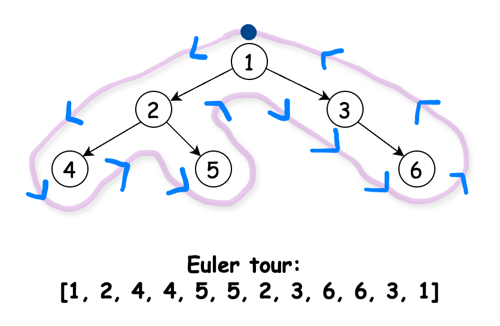
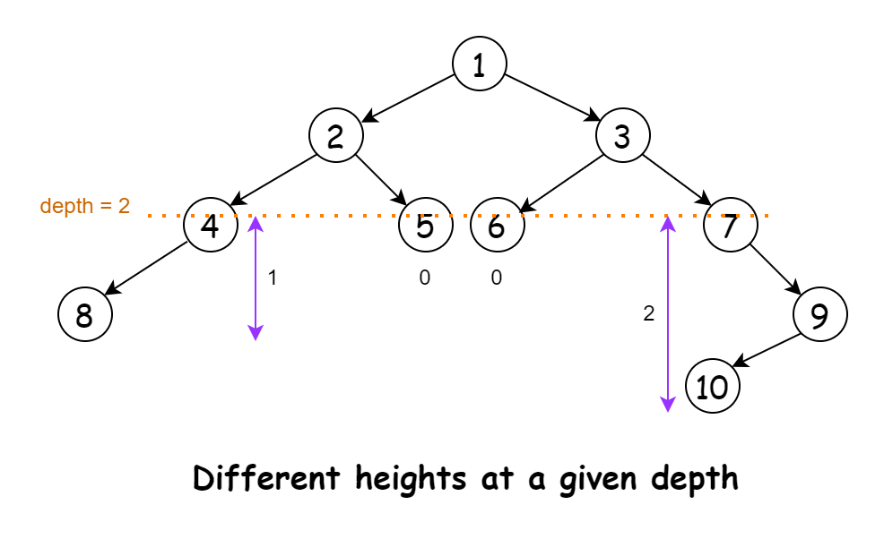

# 2458. Height of Binary Tree After Subtree Removal Queries — Approaches

## Overview

The approaches outlined below have similar time and space complexities. Rather than representing significant improvements over one another, they offer different methods and perspectives for solving the problem.

You can either review all of them and choose the one that appeals to you, or explore each one in detail to understand the various ways to tackle the problem.

---

# Approach 1: Left and Right Traversal

## Intuition

The problem asks us to find the height of a tree (the longest path from the root) after removing a subtree rooted at nodes listed in `queries`.

A brute-force solution would process each query separately by removing the specified subtree and recalculating the height of the remaining tree. However, this approach is inefficient due to its high time complexity.

To optimize, we can track the tree's height as we traverse from the root. For any node, the height after removing its subtree is simply the height of the tree before reaching that node. This allows us to avoid recalculating the height repeatedly.

We’ll perform a preorder traversal, tracking the maximum distance from the root. However, if the maximum height is achieved in the right subtree, we may miss it when traversing the left. To address this, we perform a second traversal in reverse preorder `(root, right, left)`.

We maintain an array `heights` where `heights[i]` stores the tree height after removing the subtree rooted at node `i`. During the first traversal, we update `heights` with the height at each node as we explore its left and right subtrees. In the reverse traversal, we update `heights` if the current height is greater than the stored value.

Finally, we iterate over `queries` and return the corresponding heights for each specified node.

## Algorithm

Initialize:

- a static array `maxHeightAfterRemoval` to store the maximum height of the tree after removing each node.
- a variable `currentMaxHeight` to `0`, which will track the current maximum height during traversals.

Main method `treeQueries`:

- Call the `traverseLeftToRight` method with the root node and initial height `0`.
- Reset `currentMaxHeight` to `0` for the second traversal.
- Call the `traverseRightToLeft` method with the root node and initial height `0`.
- Initialize an array `queryResults` to store the results of the queries.
- Iterate through the queries:
  - For each query, retrieve the corresponding maximum height from `maxHeightAfterRemoval`.
  - Store this height in `queryResults`.
- Return the `queryResults` array.

Define a method `traverseLeftToRight`:

- If the current node is `null`, return.
- Store the current `currentMaxHeight` in `maxHeightAfterRemoval` for the current node's value.
- Update `currentMaxHeight` to be the maximum of itself and the current height.
- Recursively call `traverseLeftToRight` for the left and right child, incrementing the height.

Define a method `traverseRightToLeft`:

- If the current node is `null`, return.
- Update `maxHeightAfterRemoval` for the current node's value to be the maximum of its current value and `currentMaxHeight`.
- Update `currentMaxHeight` to be the maximum of the current height and itself.
- Recursively call `traverseRightToLeft` for the right and left child, incrementing the height.

## Implementation

```java
class Solution {

    // Array to store the maximum height of the tree after removing each node
    static final int[] maxHeightAfterRemoval = new int[100001];

    int currentMaxHeight = 0;

    public int[] treeQueries(TreeNode root, int[] queries) {
        traverseLeftToRight(root, 0);
        currentMaxHeight = 0; // Reset for the second traversal
        traverseRightToLeft(root, 0);

        // Process queries and build the result array
        int queryCount = queries.length;
        int[] queryResults = new int[queryCount];
        for (int i = 0; i < queryCount; i++) {
            queryResults[i] = maxHeightAfterRemoval[queries[i]];
        }

        return queryResults;
    }

    private void traverseLeftToRight(TreeNode node, int currentHeight) {
        if (node == null) return;

        // Store the maximum height if this node were removed
        maxHeightAfterRemoval[node.val] = currentMaxHeight;

        // Update the current maximum height
        currentMaxHeight = Math.max(currentMaxHeight, currentHeight);

        // Traverse left subtree first, then right
        traverseLeftToRight(node.left, currentHeight + 1);
        traverseLeftToRight(node.right, currentHeight + 1);
    }

    private void traverseRightToLeft(TreeNode node, int currentHeight) {
        if (node == null) return;

        // Update the maximum height if this node were removed
        maxHeightAfterRemoval[node.val] = Math.max(
            maxHeightAfterRemoval[node.val],
            currentMaxHeight
        );

        // Update the current maximum height
        currentMaxHeight = Math.max(currentHeight, currentMaxHeight);

        // Traverse right subtree first, then left
        traverseRightToLeft(node.right, currentHeight + 1);
        traverseRightToLeft(node.left, currentHeight + 1);
    }
}
```

## Complexity Analysis

Let `n` be the number of nodes in the tree, and `q` be the number of queries.

### Time complexity

```text
O(n + q)
```

The solution performs two traversals of the binary tree, followed by processing the queries. In both traversals, each node in the tree is visited exactly once. Thus, the traversals take linear time.

To process the queries, the algorithm iterates through the `queries` array once, taking `O(q)` time.

Thus, the overall time complexity is:

```text
2 * O(n) + O(q) = O(n + q)
```

### Space complexity

```text
O(n)
```

The space complexity is determined mainly by 2 factors:

- The `maxHeightAfterRemoval` array, which has a fixed size of `100001`. This contributes `O(1)` to the space complexity as it's constant regardless of input size.
- The recursion stack used in the tree traversals. In the worst case (a completely unbalanced tree), this could reach a depth of `n`, resulting in `O(n)` space.

Combining these factors, the overall space complexity is `O(n)`.

Note: The size of the output array is not included in the space complexity calculations since it is part of the output space.

---

# Approach 2: Single Traversal

## Intuition

Let's optimize our solution to use just one traversal. We'll perform a preorder traversal starting from the root, similar to our previous approach. During this traversal, we’ll track a variable `maxVal` representing the maximum height encountered so far.

For each node, we store its corresponding answer (the `maxVal` at that point) in a `resultMap` for quick lookups during queries. We’ll also keep track of the depth as we traverse.

To determine the maximum height if a node is removed, we consider two values:

- The current `maxVal` on the path from the root to the node.
- The node’s depth plus one (to include itself) and the height of its sibling subtree.

To calculate the height of a sibling subtree, we’ll use a memoized helper function that finds the maximum distance from a given node to its leaf nodes.

Starting the DFS from the root, we populate `resultMap` with heights for each node. Once the traversal completes, we can answer queries using the information stored in `resultMap`.

## Algorithm

Initialize maps:

- `resultMap` to store the maximum height of the tree after removing each node.
- `heightCache` to store precomputed heights of subtrees.

Call the `dfs` method with initial parameters: root node, depth `0`, `maxVal` `0`, `resultMap`, and `heightCache`.

Initialize an array `result` to store the final query results.

Iterate through the queries:

- For each query, retrieve the corresponding maximum height from `resultMap`.
- Store this height in the result array.

Return the result array.

Define the `height` method to calculate the height of a tree:

- If the node is `null`, return `-1`.
- If the height of the node is already in `heightCache`, return the cached value.
- Calculate the height recursively as `1 + max(left subtree height, right subtree height)`.
- Store the calculated height in `heightCache`.
- Return the calculated height.

Define the `dfs` method for the depth-first search:

- If the current node is `null`, return.
- Store the current `maxVal` in `resultMap` for the current node's value.
- Recursively call `dfs` for the left child:
  - increment the depth
  - update `maxVal` as the maximum of current `maxVal` and `(depth + 1 + height of right subtree)`
- Recursively call `dfs` for the right child:
  - increment the depth
  - update `maxVal` as the maximum of current `maxVal` and `(depth + 1 + height of left subtree)`

## Implementation

```java
class Solution {

    public int[] treeQueries(TreeNode root, int[] queries) {
        Map<Integer, Integer> resultMap = new HashMap<>();
        Map<TreeNode, Integer> heightCache = new HashMap<>();

        // Run DFS to fill resultMap with maximum heights after each query
        dfs(root, 0, 0, resultMap, heightCache);

        int[] result = new int[queries.length];
        for (int i = 0; i < queries.length; i++) {
            result[i] = resultMap.get(queries[i]);
        }
        return result;
    }

    // Function to calculate the height of the tree
    private int height(TreeNode node, Map<TreeNode, Integer> heightCache) {
        if (node == null) {
            return -1;
        }

        // Return cached height if already calculated
        if (heightCache.containsKey(node)) {
            return heightCache.get(node);
        }

        int h =
            1 +
            Math.max(
                height(node.left, heightCache),
                height(node.right, heightCache)
            );
        heightCache.put(node, h);
        return h;
    }

    // DFS to precompute the maximum values after removing the subtree
    private void dfs(
        TreeNode node,
        int depth,
        int maxVal,
        Map<Integer, Integer> resultMap,
        Map<TreeNode, Integer> heightCache
    ) {
        if (node == null) {
            return;
        }

        resultMap.put(node.val, maxVal);

        // Traverse left and right subtrees while updating max values
        dfs(
            node.left,
            depth + 1,
            Math.max(maxVal, depth + 1 + height(node.right, heightCache)),
            resultMap,
            heightCache
        );
        dfs(
            node.right,
            depth + 1,
            Math.max(maxVal, depth + 1 + height(node.left, heightCache)),
            resultMap,
            heightCache
        );
    }
}
```

## Complexity Analysis

Let `n` be the number of nodes in the tree, and `q` be the number of queries.

### Time complexity

```text
O(n + q)
```

The main `dfs` function visits each node in the tree exactly once. For each node, it calls the `height` function (which uses memoization) to calculate the heights of the subtrees. In the worst case, when we first encounter a node, we might need to calculate its height by traversing its entire subtree. However, subsequent calls for the same node or its ancestors will use the memoized value. Given that each node is visited once by `dfs`, and each node's height is calculated once and then cached, the overall time complexity for processing the tree is `O(n)`.

The algorithm also iterates over the `queries` array to create the result, taking `O(q)` time.

Thus, the time complexity of the algorithm is `O(n + q)`.

### Space complexity

```text
O(n)
```

The `resultMap` and `heightCache` each take `O(n)` space. The recursion stack for the DFS can go as deep as the height of the tree, which is `O(n)` in the worst case.

Thus, the space complexity is `O(n)`.

---

# Approach 3: Subtree Size

## Intuition

In a preorder traversal of a tree, a subtree starts at its root's index and ends at the index equal to the start index plus the subtree's size. If we know the index and size of the subtree to be removed, we can remove this section from the traversal list. The maximum depth in the remaining traversal then represents the tree’s maximum height after removal.

For example, given the indices and depths of nodes, removing a subtree will leave us with the highest depth among the remaining nodes as our answer.

To implement this, we’ll perform a preorder traversal to:

- Assign an index to each node
- Track the depth of each node

We then create two arrays, `maxDepthsFromLeft` and `maxDepthsFromRight`, to store the maximum depth to the left and right of each index, respectively. These arrays are filled by iterating through the nodes and updating each index with the maximum of the previous result and the current node’s depth.

Finally, to process each query, we compute the result as the maximum of:

- The maximum depth from the left up to the starting index
- The maximum depth from the right beyond the ending index, if available.



## Algorithm

Initialize maps:

- `nodeIndexMap` to store the index of each node value.
- `subtreeSize` to store the number of nodes in the subtree for each node.

Initialize lists `nodeDepths`, `maxDepthFromLeft`, and `maxDepthFromRight` to store node depths and maximum depths from left and right.

Call the `dfs` method to populate `nodeIndexMap` and `nodeDepths`.

Store the total number of nodes in `totalNodes`.

Call `calculateSubtreeSize` method to populate the `subtreeSize` map.

Initialize `maxDepthFromLeft` and `maxDepthFromRight` with the first and last node depths respectively.

Iterate through the nodes to calculate `maxDepthFromLeft` and `maxDepthFromRight`:

- Update `maxDepthFromLeft` with the maximum of the previous max and current depth.
- Update `maxDepthFromRight` with the maximum of the previous max and current depth (in reverse order).

Reverse the `maxDepthFromRight` list.

Initialize an array `results` to store the query results.

Process each query. For each query node:

- Calculate the end index as the node's index minus `1`.
- Calculate the start index as the end index plus the subtree size plus `1`.
- Initialize `maxDepth` with the value from `maxDepthFromLeft` at the end index.
- If the start index is within bounds, update `maxDepth` with the maximum of current `maxDepth` and the value from `maxDepthFromRight` at the start index.
- Store the `maxDepth` in the results array.

Return the results array.

Define a method `dfs` for the depth-first search:

- If the current node is `null`, return.
- Add the current node's value and index to `nodeIndexMap`.
- Add the current depth to `nodeDepths`.
- Recursively call `dfs` for left and right children, incrementing the depth.

Define a method `calculateSubtreeSize`:

- If the current node is `null`, return `0`.
- Recursively calculate the size of left and right subtrees.
- Calculate the total size as left size plus right size plus `1`.
- Store the total size in `subtreeSize` for the current node.
- Return the total size.

## Implementation

```java
class Solution {

    public int[] treeQueries(TreeNode root, int[] queries) {
        // Map to store the index of each node value
        Map<Integer, Integer> nodeIndexMap = new HashMap<>();

        // Map to store the number of nodes in subtree for each node
        Map<Integer, Integer> subtreeSize = new HashMap<>();

        // Lists to store node depths and maximum depths from left and right
        List<Integer> nodeDepths = new ArrayList<>();
        List<Integer> maxDepthFromLeft = new ArrayList<>();
        List<Integer> maxDepthFromRight = new ArrayList<>();

        // Perform DFS to populate nodeIndexMap and nodeDepths
        dfs(root, 0, nodeIndexMap, nodeDepths);

        int totalNodes = nodeDepths.size();

        // Calculate subtree sizes
        calculateSubtreeSize(root, subtreeSize);

        // Calculate maximum depths from left and right
        maxDepthFromLeft.add(nodeDepths.get(0));
        maxDepthFromRight.add(nodeDepths.get(totalNodes - 1));

        for (int i = 1; i < totalNodes; i++) {
            maxDepthFromLeft.add(
                Math.max(maxDepthFromLeft.get(i - 1), nodeDepths.get(i))
            );
            maxDepthFromRight.add(
                Math.max(
                    maxDepthFromRight.get(i - 1),
                    nodeDepths.get(totalNodes - i - 1)
                )
            );
        }
        Collections.reverse(maxDepthFromRight);

        // Process queries
        int[] results = new int[queries.length];
        for (int i = 0; i < queries.length; i++) {
            int queryNode = queries[i];
            int startIndex = nodeIndexMap.get(queryNode) - 1;
            int endIndex = startIndex + 1 + subtreeSize.get(queryNode);

            int maxDepth = maxDepthFromLeft.get(startIndex);
            if (endIndex < totalNodes) {
                maxDepth = Math.max(maxDepth, maxDepthFromRight.get(endIndex));
            }

            results[i] = maxDepth;
        }

        return results;
    }

    // Depth-first search to populate nodeIndexMap and nodeDepths
    private void dfs(
        TreeNode root,
        int depth,
        Map<Integer, Integer> nodeIndexMap,
        List<Integer> nodeDepths
    ) {
        if (root == null) return;

        nodeIndexMap.put(root.val, nodeDepths.size());
        nodeDepths.add(depth);

        dfs(root.left, depth + 1, nodeIndexMap, nodeDepths);
        dfs(root.right, depth + 1, nodeIndexMap, nodeDepths);
    }

    // Calculate the size of subtree for each node
    private int calculateSubtreeSize(
        TreeNode root,
        Map<Integer, Integer> subtreeSize
    ) {
        if (root == null) return 0;

        int leftSize = calculateSubtreeSize(root.left, subtreeSize);
        int rightSize = calculateSubtreeSize(root.right, subtreeSize);

        int totalSize = leftSize + rightSize + 1;
        subtreeSize.put(root.val, totalSize);

        return totalSize;
    }
}
```

## Complexity Analysis

Let `n` be the number of nodes in the tree, and `q` be the number of queries.

### Time complexity

```text
O(n + q)
```

This solution employs a four-step approach to solve the problem:

- The initial depth-first search traverses each node once, populating `nodeIndexMap` and `nodeDepths`. This takes `O(n)` time.
- The calculation of subtree sizes (`calculateSubtreeSize` method) also visits each node once, taking `O(n)` time.
- Computing `maxDepthFromLeft` and `maxDepthFromRight` involves iterating through the `nodeDepths` list once, which takes `O(n)` time.
- Processing the queries and populating the result array takes `O(q)` time.

Summing up the parts, the algorithm has a time complexity of:

```text
3 * O(n) + O(q) = O(n + q)
```

### Space complexity

```text
O(n)
```

The `nodeIndexMap` and `subtreeSize` maps each store information for every node, taking `O(n)` space each. The `nodeDepths`, `maxDepthFromLeft`, and `maxDepthFromRight` lists each contain an entry for every node, also taking `O(n)` space each.

Similar to the previous approach, the recursion stack has an `O(n)` complexity.

Thus, the space complexity remains `O(n)`.

---

# Approach 4: Eulerian Tour

## Intuition

The previous approach can be generalized using an Eulerian tour. An Eulerian tour traverses the tree such that each node is visited twice, once when first encountered, and again when leaving after exploring all its subtrees.

In this tour, a subtree is bounded by the first and last occurrences of its root node. To find the maximum height of the tree after removing a subtree, we can simply look at the maximum depth before the first occurrence and after the last occurrence of the subtree's root node.

To create the Eulerian tour, we perform a DFS over the tree, recording the first and last occurrences of each node in the `firstOccurrence` and `lastOccurrence` maps, respectively, while tracking each node's depth.

Like the previous approach, we calculate `maxDepthLeft` and `maxDepthRight` for each node for quick access. For each query, we can then retrieve the maximum depths at the first and last occurrences of the queried node and return the greater of the two as our answer.



## Algorithm

Initialize a list `eulerTour` to store the Euler tour of the tree.

Initialize maps `nodeHeights`, `firstOccurrence`, and `lastOccurrence` to store information about each node.

Call the `dfs` function to build the Euler tour and populate the maps.

Set `tourSize` to the size of `eulerTour`.

Initialize arrays `maxDepthLeft` and `maxDepthRight` of size `tourSize`.

Set the first element of `maxDepthLeft` and last element of `maxDepthRight` to the height of the root node.

Iterate from `1` to `tourSize - 1`:

- Set `maxDepthLeft[i]` to the maximum of the previous max height and the current node's height.

Iterate backward from `tourSize - 2` to `0`:

- Set `maxDepthRight[i]` to the maximum of the next max height and the current node's height.

Initialize an array `results` with the same length as `queries`.

For each query in `queries`:

- Set `queryNode` to the current query value.
- Calculate `leftMax` and `rightMax` as the max height to the left and right of the node's first occurrence, respectively.
- Store the maximum of `leftMax` and `rightMax` in `results`.

Return the `results` array.

Define the `dfs` function:

- If the current node is `null`, return.
- Add the current node's height to `nodeHeights`.
- Set the first occurrence of the current node in `firstOccurrence`.
- Add the current node's value to `eulerTour`.
- Recursively call `dfs` for left and right children, incrementing the height.
- Set the last occurrence of the current node in `lastOccurrence`.
- Add the current node's value to `eulerTour` again.

## Implementation

```java
class Solution {

    public int[] treeQueries(TreeNode root, int[] queries) {
        // Lists and maps to store tree information
        List<Integer> eulerTour = new ArrayList<>();
        Map<Integer, Integer> nodeHeights = new HashMap<>();
        Map<Integer, Integer> firstOccurrence = new HashMap<>();
        Map<Integer, Integer> lastOccurrence = new HashMap<>();

        // Perform DFS to build Euler tour and node information
        dfs(root, 0, eulerTour, nodeHeights, firstOccurrence, lastOccurrence);

        int tourSize = eulerTour.size();
        int[] maxDepthLeft = new int[tourSize];
        int[] maxDepthRight = new int[tourSize];

        // Initialize the first and last elements of maxHeight arrays
        maxDepthLeft[0] = maxDepthRight[tourSize - 1] = nodeHeights.get(
            root.val
        );

        // Build maxDepthLeft and maxDepthRight array
        for (int i = 1; i < tourSize; i++) {
            maxDepthLeft[i] = Math.max(
                maxDepthLeft[i - 1],
                nodeHeights.get(eulerTour.get(i))
            );
        }

        for (int i = tourSize - 2; i >= 0; i--) {
            maxDepthRight[i] = Math.max(
                maxDepthRight[i + 1],
                nodeHeights.get(eulerTour.get(i))
            );
        }

        // Process queries
        int[] results = new int[queries.length];
        for (int i = 0; i < queries.length; i++) {
            int queryNode = queries[i];
            int leftMax = (firstOccurrence.get(queryNode) > 0)
                ? maxDepthLeft[firstOccurrence.get(queryNode) - 1]
                : 0;
            int rightMax = (lastOccurrence.get(queryNode) < tourSize - 1)
                ? maxDepthRight[lastOccurrence.get(queryNode) + 1]
                : 0;
            results[i] = Math.max(leftMax, rightMax);
        }

        return results;
    }

    // Depth-first search to build the Euler tour and store node information
    private void dfs(
        TreeNode root,
        int height,
        List<Integer> eulerTour,
        Map<Integer, Integer> nodeHeights,
        Map<Integer, Integer> firstOccurrence,
        Map<Integer, Integer> lastOccurrence
    ) {
        if (root == null) return;

        nodeHeights.put(root.val, height);
        firstOccurrence.put(root.val, eulerTour.size());
        eulerTour.add(root.val);

        dfs(
            root.left,
            height + 1,
            eulerTour,
            nodeHeights,
            firstOccurrence,
            lastOccurrence
        );
        dfs(
            root.right,
            height + 1,
            eulerTour,
            nodeHeights,
            firstOccurrence,
            lastOccurrence
        );

        lastOccurrence.put(root.val, eulerTour.size());
        eulerTour.add(root.val);
    }
}
```

## Complexity Analysis

Let `n` be the number of nodes in the tree, and `q` be the number of queries.

### Time complexity

```text
O(n + q)
```

The `dfs` method traverses each node twice (down and up) to construct the Euler tour, which takes `O(n)` time. The `maxDepthLeft` and `maxDepthRight` arrays are then built by iterating over the Euler tour in both directions and since the tour has a length of `2n`, this step also takes `O(n)` time.

Processing the queries takes `O(q)` time, making the total time complexity `O(n + q)`.

### Space complexity

```text
O(n)
```

The Euler tour, stored in a list, contains `2 * n` elements and occupies `O(n)` space. Three maps — `nodeHeights`, `firstOccurrence`, and `lastOccurrence` — each store information for every node, also taking `O(n)` space. Two arrays, `maxDepthLeft` and `maxDepthRight`, mirror the Euler tour's length and consume `O(n)` space each. Additionally, the recursion stack, as is typical, requires `O(n)` space.

Thus, the overall space complexity is `O(n)`.

---

# Approach 5: Two Largest Cousins

## Intuition

At any node, the longest path through it is the sum of its depth and the height of its subtree. For each depth, the maximum tree height at that level will be the depth plus the maximum height of any node at that depth.

To optimize this, we organize nodes by their depths and precalculate their heights. If a query removes a node, we find the maximum height at that depth, excluding the removed node.

To streamline further, the maximum height from a given depth can be found using two precomputed values:

- The maximum height at that depth, excluding the current node.
- The second-highest height at that depth, if the maximum-height subtree is removed.

Thus, we only need the two largest heights at each depth. We maintain two lists, `firstLargestHeight` and `secondLargestHeight`, where each index stores the two largest heights for each depth. We then use DFS to populate these lists, along with each node's depth and height. For each query, if a node’s height matches the largest height at its depth, we return the second-largest height at that level; otherwise, we return the largest height.



## Algorithm

Initialize maps:

- `nodeDepths` to store the depth of each node.
- `subtreeHeights` to store the height of the subtree rooted at each node.

Initialize maps `firstLargestHeight` and `secondLargestHeight` to store the first and second largest heights at each level.

Call the `dfs` function to populate these maps.

Initialize an array `results` with the same length as `queries`.

For each query in `queries`:

- Set `queryNode` to the current query value.
- Set `nodeLevel` to the depth of the query node.
- If the height of the query node's subtree equals the first largest height at its level:
  - Set the result to the sum of node level and second largest height at that level, minus `1`.
- Otherwise:
  - Set the result to the sum of node level and first largest height at that level, minus `1`.

Return the `results` array.

Define the `dfs` function:

- If the current node is `null`, return `0`.
- Add the current node's depth to `nodeDepths`.
- Recursively call `dfs` for left and right children, incrementing the level.
- Calculate `currentHeight` as `1 + max(left subtree height, right subtree height)`.
- Add the current node's subtree height to `subtreeHeights`.
- Set `currentFirstLargest` to the first largest height at the current level.
- If `currentHeight` is greater than `currentFirstLargest`:
  - Update `secondLargestHeight` at the current level with `currentFirstLargest`.
  - Update `firstLargestHeight` at the current level with `currentHeight`.
- Else if `currentHeight` is greater than the second largest height at the current level:
  - Update `secondLargestHeight` at the current level with `currentHeight`.
- Return `currentHeight`.

Note: The C++ implementation opts for vectors instead of unordered_maps. This choice stems from unordered_maps' reputation for slower performance in certain scenarios.

## Implementation

```java
class Solution {

    public int[] treeQueries(TreeNode root, int[] queries) {
        // Maps to store node depths and heights
        Map<Integer, Integer> nodeDepths = new HashMap<>();
        Map<Integer, Integer> subtreeHeights = new HashMap<>();

        // Maps to store the first and second largest heights at each level
        Map<Integer, Integer> firstLargestHeight = new HashMap<>();
        Map<Integer, Integer> secondLargestHeight = new HashMap<>();

        // Perform DFS to calculate depths and heights
        dfs(
            root,
            0,
            nodeDepths,
            subtreeHeights,
            firstLargestHeight,
            secondLargestHeight
        );

        int[] results = new int[queries.length];

        // Process each query
        for (int i = 0; i < queries.length; i++) {
            int queryNode = queries[i];
            int nodeLevel = nodeDepths.get(queryNode);

            // Calculate the height of the tree after removing the query node
            if (
                subtreeHeights
                    .get(queryNode)
                    .equals(firstLargestHeight.get(nodeLevel))
            ) {
                results[i] = nodeLevel +
                secondLargestHeight.getOrDefault(nodeLevel, 0) -
                1;
            } else {
                results[i] = nodeLevel +
                firstLargestHeight.getOrDefault(nodeLevel, 0) -
                1;
            }
        }

        return results;
    }

    // Depth-first search to calculate node depths and subtree heights
    private int dfs(
        TreeNode node,
        int level,
        Map<Integer, Integer> nodeDepths,
        Map<Integer, Integer> subtreeHeights,
        Map<Integer, Integer> firstLargestHeight,
        Map<Integer, Integer> secondLargestHeight
    ) {
        if (node == null) return 0;

        nodeDepths.put(node.val, level);

        // Calculate the height of the current subtree
        int leftHeight = dfs(
            node.left,
            level + 1,
            nodeDepths,
            subtreeHeights,
            firstLargestHeight,
            secondLargestHeight
        );
        int rightHeight = dfs(
            node.right,
            level + 1,
            nodeDepths,
            subtreeHeights,
            firstLargestHeight,
            secondLargestHeight
        );
        int currentHeight = 1 + Math.max(leftHeight, rightHeight);

        subtreeHeights.put(node.val, currentHeight);

        // Update the largest and second largest heights at the current level
        int currentFirstLargest = firstLargestHeight.getOrDefault(level, 0);
        if (currentHeight > currentFirstLargest) {
            secondLargestHeight.put(level, currentFirstLargest);
            firstLargestHeight.put(level, currentHeight);
        } else if (currentHeight > secondLargestHeight.getOrDefault(level, 0)) {
            secondLargestHeight.put(level, currentHeight);
        }

        return currentHeight;
    }
}
```

## Complexity Analysis

Let `n` be the number of nodes in the tree, and `q` be the number of queries.

### Time complexity

```text
O(n + q)
```

The `dfs` method traverses each node in the tree exactly once. For each node, it performs several comparison and update operations, all of which take constant time. So this step takes `O(n)` time.

To process each query, the algorithm does some map lookups and a comparison, both taking constant time. Thus, processing all the queries requires `O(q)` time.

Thus, the overall time complexity of the algorithm is `O(n + q)`.

### Space complexity

```text
O(n)
```

The `nodeDepths` and `subtreeHeights` maps store information for every node, taking `O(n)` space each.

The `firstLargestHeight` and `secondLargestHeight` maps typically store `log n` (balanced trees) elements, but in the worst case (skewed trees), could store information for all `n` levels. Thus, these take a further `O(n)` space.

The recursion stack goes as deep as the height of the tree, which can be `n` in the worst case.

Thus, the overall space complexity is `O(n)`.
