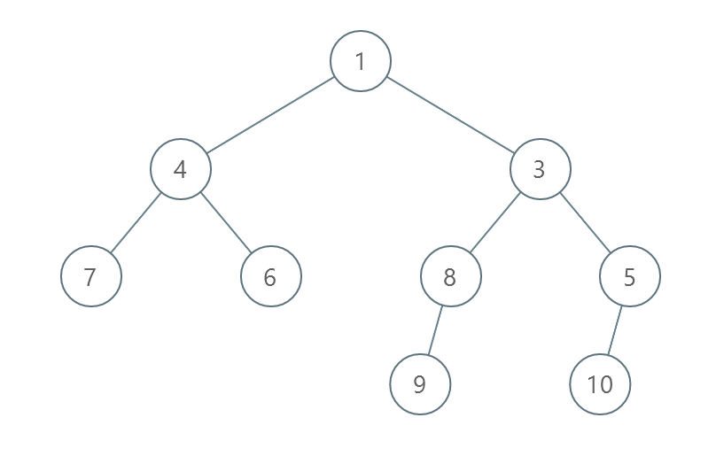
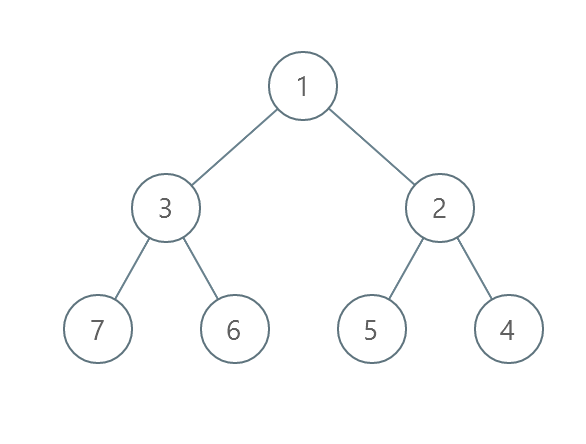
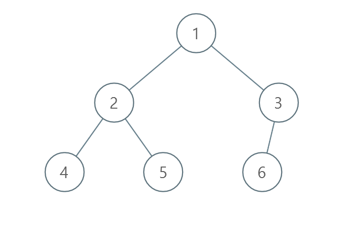

# 2471. Minimum Number of Operations to Sort a Binary Tree by Level

## Problem

You are given the **root of a binary tree with unique values**.

In **one operation**, you can choose **any two nodes at the same level** and **swap their values**.

Your task is to compute the **minimum number of operations** required so that the values at **each level** of the tree are sorted in **strictly increasing order**.

The **level** of a node is defined as the number of edges between the node and the **root**.

---

## Example 1



### Input

```
root = [1,4,3,7,6,8,5,null,null,null,null,9,null,10]
```

### Output

```
3
```

### Explanation

Operations:

1. Swap **4** and **3** → level 2 becomes `[3,4]`
2. Swap **7** and **5** → level 3 becomes `[5,6,8,7]`
3. Swap **8** and **7** → level 3 becomes `[5,6,7,8]`

Total operations = **3**.

---

## Example 2



### Input

```
root = [1,3,2,7,6,5,4]
```

### Output

```
3
```

### Explanation

Operations:

1. Swap **3** and **2** → level 2 becomes `[2,3]`
2. Swap **7** and **4** → level 3 becomes `[4,6,5,7]`
3. Swap **6** and **5** → level 3 becomes `[4,5,6,7]`

Total operations = **3**.

---

## Example 3



### Input

```
root = [1,2,3,4,5,6]
```

### Output

```
0
```

### Explanation

Each level is already sorted in strictly increasing order, so **no operations are required**.

---

## Constraints

```
1 ≤ number of nodes ≤ 10^5
1 ≤ Node.val ≤ 10^5
All node values are unique
```

---

## Key Idea

The problem requires sorting node values **level by level** using **minimum swaps**.

This reduces to:

1. Perform **level-order traversal (BFS)**.
2. For each level:
   - Extract the node values.
   - Compute the **minimum number of swaps needed to sort the array**.

The minimum swaps needed to sort an array can be computed using **cycle detection in permutations**.
