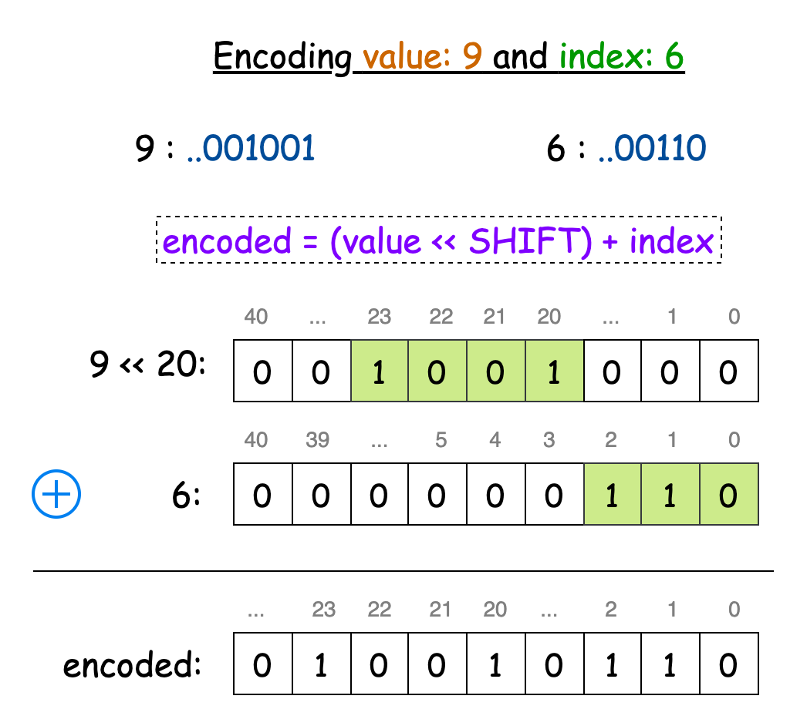
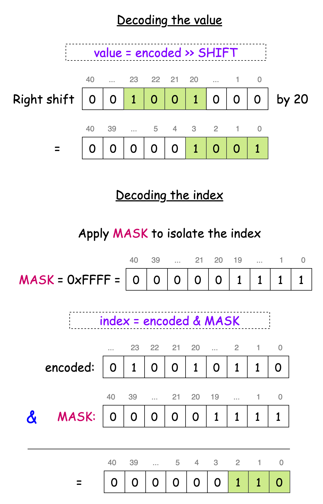

# 2471. Minimum Number of Operations to Sort a Binary Tree by Level

## Approach 1: Hash Map

### Intuition

Our first task is to traverse the tree **level by level**. This is known as **level-order traversal**, typically implemented using **Breadth-First Search (BFS)**.

Level-order traversal explores all nodes at the current level before moving to the next level. A **queue** helps manage this traversal order.

Steps:

1. Use a queue for BFS.
2. At each level:
   - Record the values of nodes at that level.
   - Add children of those nodes to the queue.
3. Once the level values are collected, compute the **minimum swaps needed to sort the array**.

The minimum swaps needed to sort an array can be found using **cycle detection in permutations**.

The algorithm:

- Create a sorted version of the array.
- Track positions of each value using a **hash map**.
- If an element is not in its correct position, swap it with the correct value.
- Continue until the array becomes sorted.

The total swaps across all levels give the final answer.

---

### Algorithm

1. Initialize:
   - Queue for BFS traversal.
   - Variable `totalSwaps`.
2. Add the root node to the queue.
3. While the queue is not empty:
   - Determine the size of the current level.
   - Create an array `levelValues`.
4. For each node in the level:
   - Remove node from queue.
   - Store its value.
   - Add children to queue.
5. Compute minimum swaps needed to sort `levelValues`.
6. Add swaps to `totalSwaps`.
7. Continue for the next level.
8. Return `totalSwaps`.

---

### Java Implementation

```java
class Solution {

    public int minimumOperations(TreeNode root) {
        Queue<TreeNode> queue = new LinkedList<>();
        queue.add(root);
        int totalSwaps = 0;

        while (!queue.isEmpty()) {
            int levelSize = queue.size();
            int[] levelValues = new int[levelSize];

            for (int i = 0; i < levelSize; i++) {
                TreeNode node = queue.poll();
                levelValues[i] = node.val;

                if (node.left != null) queue.add(node.left);
                if (node.right != null) queue.add(node.right);
            }

            totalSwaps += getMinSwaps(levelValues);
        }

        return totalSwaps;
    }

    private int getMinSwaps(int[] original) {
        int swaps = 0;
        int[] target = original.clone();
        Arrays.sort(target);

        Map<Integer, Integer> pos = new HashMap<>();
        for (int i = 0; i < original.length; i++) {
            pos.put(original[i], i);
        }

        for (int i = 0; i < original.length; i++) {
            if (original[i] != target[i]) {
                swaps++;

                int curPos = pos.get(target[i]);
                pos.put(original[i], curPos);
                original[curPos] = original[i];
            }
        }

        return swaps;
    }
}
```

---

### Complexity Analysis

Let **n** be the number of nodes.

**Time Complexity**

```
O(n log n)
```

Explanation:

- BFS traversal: `O(n)`
- Sorting values at each level: `O(w log w)`
- Worst case width `w ≈ n/2`

Total complexity:

```
O(n log n)
```

**Space Complexity**

```
O(n)
```

Used by:

- BFS queue
- level arrays
- hash map

---

# Approach 2: Bit Manipulation

### Intuition

The previous solution used:

- original array
- sorted array
- hash map

We can reduce memory by **encoding value and index together** using bit manipulation.

Observation:

- Node values ≤ `10^5`
- Level indices ≤ `10^5`

20 bits are enough to store each.

We encode:

```
encoded = (value << 20) + index
```

- High 20 bits → value
- Low 20 bits → index

To extract index:

```
encoded & MASK
```

Where:

```
MASK = 0xFFFFF
```

This allows us to sort and track original positions without an additional map.





---

### Algorithm

1. Define constants:

```
SHIFT = 20
MASK = 0xFFFFF
```

2. Perform BFS level traversal.
3. At each level:
   - Encode value and position into `long`.
4. Sort the encoded array.
5. If the original position does not match current index:
   - swap elements
   - decrement index to recheck
6. Count swaps.

---

### Java Implementation

```java
class Solution {

    final int SHIFT = 20;
    final int MASK = 0xFFFFF;

    public int minimumOperations(TreeNode root) {
        Queue<TreeNode> queue = new LinkedList<>();
        queue.add(root);

        int swaps = 0;

        while (!queue.isEmpty()) {
            int levelSize = queue.size();
            long[] nodes = new long[levelSize];

            for (int i = 0; i < levelSize; i++) {
                TreeNode node = queue.poll();
                nodes[i] = ((long) node.val << SHIFT) + i;

                if (node.left != null) queue.add(node.left);
                if (node.right != null) queue.add(node.right);
            }

            Arrays.sort(nodes);

            for (int i = 0; i < levelSize; i++) {
                int origPos = (int) (nodes[i] & MASK);

                if (origPos != i) {
                    long temp = nodes[i];
                    nodes[i--] = nodes[origPos];
                    nodes[origPos] = temp;
                    swaps++;
                }
            }
        }

        return swaps;
    }
}
```

---

### Complexity Analysis

Let **n** be the number of nodes.

**Time Complexity**

```
O(n log n)
```

- BFS traversal: `O(n)`
- Sorting level arrays: `O(w log w)`

Worst case:

```
O(n log n)
```

**Space Complexity**

```
O(n)
```

Used by:

- BFS queue
- encoded node array

---

# Summary

| Approach     | Technique              | Time       | Space |
| ------------ | ---------------------- | ---------- | ----- |
| Hash Map     | BFS + cycle sort       | O(n log n) | O(n)  |
| Bit Encoding | BFS + bit manipulation | O(n log n) | O(n)  |

Both approaches rely on:

- **Level order traversal**
- **Minimum swaps to sort an array**
