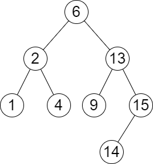

# 2476. Closest Nodes Queries in a Binary Search Tree

## Problem

You are given the **root of a Binary Search Tree (BST)** and an integer array **queries**.

For each query value `queries[i]`, return two values:

```
answer[i] = [mini, maxi]
```

Where:

- **mini** = the largest value in the tree that is **≤ queries[i]**
- **maxi** = the smallest value in the tree that is **≥ queries[i]**

If such values do not exist, return **-1** instead.

Return a 2D array containing answers for all queries.

---

# Example 1



### Input

```
root = [6,2,13,1,4,9,15,null,null,null,null,null,null,14]
queries = [2,5,16]
```

### Output

```
[[2,2],[4,6],[15,-1]]
```

### Explanation

- Query = **2**
  - largest ≤ 2 → **2**
  - smallest ≥ 2 → **2**
  - result → `[2,2]`

- Query = **5**
  - largest ≤ 5 → **4**
  - smallest ≥ 5 → **6**
  - result → `[4,6]`

- Query = **16**
  - largest ≤ 16 → **15**
  - smallest ≥ 16 → **does not exist**
  - result → `[15,-1]`

---

# Example 2

### Input

```
root = [4,null,9]
queries = [3]
```

### Output

```
[[-1,4]]
```

### Explanation

- largest ≤ 3 → **does not exist**
- smallest ≥ 3 → **4**

Result:

```
[-1,4]
```

---

# Constraints

```
2 ≤ number of nodes ≤ 10^5
1 ≤ Node.val ≤ 10^6
1 ≤ queries.length ≤ 10^5
1 ≤ queries[i] ≤ 10^6
```

---

# Key Properties

Because the tree is a **Binary Search Tree**, the values satisfy:

```
left subtree < node < right subtree
```

This property allows efficient searching for floor and ceiling values for each query.
