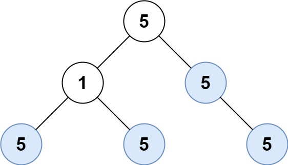

from pathlib import Path

content = """

# 250. Count Univalue Subtrees

## Problem

Given the **root of a binary tree**, return the **number of uni-value subtrees**.

A **uni-value subtree** is a subtree where **all nodes have the same value**.

---

## Example 1



**Input**

```
root = [5,1,5,5,5,null,5]
```

**Output**

```
4
```

---

## Example 2

**Input**

```
root = []
```

**Output**

```
0
```

---

## Example 3

**Input**

```
root = [5,5,5,5,5,null,5]
```

**Output**

```
6
```

---

## Constraints

- Number of nodes in the tree: **[0, 1000]**
- `-1000 ≤ Node.val ≤ 1000`
  """

path = Path("/mnt/data/count_univalue_subtrees_250.md")
path.write_text(content)

path
