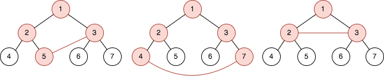
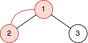

# 2509. Cycle Length Queries in a Tree

## Problem

You are given an integer **n**. There is a **complete binary tree** with **2^n - 1 nodes**.

- The root node has value **1**.
- For any node with value **val** in the range `[1, 2^n - 2]`:
  - Left child → `2 * val`
  - Right child → `2 * val + 1`

You are also given a **2D integer array `queries`** of length **m**, where:

```
queries[i] = [ai, bi]
```

For each query, perform the following steps:

1. Add an edge between nodes **ai** and **bi**.
2. Determine the **length of the cycle** created in the graph.
3. Remove the added edge before processing the next query.

---

## Definitions

### Cycle

A **cycle** is a path that:

- Starts and ends at the **same node**
- Visits each edge **exactly once**

### Cycle Length

The **cycle length** is the **number of edges** in that cycle.

Note:

- Adding the edge may create **multiple edges between two nodes**.

---

# Example 1



### Input

```
n = 3
queries = [[5,3],[4,7],[2,3]]
```

### Output

```
[4,5,3]
```

### Explanation

The tree has:

```
2^3 - 1 = 7 nodes
```

For each query:

1. Add edge **(5,3)**
   Cycle formed: `[5,2,1,3]`
   Cycle length → `4`

2. Add edge **(4,7)**
   Cycle formed: `[4,2,1,3,7]`
   Cycle length → `5`

3. Add edge **(2,3)**
   Cycle formed: `[2,1,3]`
   Cycle length → `3`

---

# Example 2



### Input

```
n = 2
queries = [[1,2]]
```

### Output

```
[2]
```

### Explanation

Tree size:

```
2^2 - 1 = 3 nodes
```

Adding edge **(1,2)** forms the cycle:

```
[2,1]
```

Cycle length:

```
2
```

---

# Constraints

```
2 ≤ n ≤ 30
1 ≤ m ≤ 10^5
queries[i].length == 2
1 ≤ ai, bi ≤ 2^n - 1
ai != bi
```

Where:

- **n** = height parameter of the complete binary tree
- **m** = number of queries
