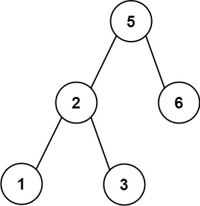

# 255. Verify Preorder Sequence in Binary Search Tree

## Problem

Given an array of **unique integers** `preorder`, return **true** if it is the correct **preorder traversal sequence** of a **Binary Search Tree (BST)**.

---

## Example 1



**Input**

```
preorder = [5,2,1,3,6]
```

**Output**

```
true
```

---

## Example 2

**Input**

```
preorder = [5,2,6,1,3]
```

**Output**

```
false
```

---

## Constraints

- `1 <= preorder.length <= 10^4`
- `1 <= preorder[i] <= 10^4`
- All elements of `preorder` are **unique**.

---

## Follow Up

Can you solve this problem using **constant space complexity (O(1))**?
