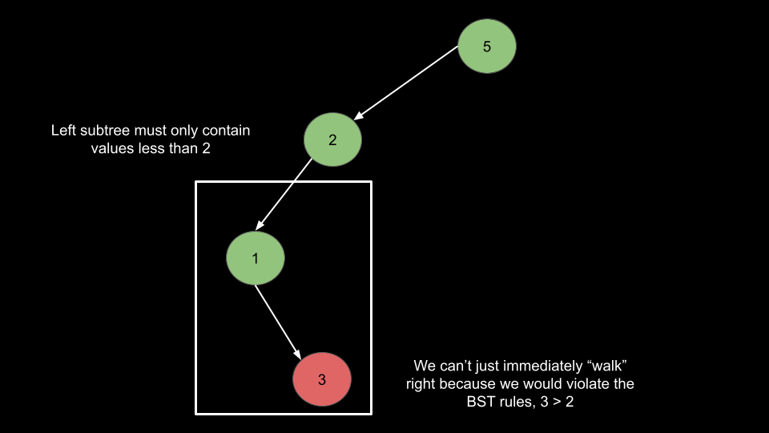
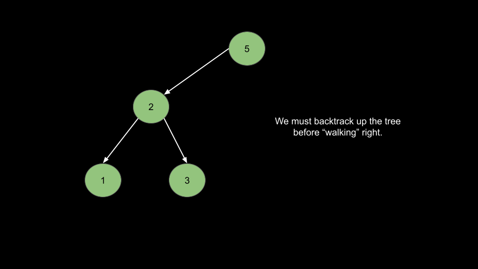
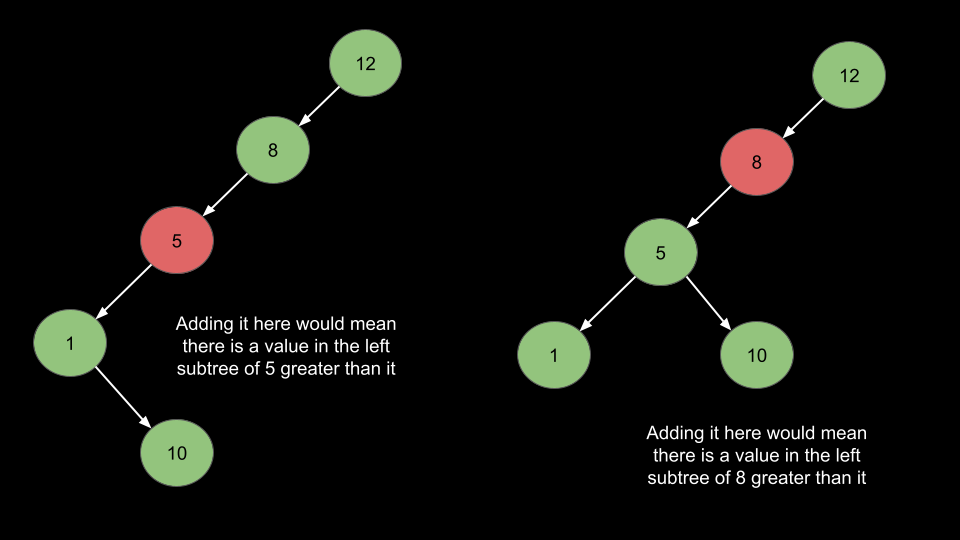

# Verify Preorder Sequence in Binary Search Tree — Solution Approaches

## Approach 1: Monotonic Stack

### Intuition

In **preorder traversal**, a node is visited before its children:

```
Root → Left → Right
```

Because of this order, we can iterate through the preorder sequence and determine where each node belongs in the BST.

Example:

```
preorder = [5,2,1,3,6]
```

- `5` is the root.
- `2 < 5` → left child.
- `1 < 2` → left child again.
- `3 > 1` → must backtrack to find the correct parent.
- `6 > 5` → belongs in the right subtree.

When the sequence decreases, we move left.
When it increases, we **backtrack up the tree**.

To simulate recursion, we use a **stack**.



### Key Idea

- The stack represents the current path in the tree.
- When encountering a larger number, we pop until we find its parent.
- Maintain a variable `minLimit` that ensures we never violate BST rules.

Once we enter a node's right subtree, we **cannot return to its left subtree**.





---

## Algorithm

1. Initialize:
   - `minLimit = -∞`
   - empty stack
2. Iterate through preorder:
   - While stack top < current value → pop and update `minLimit`
   - If `num <= minLimit` → invalid sequence
   - Push `num` onto stack
3. If traversal finishes without violation → return `true`.

---

## Java Implementation

```java
class Solution {
    public boolean verifyPreorder(int[] preorder) {

        int minLimit = Integer.MIN_VALUE;
        Stack<Integer> stack = new Stack<>();

        for (int num : preorder) {

            while (!stack.isEmpty() && stack.peek() < num) {
                minLimit = stack.pop();
            }

            if (num <= minLimit) {
                return false;
            }

            stack.push(num);
        }

        return true;
    }
}
```

---

## Complexity Analysis

### Time Complexity

```
O(n)
```

Each element is pushed and popped at most once.

### Space Complexity

```
O(n)
```

The stack may contain up to `n` elements.

---

# Approach 2: Constant Auxiliary Space

### Intuition

We can simulate the stack **directly inside the input array**.

Instead of using a separate stack structure:

- Use index `i` to represent the stack size.
- `preorder[i-1]` becomes the stack top.

Operations:

- **Push:** `preorder[i] = num; i++`
- **Pop:** `i--`

This avoids using extra memory.

---

## Algorithm

1. Initialize:
   - `minLimit = -∞`
   - `i = 0`
2. Iterate through preorder:
   - While `preorder[i-1] < num` → pop
   - If `num <= minLimit` → invalid
   - Push `num`
3. If sequence processed → return true.

---

## Java Implementation

```java
class Solution {
    public boolean verifyPreorder(int[] preorder) {

        int minLimit = Integer.MIN_VALUE;
        int i = 0;

        for (int num : preorder) {

            while (i > 0 && preorder[i - 1] < num) {
                minLimit = preorder[i - 1];
                i--;
            }

            if (num <= minLimit) {
                return false;
            }

            preorder[i] = num;
            i++;
        }

        return true;
    }
}
```

---

## Complexity Analysis

### Time Complexity

```
O(n)
```

Same reasoning as stack approach.

### Space Complexity

```
O(1) auxiliary
```

We only use a few integer variables.

Note: The input array itself still occupies `O(n)` space, but no additional memory is required.

---

# Approach 3: Recursion

### Intuition

This approach mirrors the **Validate BST** recursion idea.

Each node must satisfy:

```
minLimit < node.val < maxLimit
```

We recursively attempt to place nodes into:

- left subtree
- right subtree

The recursion processes elements in the **same order as preorder**.

A shared index `i` is used to track the current node.

---

## Algorithm

1. Use recursive helper function:

```
helper(preorder, index, minLimit, maxLimit)
```

2. Base case:

```
index == preorder.length → return true
```

3. Check BST constraint:

```
minLimit < value < maxLimit
```

4. Recursively explore:

- left subtree `(minLimit, root)`
- right subtree `(root, maxLimit)`

---

## Java Implementation

```java
class Solution {

    public boolean verifyPreorder(int[] preorder) {
        int[] i = {0};
        return helper(preorder, i, Integer.MIN_VALUE, Integer.MAX_VALUE);
    }

    public boolean helper(int[] preorder, int[] i, int minLimit, int maxLimit) {

        if (i[0] == preorder.length) {
            return true;
        }

        int root = preorder[i[0]];

        if (root <= minLimit || root >= maxLimit) {
            return false;
        }

        i[0]++;

        boolean left = helper(preorder, i, minLimit, root);
        boolean right = helper(preorder, i, root, maxLimit);

        return left || right;
    }
}
```

---

## Complexity Analysis

### Time Complexity

```
O(n)
```

Each element triggers at most two recursive checks.

### Space Complexity

```
O(n)
```

Recursion stack depth can reach `n` in worst case.
