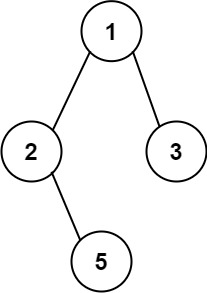

# 257. Binary Tree Paths

## Problem

Given the **root of a binary tree**, return **all root-to-leaf paths** in any order.

A **leaf** is a node with **no children**.

Each path should be represented as a string in the following format:

```
node1->node2->node3
```

---

## Example 1



**Input**

```
root = [1,2,3,null,5]
```

**Output**

```
["1->2->5","1->3"]
```

---

## Example 2

**Input**

```
root = [1]
```

**Output**

```
["1"]
```

---

## Constraints

- Number of nodes in the tree: **[1, 100]**
- `-100 ≤ Node.val ≤ 100`
