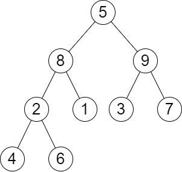

# 2583. Kth Largest Sum in a Binary Tree

## Problem

You are given the **root of a binary tree** and a positive integer **k**.

The **level sum** of a tree level is defined as the **sum of the values of all nodes on the same level**.

Return the **k-th largest level sum** in the tree (not necessarily distinct).
If the tree has **fewer than k levels**, return **-1**.

Two nodes are on the same level if they have the **same distance from the root**.

---

## Example 1



### Input

```
root = [5,8,9,2,1,3,7,4,6]
k = 2
```

### Output

```
13
```

### Explanation

Level sums:

- Level 1 → `5`
- Level 2 → `8 + 9 = 17`
- Level 3 → `2 + 1 + 3 + 7 = 13`
- Level 4 → `4 + 6 = 10`

Sorted level sums (descending):

```
17, 13, 10, 5
```

The **2nd largest** level sum is:

```
13
```

---

## Example 2

### Input

```
root = [1,2,null,3]
k = 1
```

### Output

```
3
```

### Explanation

Level sums:

- Level 1 → `1`
- Level 2 → `2`
- Level 3 → `3`

Largest level sum:

```
3
```

---

## Constraints

```
2 ≤ n ≤ 10^5
1 ≤ Node.val ≤ 10^6
1 ≤ k ≤ n
```

Where **n** is the number of nodes in the tree.
